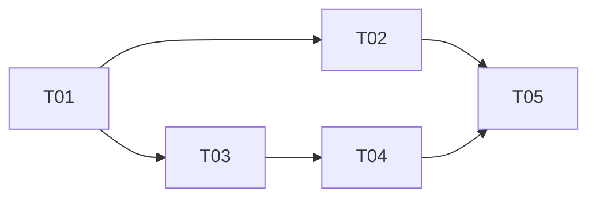

# 大蓝书 · 华为 Account Kit 一键登录 · 系统设计与任务分解

> 角色：交付架构师 高见远（Bob）
> 范围：P0 全量 + P1 ①④（首次昵称/头像初始化、深色适配）；P1 ②③（失败降级、unionID 冲突）已含在任务内；P2（账号绑定管理/手机号一键登录/埋点）不排期
> 技术栈：后端 Node.js + Express + TypeScript + Prisma + MySQL（端口 3000）；前端 HarmonyOS NEXT 原生（ArkTS + ArkUI，Stage 模型 **API 24**，ArkTS V1 严格模式）
> 配套图：`docs/huawei_login_sequence.mermaid`（调用时序）、`docs/huawei_login_class.mermaid`（类/结构）

---

## 0. 已核实事实与对 PRD 假设的必要修正（重要，请先读）

我直接阅读了现有代码，发现 PRD/前置说明中有多处描述与**实际代码**不符。以下为权威事实，后续设计以此为准：

| # | PRD/前置假设 | 实际代码（已核实） | 对本次设计的影响 |
|---|-------------|-------------------|------------------|
| F1 | 后端 `auth.ts` 是「手机号/账号密码登录」 | `POST /login` 实际收 `{openId, nickname, avatar}`，是**鸿蒙 openId 授权登录**（当前为 dev 桩 `科技老张`）；仓库内**无任何手机号/密码端点** | 「两种方式并存」= **现有 openId 登录 + 新增华为 unionID 登录**；P0 只做华为按钮，不新建手机号 UI |
| F2 | 前端「复用 AuthManager 持久化」 | `utils/auth.ets` 是**模块级函数**（`setSession(token, user)` / `getToken()` / `getCurrentUser()` / `clearSession()` / `ensureLogin()`），**不是类** | 华为登录成功后调用 `setSession(token, user)` 即可复用同一登录态 |
| F3 | 假设存在 `LoginPage.ets` | `pages/` 仅有 `Index` / `DetailPage` / `SearchResultPage`；登录是各页 `ensureLogin()` dev 桩**自动**完成，**无真实登录 UI** | 须**新建** `LoginPage.ets`，并接好路由与入口跳转 |
| F4 | `main_pages.json` 在 `ets/` 下 | 实际路径 `entry/src/main/resources/base/profile/main_pages.json` | 注册 `LoginPage` 改此文件 |
| F5 | 后端用 axios / fetch（待定） | `package.json` **无 axios**；运行环境 **Node v22.22.2**，原生 `fetch` 全局可用 | 华为 OAuth 调用用**原生 `fetch`**，**不新增后端依赖** |
| F6 | `User` 加 `unionID(unique)` | `User.openId` 当前为 **`String @unique`（NOT NULL）**；华为用户无 openId | 须把 `openId` 改为 **`String? @unique`**（可空唯一），并新增 `unionID String? @unique`；否则华为用户无法入库 |
| F7 | 华为端点响应结构待定 | 现有登录响应为 `{token, user}`（`LoginResult`），`user` 含 `id/nickname/avatar` | 华为端点直接**复用** `{token, user}` 结构，前端零改解析 |

---

## 1. 实现方案 + 框架选型

**结论：完全沿用现有栈，仅做最小增量改动，不引入新框架/新依赖（前端零新增、后端零新增）。**

### 1.1 前端：系统组件 `LoginWithHuaweiIDButton`
- 来自 `@kit.AccountKit`，属 HarmonyOS SDK **内置模块**，**无需 ohpm 安装**。
- 它是 ArkUI 系统级按钮：用户点击 → 华为系统授权（指纹/密码）→ 回调返回**一次性 `authorizationCode`**。
- 在 `LoginPage.ets` 的 `build()` 中嵌入该按钮，并配 `onLoginSuccess` / `onLoginFailure` 回调。
- **深色模式（P1-④）**：`LoginWithHuaweiIDButton` 支持 `mode` 参数（亮/暗/跟随系统），将 `mode` 绑定到 App 当前色系即可；系统组件默认也能跟随系统深色，本任务仅做显式绑定确认。

### 1.2 后端：新增 `huaweiAuth` 服务（原生 `fetch`）
- 选 **原生 `fetch`**（依据 F5：无 axios、Node v22 全局可用），不新增依赖，保持依赖面最小。
- 封装两次华为调用：
  1. **换 token**：`POST https://oauth-login.cloud.huawei.com/oauth2/v3/token`
     - `grant_type=authorization_code`、`client_id`、`client_secret`（从 `process.env.HUAWEI_CLIENT_SECRET` 读取）、`code`；`redirect_uri` 可选（AGC 注册回填，通常留空）。
  2. **取 unionID + 资料**：`GET https://account.cloud.huawei.com/rest.php?nsp_svc=GOpen.User.getInfo`
     - 请求头 `Authorization: Bearer <access_token>`，返回 `{ unionID, nickName, avatarUri, ... }`。
- `client_secret` **只在后端 `.env` 读取，绝不下发前端**。

### 1.3 并存策略（核心）
- 华为 unionID 登录与现有 openId 登录 **共用同一套 JWT token 体系与 `setSession` 持久化**。
- 后端新增 `loginWithHuawei(unionID, nickname?, avatar?)`：`findOrCreate`（按 `unionID` 唯一查；命中返回原账号——「首次关联为准」；未命中则创建）。
- 归档原则：沿用后端既有「route → service → prisma」三层；前端沿用「模块函数鉴权工具 + `api` 客户端」。

---

## 2. 文件列表及相对路径（标注 新增 / 修改）

| 文件 | 操作 | 说明 |
|------|------|------|
| `backend/prisma/schema.prisma` | 改 | `User.openId` → `String? @unique`；新增 `unionID String? @unique` |
| `backend/src/config/env.ts` | 改 | `env` 新增 `huawei: { clientId, clientSecret, redirectUri }` |
| `backend/src/utils/response.ts` | 改 | `CODE` 新增 `HUAWEI_AUTH_FAILED: 480` |
| `backend/.env` | 改 | 新增 `HUAWEI_CLIENT_ID=` / `HUAWEI_CLIENT_SECRET=` / `HUAWEI_REDIRECT_URI=`（不提交，已 gitignore） |
| `backend/.env.example` | 改 | 同步新增三项占位（模板，可提交） |
| `backend/src/services/huaweiAuth.ts` | **新** | 封装 OAuth 换 token + getInfo 取 unionID |
| `backend/src/services/authService.ts` | 改 | 新增 `loginWithHuawei(unionID, nickname?, avatar?)` |
| `backend/src/routes/auth.ts` | 改 | 新增 `POST /huawei/exchange`（`/v1/auth` 与 `/v1/users` 已双挂） |
| `entry/src/main/ets/services/api.ets` | 改 | 新增 `HuaweiExchangeBody` 类型 + `exchangeHuaweiCode()`，复用 `LoginResult` |
| `entry/src/main/resources/base/profile/main_pages.json` | 改 | `src` 数组新增 `"pages/LoginPage"` |
| `entry/src/main/ets/pages/Index.ets` | 改 | `aboutToAppear`：无 session 时 `router.pushUrl({url:'pages/LoginPage'})` |
| `entry/src/main/ets/pages/LoginPage.ets` | **新** | 登录页：嵌入 `LoginWithHuaweiIDButton` + 原方式入口 |
| `entry/src/main/ets/components/HuaweiLoginButton.ets` | **新** | 封装系统按钮 + 回调（降低 `LoginPage` 复杂度，便于深色/降级复用） |
| `entry/src/main/ets/utils/auth.ets` | 改 | 增加华为路径辅助（如 `loginByHuaweiResult`/增强 `ensureLogin` 兼容），不改现有签名语义 |

> 注：以上相对路径基于 `HarmonyProject1/` 根目录。`entry/src/main/module.json5` **默认不改**（PRD 确认 Client ID 与 App ID 相同时无需配 metadata）；若 AGC 中两者不同，再补 `metadata.clientId`。

---

## 3. 数据结构和接口

### 3.1 `User` 模型变更（`prisma/schema.prisma`）
```prisma
model User {
  id         Int      @id @default(autoincrement())
  openId     String?  @unique @db.VarChar(64) // 鸿蒙 openId（华为登录用户可为空）
  unionID    String?  @unique @db.VarChar(64) // 华为 unionID（新增，唯一）
  nickname   String   @db.VarChar(32)
  avatar     String?  @db.VarChar(255)
  gender     Int?     @default(1)
  followTags Json?
  status     Int      @default(1)
  createdAt  DateTime @default(now())
  updatedAt  DateTime @updatedAt
  // 关联（posts/comments/...）保持不变
}
```
> MySQL 唯一索引允许多个 NULL，故 `openId`/`unionID` 可空 + 唯一成立；现有 openId 用户不受影响。

### 3.2 接口结构
**请求** `POST /v1/auth/huawei/exchange`
```json
{ "code": "string" }   // 华为一次性 authorizationCode
```
**响应**（复用现有 `LoginResult`）
```json
{ "code": 0, "data": { "token": "string", "user": { "id": 1, "nickname": "华为用户xxxx", "avatar": "https://..." } }, "message": "success" }
```
失败时 `code: 480`（见 7.1），`httpStatus: 200`（保证前端 `request()` 能抛出友好文案，见 3.4）。

### 3.3 后端方法签名（关键签名，非完整实现）
```ts
// backend/src/services/huaweiAuth.ts
export async function exchangeCodeForToken(code: string): Promise<string>;            // → access_token
export async function fetchHuaweiUserProfile(accessToken: string): Promise<{ unionID: string; nickName?: string; avatarUri?: string }>;

// backend/src/services/authService.ts（新增，复用 jwt 签发）
export async function loginWithHuawei(unionID: string, nickname?: string, avatar?: string): Promise<{ token: string; user: User }>;
```

### 3.4 路由（关键片段）
```ts
// backend/src/routes/auth.ts
router.post('/huawei/exchange', async (req, res) => {
  const { code } = req.body ?? {};
  if (!code) return fail(res, CODE.BAD_REQUEST, '缺少 authorizationCode');
  try {
    const token = await exchangeCodeForToken(code);
    const profile = await fetchHuaweiUserProfile(token);
    const result = await loginWithHuawei(profile.unionID, profile.nickName, profile.avatarUri);
    return ok(res, result);                       // { code:0, data:{token, user} }
  } catch {
    // 返回 200 + 业务码 480，前端 request() 抛 message → toast（P1-② 降级不阻塞）
    return fail(res, CODE.HUAWEI_AUTH_FAILED, '华为登录失败，请稍后重试或切换其他登录方式', 200);
  }
});
```

### 3.5 前端 API 封装（`api.ets` 新增）
```ts
export interface HuaweiExchangeBody { code: string; }
export function exchangeHuaweiCode(body: HuaweiExchangeBody): Promise<LoginResult> {
  return api.post<LoginResult>('/v1/auth/huawei/exchange', body);
}
```

### 3.6 前端登录页（`LoginPage.ets` 关键片段，严格模式友好写法）
```ts
import { LoginWithHuaweiIDButton } from '@kit.AccountKit';
import { exchangeHuaweiCode } from '../services/api';
import { setSession, getCurrentUser } from '../utils/auth';

struct LoginPage {
  aboutToAppear(): void { /* initAuthStorage 已在 Index 调；此处无需重复 */ }
  onHuaweiSuccess(resp: AuthorizationWithHuaweiIDResponse): void {
    const code: string = resp.authorizationCode;
    exchangeHuaweiCode({ code }).then((r: LoginResult) => {
      setSession(r.token, r.user);   // 复用现有登录态
      router.back();                  // 回到 Index（已登录）
    }).catch((e: Error) => { /* toast: e.message，不阻塞 */ });
  }
  onHuaweiFailure(error: Error): void { /* toast 降级，保留“原方式”入口 */ }
  build(): void {
    Column() {
      LoginWithHuaweiIDButton({
        params: { /* scopeList 可选；默认即可换 code */ },
        onLoginSuccess: (resp: AuthorizationWithHuaweiIDResponse): void => { this.onHuaweiSuccess(resp); },
        onLoginFailure: (error: Error): void => { this.onHuaweiFailure(error); },
      }).mode(/* 绑定 App 色系：LoginWithHuaweiIDButtonMode */)
      Button('其他方式登录').onClick((): void => { /* 调 ensureLogin() 走现有 openId 路径，并存 */ })
    }
  }
}
```
> 严格模式提示：回调沿用现有 `api.ets` 的箭头函数风格（现有 `api.get = <T>(p) => ...` 即此风格）。`onLoginSuccess`/`onLoginFailure` 先转调 struct 方法，逻辑不写在匿名函数体内，降低审查风险。按钮 `params`/`mode` 的**精确属性名以 API 24 官方文档为准**（Account Kit 迭代较快）。

---

## 4. 程序调用流程

完整时序见 `docs/huawei_login_sequence.mermaid`。要点：
1. 用户进入 `LoginPage`（由 `Index.aboutToAppear` 判断无 session 后 `pushUrl` 而来）。
2. 点击 `LoginWithHuaweiIDButton` → 华为系统授权 → `onLoginSuccess(authorizationCode)`。
3. 前端 `exchangeHuaweiCode({code})` → `POST /v1/auth/huawei/exchange`。
4. 后端 `huaweiAuth`：用 `code + client_secret` 换 `access_token` → 用 token 调 `getInfo` 取 `unionID/nickName/avatarUri`。
5. `authService.loginWithHuawei` 按 `unionID` **findOrCreate** → 签发 JWT → 返回 `{token, user}`。
6. 前端 `setSession(token, user)` 持久化 → `router.back()` 回 `Index`（已登录态）。
7. 失败：`onLoginFailure` 或后端 480 → 前端 toast 提示，**保留「原方式」入口不阻塞**（P1-②）。

类/结构关系见 `docs/huawei_login_class.mermaid`（User 模型、DTO、HuaweiAuthService、AuthService、AuthRoute、前端 ApiClient/AuthUtils/LoginPage/HuaweiLoginButton 及华为外部系统）。

---

## 5. 任务列表（有序、含依赖，按实现顺序）

> 规则遵循：≤5 个任务、每个任务 ≥3 个相关文件、按模块/层次分组、T01 为基础设施；依赖链仅两级。

| 任务ID | 任务名 | 归属 | 产物文件（新增/修改） | 依赖 | 优先级 |
|--------|--------|------|----------------------|------|--------|
| **T01** | 契约与配置基座（后端） | 后端 | `prisma/schema.prisma`(改)、`src/config/env.ts`(改)、`src/utils/response.ts`(改)、`.env`(改)、`.env.example`(改)；执行 `prisma generate` + `prisma db push` | 无 | P0 |
| **T02** | 后端华为鉴权服务与路由 | 后端 | `src/services/huaweiAuth.ts`(新)、`src/services/authService.ts`(改)、`src/routes/auth.ts`(改) | T01 | P0 |
| **T03** | 前端 API 封装与页面路由 | 前端 | `services/api.ets`(改)、`resources/base/profile/main_pages.json`(改)、`pages/Index.ets`(改) | T01 | P0 |
| **T04** | 前端登录页与华为按钮组件 | 前端 | `pages/LoginPage.ets`(新)、`components/HuaweiLoginButton.ets`(新)、`utils/auth.ets`(改) | T03 | P0/P1 |
| **T05** | 联调·降级/深色/冲突验证 | 前后端 | `pages/LoginPage.ets`(改)、`components/HuaweiLoginButton.ets`(改)、`utils/auth.ets`(改) | T02, T04 | P1 |

**说明**
- **T01（先）**：所有后续任务依赖此契约（unionID 字段、env、错误码）。必须 `prisma db push` 让 DB schema 生效，否则 T02 运行即报错。
- **T02（后端 service+route）**：独立可并行于前端；实现 `findOrCreate` 即落实「首次关联为准」冲突策略。
- **T03（前端 api+路由）**：仅加封装与页面注册，不影响现有页面。
- **T04（前端登录页）**：消费 T03 的 `exchangeHuaweiCode`；建议抽出 `HuaweiLoginButton.ets` 组件承载系统按钮与回调，降低 `LoginPage` 复杂度。
- **T05（联调/质量）**：失败降级 toast（不阻塞原登录）、深色 `mode` 绑定、unionID 冲突策略真机验证、真机联调（模拟器不可跑 Account Kit）。

### 5.1 任务依赖图


---

## 6. 依赖包列表

| 包 | 是否新增 | 说明 |
|----|---------|------|
| 前端 `@kit.AccountKit` | **否**（SDK 内置） | 系统组件 `LoginWithHuaweiIDButton`，无需 ohpm 安装 |
| 后端 `axios` | **否** | 依据 F5 改用原生 `fetch`（Node v22 全局可用），不新增依赖 |
| 后端 `@prisma/client` / `prisma` | 否 | 已有；T01 执行 `generate` + `db push` |

需变更的环境变量（不新增 npm 包）：
- `backend/.env`：新增 `HUAWEI_CLIENT_ID`、`HUAWEI_CLIENT_SECRET`、`HUAWEI_REDIRECT_URI`（可选）。`.env` 已被 `.gitignore` 忽略，不会提交。
- `backend/.env.example`：同步新增三项占位，供团队成员复制。

---

## 7. 共享知识（跨文件约定）

1. **错误码约定**：`CODE.HUAWEI_AUTH_FAILED = 480`（在 `response.ts` 新增）。所有华为登录失败统一返回此码 + 友好 `message`；HTTP 状态用 `200`（让前端 `request()` 抛出 `message` 而非底层 `HTTP 5xx`）。
2. **Token 字段命名**：严格复用现有 `{ token, user }`（`LoginResult`），`user` 含 `id/nickname/avatar`。**禁止**新增字段名（如 `accessToken`/`huaweiToken`）以免前端解析分歧。
3. **登录态工具调用**：用 `utils/auth.ets` 的 `setSession(token, user)` 持久化；持久化键固定为 `authToken / authUserId / authNickname / authAvatar`（PersistentStorage）。**不要**新增登录态入口。
4. **HTTP 请求体**：前端用 `@kit.NetworkKit` 的 `http`，body 走 `extraData`（严格模式铁律），沿用 `api.ets` 的 `request()` 封装，**不要**手写 `fetch`/裸 `http`。
5. **跨页参数**：用 `AppStorage`（如 `setOrCreate('authToken', ...)`），**禁止** `router.getParams()`（API 24 失效）。`LoginPage → Index` 回跳用 `router.back()`，无需传参。
6. **密钥隔离**：`HUAWEI_CLIENT_SECRET` 仅后端 `.env` / `env.ts` 读取，**绝不下发前端**；前端只持有一次性 `authorizationCode`。
7. **可空唯一键**：`openId` 与 `unionID` 均为 `String? @unique`（见 F6）；`loginWithHuawei` 建号时 `openId` 留空、`unionID` 必填。
8. **严格模式回调风格**：`onLoginSuccess`/`onLoginFailure` 采用「箭头转调 struct 方法」写法（沿用 `api.ets` 现有箭头风格），逻辑不放匿名函数体内。
9. **深色模式**：`LoginWithHuaweiIDButton.mode` 绑定 App 当前色系；系统组件默认跟随系统深色，本任务仅做显式绑定确认（P1-④）。
10. **路由前缀**：`authRouter` 同时挂 `/v1/auth` 与 `/v1/users`，新增 `/huawei/exchange` 两端均可访问，前端用 `/v1/auth/huawei/exchange`。

---

## 8. 待明确事项（需用户 / 产品经理决策）

1. **unionID 冲突策略（关键）**：当前方案「首次关联为准」——`unionID` 已存在则直接返回原账号（不合并数据）。PRD 建议「冲突提示换绑」。需 PM 确认 UX：
   - (a) 静默用原账号登录（当前默认，最简单）；
   - (b) 弹窗提示「该华为账号已绑定其他大蓝书账号」，要求换绑/解绑（P2 再做换绑能力）。
2. **「原方式」UI 范围**：实际代码中并无手机号/密码 UI（F1）。P0 的「两种方式并存」实现为「华为按钮 + 一个调 `ensureLogin()` 的『其他方式登录』入口」即可满足 US-5；是否要真正做手机号/账号密码表单，**不在本期 P0**，需 PM 确认是否单列需求。
3. **登录页入口交互**：当前 `Index` 是 `@Entry` 启动页。建议 `Index.aboutToAppear` 判断无 session → `router.pushUrl('pages/LoginPage')`（Index 保留在栈底，登录后 `router.back()` 回 Index）。需主理人/PM 确认此入口是否符合预期，或改为独立 Splash/启动判断。
4. **`HUAWEI_REDIRECT_URI` 是否必填**：`LoginWithHuaweiIDButton` 服务端换码通常不需要 `redirect_uri`；若 AGC 配置要求回填，则在 `.env` 补 `HUAWEI_REDIRECT_URI`。需用户在 AGC 操作后确认。
5. **`module.json5` metadata**：仅当 AGC 的 Client ID ≠ App ID 时才需在 `module.json5` 配 `clientId` metadata；默认不改（见文件列表注）。需用户提供 AGC 实际取值后确认。
6. **真机验证前置**：Account Kit 在**模拟器无法验证**，须真机 + AGC 已完成（创建应用、开通 Account Kit、填 SHA256 指纹、取 Client ID/Secret）。此为用户侧前置依赖，非本任务可自测。
7. **P2 能力**：账号绑定管理、华为手机号一键登录（需申请 `quickLoginMobilePhone`）、埋点——本期不排期，待 P0/P1 上线后评估。

---

架构设计完成，可转工程师。
