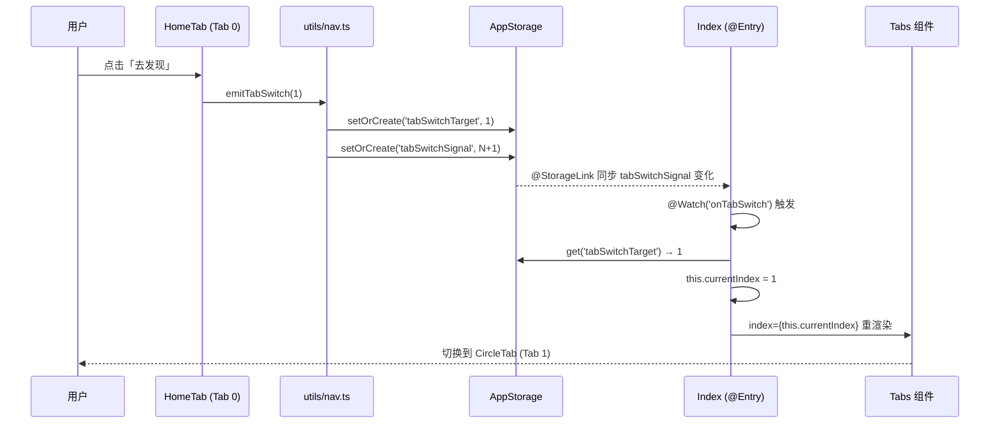

# 跨 Tab 跳转修复 & Navigation 迁移评估

> 架构师：Bob | 针对问题：「去发现」按钮跨 Tab 跳转失效 | 日期：2025-07-11

---

## 1. 推荐方案与理由

### 方案对比

| 维度 | 方案 A（最小侵入） | 方案 B（半迁移） | 方案 C（全量迁移） |
|------|-------------------|-----------------|-------------------|
| 改动文件数 | 3 | 10+ | 15+ |
| 预计工时 | 0.5 天 | 3-5 天 | 5-8 天 |
| 编译风险 | 低 | 中高 | 高 |
| 回归风险 | 极低 | 中高 | 高 |
| 即时解决问题 | ✅ | ✅ | ✅ |
| 与未来迁移契合度 | 中性（不阻碍） | 差（混合态更难迁移） | 最佳（一步到位） |

### 推荐：方案 A

**理由：**

1. **问题明确，方案对症**：「去发现」按钮失效的根因是 `AppStorage.setOrCreate('homeTabIndex', 1)` 写了信号但 Index 从未监听。方案 A 补上监听端即可闭合链路。
2. **已有验证模式**：项目中 HomeTab 已用 `@StorageLink('authToken') @Watch('onTokenReady')` 实现登录态响应（HomeTab.ets 第 39 行），方案 A 完全复用此模式，无新技术引入。
3. **风险最低**：仅改 3 个文件，不触碰 Tabs 结构、不引入 Navigation、不改路由体系。
4. **不阻碍未来迁移**：方案 C（全量 Navigation 迁移）应作为独立 epic 规划。方案 A 的 AppStorage 桥接在迁移时会被 NavPathStack 替换，不产生技术债。
5. **方案 B 不推荐**：混合态（Tabs 内 + Navigation 外）导致两套导航范式共存，维护成本高于 A，且迁移到 C 时仍需大改，投入产出比最差。

### 长期迁移路径建议

```
当前 → 方案 A（立即修复，本次迭代）→ 方案 C（独立 epic，下个迭代）
```

方案 C 的迁移应在功能稳定后作为专项任务执行，包含：
- Index 改为 Navigation + 自定义 TabBar
- 8 个 `router.pushUrl` 页面迁移为 NavDestination
- 全量回归测试

---

## 2. 实现细节

### 涉及文件

| 文件 | 改动类型 | 说明 |
|------|---------|------|
| `entry/src/main/ets/utils/nav.ts` | 新增函数 | 添加 `emitTabSwitch()` 信号发射器 |
| `entry/src/main/ets/pages/Index.ets` | 修改 | 添加 `@StorageLink` + `@Watch` 监听 |
| `entry/src/main/ets/components/HomeTab.ets` | 修改 | 替换「去发现」onClick 实现 |

### 改动点

#### 2.1 `utils/nav.ts` — 新增跨 Tab 跳转信号

在现有 `takeDetailPostId()` 之后追加：

```typescript
// 跨 Tab 跳转信号：子组件调用此函数触发 Index 切换 Tab。
// 用递增序列号保证 @Watch 每次都能触发（@Watch 对同值不触发）。
export function emitTabSwitch(target: number): void {
  AppStorage.setOrCreate('tabSwitchTarget', target);
  const seq: number = (AppStorage.get<number>('tabSwitchSignal') ?? 0) + 1;
  AppStorage.setOrCreate('tabSwitchSignal', seq);
}
```

#### 2.2 `Index.ets` — 添加监听

**新增属性**（`@State currentIndex` 下方）：

```typescript
@StorageLink('tabSwitchSignal') @Watch('onTabSwitch') tabSwitchSignal: number = 0;
```

**新增方法**（`refreshUnread()` 下方）：

```typescript
// 跨 Tab 跳转监听：子组件 emitTabSwitch() 写入信号后触发
onTabSwitch(): void {
  const target: number = AppStorage.get<number>('tabSwitchTarget') ?? 0;
  if (target >= 0 && target <= 4) {
    this.currentIndex = target;
  }
}
```

#### 2.3 `HomeTab.ets` — 修复 onClick

**第 11 行 import 修改**（追加 `emitTabSwitch`）：

```typescript
import { setDetailPostId, emitTabSwitch } from '../utils/nav';
```

**第 354-359 行 onClick 替换**：

```typescript
Button('去发现')
  .margin({ top: 12 })
  .onClick(() => {
    emitTabSwitch(1); // 跳转到底部「圈子」Tab（CircleTab）
  })
```

### 数据流



---

## 3. 任务列表

```
T1: 实现跨 Tab 跳转信号机制 - utils/nav.ts, Index.ets, HomeTab.ets - [依赖: 无]
```

> 仅 1 个任务，3 个文件，内聚度高。无前置依赖，工程师可直接开工。

---

## 4. 共享知识

### AppStorage key 命名约定

| Key | 类型 | 用途 | 写入方 | 读取方 |
|-----|------|------|--------|--------|
| `tabSwitchSignal` | number | 递增序列号，触发 @Watch | `emitTabSwitch()` | Index `@StorageLink` |
| `tabSwitchTarget` | number | 目标 Tab 索引 (0-4) | `emitTabSwitch()` | Index `onTabSwitch()` |
| ~~`homeTabIndex`~~ | — | **废弃**（原 HomeTab 写入但无人监听） | — | — |

### @Watch 回调命名约定

- 格式：`on` + 被监听变量语义名，如 `tabSwitchSignal` → `onTabSwitch`
- 与现有 `onTagChanged`、`onTokenReady` 风格一致
- 不标记 `private`（与现有 watch 回调一致）

### 边界条件处理

| 场景 | 行为 | 原因 |
|------|------|------|
| 连续点击「去发现」 | 每次递增 signal，每次触发 watch，`currentIndex` 重复设为 1 | 无副作用，Tabs 对相同 index 不重复切换 |
| 已在圈子 Tab 时点击 | 不可能触发（按钮仅在 HomeTab 关注流空态渲染） | — |
| signal 初始值 0 | 不触发 watch（@Watch 仅在值变化时触发） | 初始化不算变化 |
| target 未设置时 watch 误触发 | `?? 0` 兜底，0 是合法 Tab 但不会误触发（signal 仅由 emitTabSwitch 递增） | — |

---

## 5. 待明确事项

1. **未来是否有其他跨 Tab 跳转需求？** 当前 `emitTabSwitch(target)` 已支持任意目标 Tab。如后续 ProfilePage / MessagePage 需要跳转到首页，直接调用 `emitTabSwitch(0)` 即可，无需额外开发。
2. **方案 C 迁移排期**：建议下个迭代作为独立 epic，需 PM 确认优先级。当前方案 A 不阻碍后续迁移。
3. **`homeTabIndex` 旧 key 残留**：AppStorage 中可能残留旧值 `homeTabIndex`，不影响功能，无需手动清理（AppStorage 非持久化，重启后消失）。

---

## 6. 风险评估

### 编译风险

| 风险点 | 等级 | 说明 | 应对 |
|--------|------|------|------|
| `AppStorage.get<number>()` 泛型用法 | 低 | 项目中已有 `AppStorage.get<string>()` 先例（auth.ets:14），number 同理 | `?? 0` 兜底 undefined |
| `AppStorage` 在 `.ts` 文件可用性 | 低 | `nav.ts` 已被 ArkTS 编译管线处理，`AppStorage` 为运行时全局对象 | 若编译报错，将函数移至 `.ets` 文件 |
| `@Watch` 回调非 private | 无 | 与现有 `onTagChanged` / `onTokenReady` 一致 | — |
| 新增 import 语句 | 无 | `emitTabSwitch` 从已有 `utils/nav.ts` 导入，无新依赖 | — |

### 运行时风险

| 风险点 | 等级 | 说明 | 应对 |
|--------|------|------|------|
| @Watch 在 @Entry 组件不触发 | 极低 | @StorageLink + @Watch 在 @Entry 中与子组件行为一致；HomeTab 已验证此模式 | QA 验证点击「去发现」后 Tab 切换 |
| @Watch 回调内读 AppStorage 时序 | 极低 | @Watch 在值变更后触发，此时 `tabSwitchTarget` 已先于 `tabSwitchSignal` 写入 | emitTabSwitch 中 target 先写、signal 后写 |
| signal 递增溢出 | 可忽略 | JS number 为 64 位浮点，实际不可能溢出 | — |

### 回归风险

| 风险点 | 等级 | 说明 | 应对 |
|--------|------|------|------|
| 普通 Tab 点按/滑动切换 | 无 | `onChange` 回调不变，Tabs 内置行为不受影响 | QA 回归 5 个 Tab 的点按切换 |
| 消息 Tab 红点 | 无 | `@StorageLink('unreadMessageCount')` 不受影响 | QA 回归未读红点 |
| 登录跳转 | 无 | `aboutToAppear` 中 `router.pushUrl` 不变 | QA 回归未登录→登录流程 |
| 其他页面跳转 | 无 | 不涉及 DetailPage / SearchResultPage 等路由 | — |
