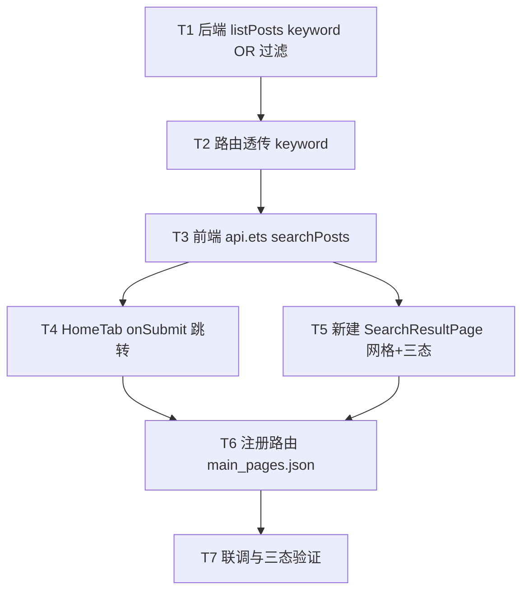

# 大蓝书 · 帖子搜索功能 · 系统设计与任务分解

> 角色：交付架构师（高见远）
> 范围：P0（搜索可用）+ P1（加载/空/失败/跳详情）；P2（热搜/联想/高亮）不排入任务
> 技术栈：后端 Node.js + Express + TypeScript + Prisma + MySQL（端口 3000）；前端 HarmonyOS NEXT 原生（ArkTS + ArkUI，Stage 模型 **API 24**，ArkTS V1 严格模式）
> 配套图：`docs/sequence-diagram.mermaid`（调用时序）、`docs/class-diagram.mermaid`（类/结构）

---

## 0. 已核实事实与对 PRD 假设的必要修正（重要，请先读）

我直接阅读了现有代码，发现 PRD/任务说明中的几处描述与**实际代码**不符。以下为权威事实，后续设计以此为准：

| # | PRD 原假设 | 实际代码（已核实） | 对本次设计的影响 |
|---|-----------|------------------|----------------|
| F1 | `tags(String[])`、`images(String[])` | `prisma/schema.prisma`：`tags Json`、`images Json` | 标签匹配用 Prisma `arrayContains`（Json 数组精确包含），**不是** `has`。`images` 不参与搜索。 |
| F2 | `listPosts` 返回 `{items,total,page,pageSize}`，且经 `toPostDTO()` 序列化 | `postService.ts` 实际返回 `{ list, pagination: {page, limit, total} }`，**无** `toPostDTO()`，直接返回 Prisma 对象（含 `user` 关联） | `searchPosts` 必须返回**同形** `ListResult<Post>`，即 `{list, pagination}`。前端 `api.ets` 已定义 `ListResult<T> = {list, pagination}`，直接复用。 |
| F3 | `PostCard` 自带点击 emit 跳详情 | `PostCard.ets` **无**点击处理；点击由 `HomeTab` 用 `GridItem().onClick` 父级包裹实现（写 `AppStorage` + `setDetailPostId` + `router.pushUrl('pages/DetailPage')`） | `SearchResultPage` **照抄** `HomeTab` 的父级包裹点击模式即可，**不要改 `PostCard`**。 |
| F4 | `main_pages.json` 在 `entry/src/main/ets/` | 实际路径 `entry/src/main/resources/base/profile/main_pages.json` | 注册 `SearchResultPage` 改这个文件。 |
| F5 | `router.getParams()` 传参 | `utils/nav.ts` 注释明确："router.getParams() 在 API 24 已弃用且返回空" | keyword 跨页传递用 `AppStorage.setOrCreate('searchKeyword', kw)`，与 `detailPostId` 既有做法一致。 |

---

## 1. 实现方案 + 框架选型

**结论：完全沿用现有栈，仅做最小增量改动，不引入新框架/新依赖。**

### 1.1 后端：扩展 `GET /v1/posts`，新增可选 `keyword` 查询参数
- 不新增独立端点（PRD 决策 #5），复用 `listPosts` 的分页/排序管线与返回结构，最小化改动面。
- `listPosts(params)` 新增可选 `keyword?: string`；当 `keyword` 非空时，在现有 `where`（`status: 1` + 可选 tag/author）基础上叠加 `OR` 条件，命中**任一**字段即返回（PRD 决策 #1 用 OR）。
- 四个命中字段及匹配方式（基于 F1 的 Json 现实）：
  - `title` → `{ contains: kw, mode: 'insensitive' }`
  - `content` → `{ contains: kw, mode: 'insensitive' }`（content 可空，空值自然不匹配）
  - `genre` → `{ contains: kw, mode: 'insensitive' }`
  - `tags`（Json）→ `{ arrayContains: kw }`（**精确包含某标签**，非子串模糊；Json 列无法用 ORM 做数组元素子串模糊，且非 v1 范围，PRD 决策 #2 仅要求 LIKE 级模糊，标题/正文/体裁已满足）

```ts
// backend/src/services/postService.ts —— listPosts 内新增
if (params.keyword) {
  const kw = String(params.keyword).trim();
  if (kw) {
    where.OR = [
      { title: { contains: kw, mode: 'insensitive' } },
      { content: { contains: kw, mode: 'insensitive' } },
      { genre: { contains: kw, mode: 'insensitive' } },
      { tags: { arrayContains: kw } },
    ];
  }
}
```

> 说明：`where` 类型为 `any`；Prisma 在顶层 `where` 中会把 `status` 与 `OR` 自动 AND 处理，因此结果 = "已发布 且 (标题|正文|体裁|标签 命中关键词)"，符合预期。`mode: 'insensitive'` 需 **MySQL 8.0+**（本地开发库默认满足）。

### 1.2 排序与分页
- 排序：默认按 `createdAt desc`（`latest`）；`sort` 参数预留 `'latest' | 'hot'`，本期仅实现 `latest` 分支（PRD 决策 #3）。后端 `listPosts` 已有 `sort` 分支，无需改动排序逻辑。
- 分页：`page` + `limit`，后端已有 `skip/take` 与 `count`。前端 `searchPosts` 默认 `pageSize = 10`（PRD 决策 #4）；结果页**滚动到底加载更多**，不显示分页按钮。

### 1.3 前端
- `api.ets` 新增 `searchPosts(params: SearchPostsParams)`：复用 `toQuery` 拼 `keyword/page/limit/sort`，请求 `GET /v1/posts`。
- `HomeTab` 搜索框 `onSubmit`：由 `promptAction.showToast` 占位改为「写 `AppStorage` + `router.pushUrl('pages/SearchResultPage')`」。
- 新建 `SearchResultPage`：自有顶栏（返回 / 可改搜索框 / 清除 ✕ / 结果计数），复用 `PostCard` 2 列网格 + `Refresh` 下拉刷新 + `onScrollIndex` 上拉加载更多 + 三态（加载/空/失败重试），点击跳详情沿用 F3 父级包裹模式。

---

## 2. 文件列表（标注 新增 / 修改）

### 后端（`backend/src`）
| 文件 | 操作 | 改动点 |
|------|------|--------|
| `services/postService.ts` | **修改** | `ListParams` 增加 `keyword?`；`listPosts` 内追加 OR 过滤（见 §1.1）。 |
| `routes/posts.ts` | **修改** | `GET /` 解构并透传 `keyword` 查询参数给 `listPosts`。 |
| `__tests__/postService.search.test.ts` | **新增（可选）** | 对 `listPosts({keyword})` 的 OR 命中做单测（标题/正文/体裁/标签各一例 + 空结果）。不强制，建议补。 |

### 前端（`entry/src/main/ets`）
| 文件 | 操作 | 改动点 |
|------|------|--------|
| `services/api.ets` | **修改** | 新增 `SearchPostsParams` 接口与 `searchPosts()`；复用 `toQuery` 与 `ListResult<Post>`。 |
| `components/HomeTab.ets` | **修改** | 搜索框 `onSubmit`：写 `AppStorage('searchKeyword')` 并 `router.pushUrl('pages/SearchResultPage')`（替换 toast）。 |
| `pages/SearchResultPage.ets` | **新增** | 结果页：顶栏 + 2 列 `PostCard` 网格 + 下拉刷新 + 上拉加载 + 三态（加载/空/失败重试）+ 点击跳详情。 |
| `../resources/base/profile/main_pages.json`（路径见 F4） | **修改** | `src` 数组追加 `"pages/SearchResultPage"`。 |

> 说明：`SearchResultPage.ets` 仅**复用** `PostCard`（`@Prop post`），不修改 `PostCard.ets`（F3）。

---

## 3. 数据结构和接口

见 `docs/class-diagram.mermaid`。核心契约如下（ArkTS / TS 表达）：

### 3.1 前端入参（新增）
```ts
// services/api.ets
export interface SearchPostsParams {
  keyword: string;
  page?: number;       // 默认 1
  pageSize?: number;   // 默认 10（= 后端 limit）
  sort?: SortType;     // 'latest' | 'hot'，本期仅 latest 生效
}
```

### 3.2 复用数据结构（models/types.ets / api.ets）
```ts
export interface Pagination { page: number; limit: number; total: number; }
export interface ListResult<T> { list: T[]; pagination: Pagination; }
// Post / User 见 models/types.ets（Post.user 可选，由后端 user 关联填充）
```

### 3.3 接口形态（扩展现有 GET /v1/posts）
```
GET /v1/posts?keyword=<kw>&page=1&limit=10&sort=latest
```
- 请求：`keyword` 必填（前端保证非空再跳），`page`/`limit`/`sort` 可选。
- 响应（与现有列表**完全一致**，F2）：
```json
{ "code": 0, "message": "ok",
  "data": {
    "list": [ { "id": 1, "title": "...", "content": "...", "genre": "review",
                "tags": ["数码选购"], "images": [...], "upCount": 12,
                "bookmarkCount": 3, "commentCount": 5,
                "createdAt": "2025-07-01T08:00:00.000Z",
                "user": { "id": 9, "nickname": "老王", "avatar": "..." } } ],
    "pagination": { "page": 1, "limit": 10, "total": 37 }
  }
}
```
- 错误：`code !== 0` 或 HTTP 非 200 → 前端进入失败态（P1-3 重试）。

### 3.4 后端 ListParams（修改后）
```ts
// services/postService.ts
export interface ListParams {
  page?: number;
  limit?: number;
  sort?: SortType;
  tag?: string;
  author?: number;
  keyword?: string;   // 新增
}
```

---

## 4. 程序调用流程（时序图）

完整时序见 `docs/sequence-diagram.mermaid`，要点：

1. **触发**：`HomeTab` 搜索框 `onSubmit` → `AppStorage.setOrCreate('searchKeyword', kw)` → `router.pushUrl({url:'pages/SearchResultPage'})`。
2. **初始化**：`SearchResultPage.aboutToAppear` 从 `AppStorage` 读 `searchKeyword` → `refresh()`。
3. **首屏**：`searchPosts({keyword, page:1, limit:10, sort:'latest'})` → `GET /v1/posts?keyword=..&page=1&limit=10&sort=latest` → `PostsRoute` → `postService.listPosts({keyword,...})` → `prisma.post.findMany({where:{status:1, OR:[...]}, orderBy, skip, take})` + `count` → 返回 `{list, pagination}` → 渲染 2 列 `PostCard` 网格 + "共找到 N 篇"。
4. **加载更多**：`Grid.onScrollIndex` 末项可见 → `loadMore()`（`page++`）→ 再次 `searchPosts` → `posts.concat(res.list)`；当返回条数 `< limit` 置 `finished`。
5. **点击跳详情**：父级 `GridItem.onClick` → `AppStorage.setOrCreate('detailPostId', id)` + `setDetailPostId(id)` + `router.pushUrl('pages/DetailPage')`（同 F3）。
6. **失败重试**：`fetch` 抛错 → `error` 置位 → 空态区显示 "加载失败：…" + **重试按钮** → `refresh()`。

---

## 5. 任务列表（有序、含依赖、按实现顺序）

> 按依赖顺序执行；P0 必须全部完成方可联调，P1 为体验增强但建议同批完成。

| 任务 | 名称 | 源文件 | 依赖 | 优先级 |
|------|------|--------|------|--------|
| **T1** | 后端 `listPosts` 增加 keyword OR 过滤 | `services/postService.ts`（改）；`__tests__/postService.search.test.ts`（新增，可选） | 无 | P0 |
| **T2** | 后端路由透传 `keyword` 查询参数 | `routes/posts.ts`（改） | T1 | P0 |
| **T3** | 前端 `api.ets` 新增 `searchPosts` | `services/api.ets`（改） | T1, T2 | P0 |
| **T4** | `HomeTab` 搜索框 `onSubmit` 改跳转 | `components/HomeTab.ets`（改） | T3 | P0 |
| **T5** | 新建 `SearchResultPage`（2列网格 + 分页 + 三态 + 跳详情） | `pages/SearchResultPage.ets`（新增） | T3, T4 | P0(P0-4) + P1(P1-1~P1-4) |
| **T6** | 注册 `SearchResultPage` 路由 | `resources/base/profile/main_pages.json`（改） | T5 | P0 |
| **T7** | 联调与三态验证（含失败重试、空态、加载更多） | 上述全部 | T1–T6 | P0+P1 收尾 |

依赖链：`T1 → T2 → T3 → {T4, T5} → T6 → T7`。T4 与 T5 可并行（都只依赖 T3）。

---

## 6. 依赖包列表

**本期无需新增任何 npm 依赖，也无需新增 ohpm 依赖。**
- 后端：仅用既有 Prisma ORM 条件拼接 + Express，无新包。
- 前端：仅复用既有 `@kit.ArkUI` / `@kit.NetworkKit` / `AppStorage`，无新包。

---

## 7. 共享知识（跨文件约定，Engineer 必读）

1. **ArkTS V1 严格模式**：`@State` 禁用保留字（`tabIndex`/`width`/`height` 等）；**禁止解构**；对象字面量必须对应具名 `interface`；`http` 请求体走 `extraData: JSON.stringify(body)`（本项目 `request()` 已封装，勿改）。`SearchResultPage` 所有状态用显式 `@State` 标量/数组，不依赖解构。
2. **跨页传参用 `AppStorage`**：`router.getParams()` 在 API 24 失效（F5）。`HomeTab` 跳转前 `AppStorage.setOrCreate('searchKeyword', kw)`；`SearchResultPage.aboutToAppear` 用 `AppStorage.get('searchKeyword')` 读取并初始化。详情跳转为 `AppStorage.setOrCreate('detailPostId', id)` + `setDetailPostId(id)`（沿用既有 `utils/nav.ts`）。
3. **`PostCard` 不改，点击由父级包裹**：`SearchResultPage` 直接复用 `PostCard({post})`，在 `GridItem` 上 `.onClick` 写 `detailPostId` 并 `router.pushUrl('pages/DetailPage')`，**完全照抄 `HomeTab` 第 181–191 行模式**。
4. **分页 / 三态 UI 模式照抄 `HomeTab`**：`Refresh` 下拉刷新 + `Grid.onScrollIndex(end>=posts.length-1)` 上拉加载更多 + 状态变量 `loading/finished/isRefreshing/error`。区别仅在**失败态增加「重试」按钮**（P1-3），其余（加载中 `LoadingProgress`、空态文案）与 `HomeTab` 视觉一致。
5. **返回结构约定（重要，基于 F2）**：`searchPosts` 与 `listPosts` 同形返回 `ListResult<Post> = { list, pagination:{page, limit, total} }`，**无 `toPostDTO`**；`finished` 判定用 `res.list.length < this.limit`（不要用写死的 20，除非你特意把 `limit` 设为 20）。
6. **标签匹配用 `arrayContains`（基于 F1）**：`tags` 是 `Json` 列，关键词匹配标签用 `{ tags: { arrayContains: kw } }`（精确包含某标签）；不做数组元素子串模糊（Json + ORM 不支持且无 v1 必要）。首页既有标签筛选用的也是 `arrayContains`，保持统一。

---

## 8. 待明确事项

1. **搜索结果页接收 keyword 的方式**：已据 API 24 实测（`utils/nav.ts` 注释）决定用 `AppStorage` 传递，**已落地于共享知识②**，无需再确认。
2. **`searchPosts` 默认 `pageSize`**：PRD 决策 #4 定为 **10**；而 `HomeTab` 列表用 `limit: 20`。两者不一致但是 PRD 有意为之（搜索结果页默认 10）。若希望与首页视觉节奏统一，可把 `searchPosts` 默认 `pageSize` 改为 20 —— **默认按 PRD 用 10**，如团队偏好 20 请联调前告知。
3. **`mode: 'insensitive'` 数据库前提**：需 MySQL 8.0+（本地库默认满足）。若部署库为 MySQL 5.7，需去掉 `mode:'insensitive'`（中文搜索大小写不敏感无影响）。
4. **既有 `HomeTab` 标签筛选**：其 `postService.ts` 第 21 行使用 `arrayContains`（与 Json schema 一致，**正确**），本次 keyword 的 tags 匹配同样用 `arrayContains`，保持统一，无需改动既有逻辑。
5. **其余 PRD 待确认项**（匹配 OR 逻辑、LIKE 方案、默认排序、滚动分页、扩展 GET /v1/posts、搜索历史延期、不复用组合筛选）均已按默认决策落地，本期不排 P2（热搜/联想/高亮）。

---

## 9. 任务依赖图（Mermaid）


