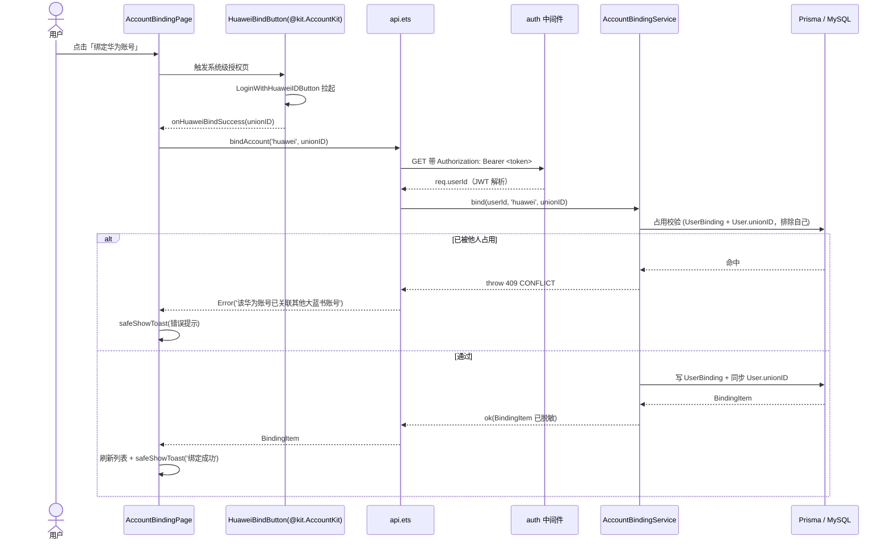
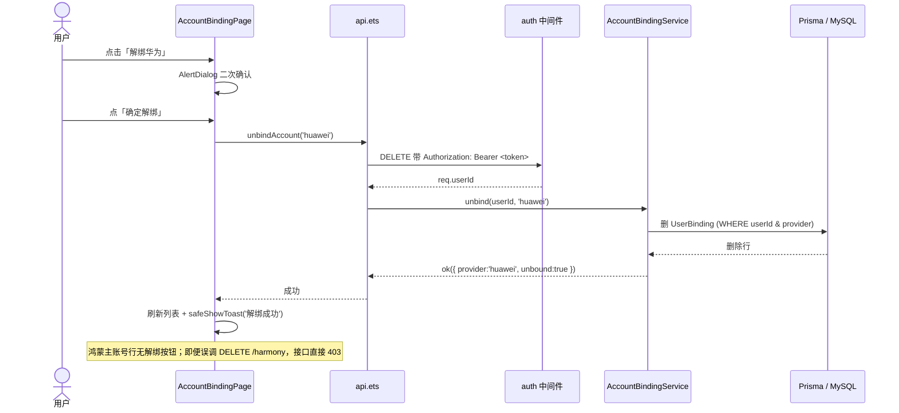
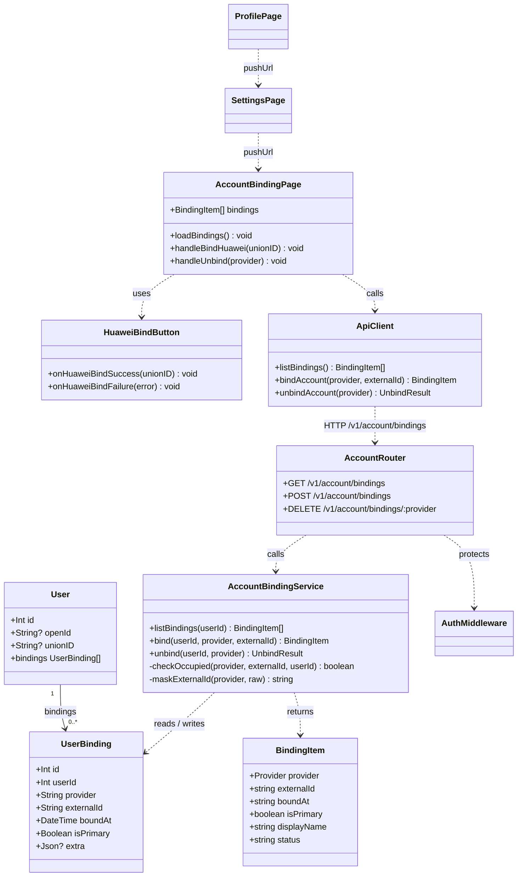

# 系统设计文档 · 账号绑定管理页（大蓝书）

> 文档类型：架构设计 + 任务分解（不含实现代码）
> 作者：高见远（架构师）
> 关联 PRD：`entry/Docs/prd-account-binding.md`
> 技术栈：前端 HarmonyOS NEXT（ArkTS + ArkUI，API 24，V1 严格模式）· 后端 Node.js + Express + TypeScript + Prisma + MySQL（端口 3000）

---

## 0. 核心设计决策（拍板项速览）

| 决策点 | 结论 |
| :--- | :--- |
| **数据模型** | 采用**独立 `UserBinding` 表** `{ id, userId, provider, externalId, boundAt, isPrimary, extra? }`，`(userId, provider)` 唯一。 |
| **`User.unionID` 冗余列** | **保留并同步**。绑定华为时同时写 `UserBinding` 与 `User.unionID`，兼容现有 `loginWithHuawei`（按 `unionID` findOrCreate）逻辑。 |
| **鸿蒙主账号在列表中的呈现** | **不落 `UserBinding` 行**，由 `GET` 接口从 `User.openId` / `User.createdAt` **合成**为 `provider='harmony'` 的置顶项（`isPrimary=true`）。理由：主账号是账号身份、不可变、永驻，不属于"绑定关系"语义；这样既满足"列表以 `UserBinding` 为准"（第三方关系唯一真源仍是表），又无需改登录流程、天然防锁死。 |
| **provider 枚举值** | `'harmony'`（鸿蒙主账号）/ `'huawei'`（华为）/ `'wechat'`（微信，P1）。常量统一定义，避免散落字符串。 |
| **华为授权交互** | 走 Account Kit **系统级授权页**（复用 `LoginWithHuaweiIDButton` 思路，新做 `HuaweiBindButton` 暴露 `unionID`），非 WebView。前端直接取 `unionID` 调 `POST /v1/account/bindings`（body `{provider, externalId}`），契合既定接口契约。 |
| **解绑策略** | 鸿蒙主账号**无解绑入口 + DELETE 接口直接 403**；第三方（华为）自由解绑。主账号永驻 → 天然满足"至少一种登录方式"约束。 |
| **Prisma 变更方式** | 用 `prisma db push`（非 migrate），因 DB 用户无建库权；变更仅为**新增表 + 虚拟关系**（对 `User` 无新增列），属安全可加操作。 |

---

## 1. 实现方案 + 框架选型

### 1.1 后端落地

- **框架**：沿用现有 Express + TS + Prisma + MySQL，端口 3000，统一响应 `{ code, data, message }`。
- **鉴权中间件复用**：直接 `import { auth } from '../middleware/auth'`，三个接口全部 `auth` 保护；`req.userId` 来自 JWT `payload.userId`，**所有 DB 操作强制以 `req.userId` 为过滤条件**，杜绝越权。
- **路由组织**：新增 `backend/src/routes/account.ts`，在 `backend/src/app.ts` 中以 `app.use('/v1/account', accountRouter)` 挂载（与现有 `/v1/auth`、`/v1/posts` 同级）。
- **业务分层**：`account.ts` 仅做参数校验 + 鉴权透传 + 调 `accountBindingService.ts`；占用校验 / 写表 / 同步 `User.unionID` / 脱敏 全部在 service 内，便于单测（复用现有 `auth.huawei.test.ts` 的 in-process 测试模式）。
- **错误码**：**完全复用** `utils/response.ts` 现有 `CODE`（`401/400/409/403/404/500`），**无需改动 response.ts**。
- **Schema 变更方式**：`npx prisma db push` 推送 schema 到 DB（不生成迁移文件）；随后 `npx prisma generate` 刷新客户端类型。新增 `UserBinding` 为独立新表，并在 `User` 上追加虚拟关系 `bindings UserBinding[]`（无新列，仅外键落在 `UserBinding.userId`），属纯增量、零数据风险操作。

### 1.2 前端落地

- **语言/框架**：ArkTS + ArkUI，V1 严格模式（catch 不标类型、throw 只抛 `Error`、对象字面量带上下文类型）。
- **请求封装复用**：在现有 `services/api.ets` 的 `api` 客户端上**新增** `listBindings / bindAccount / unbindAccount` 三个函数（不新建文件，保持单 API 文件结构）。
- **鉴权头**：`api.ets` 的 `request` 已自动从 `AppStorage.get('authToken')` 注入 `Authorization: Bearer <token>`，无需改动。
- **华为授权**：新建 `components/HuaweiBindButton.ets`，复用 `@kit.AccountKit` 的 `LoginWithHuaweiIDButton` + `loginComponentManager`，回调提取 `response.unionID` 后通过 `onHuaweiBindSuccess(unionID)` 暴露给页面（与现有 `HuaweiLoginButton` 只取 `code` 形成职责区分，互不干扰）。
- **提示**：统一用 `utils/toast.ets` 的 `safeShowToast(this.getUIContext(), { message })`。
- **导航**：沿用 `router.pushUrl` / `router.back()`（本期不迁 Navigation）。新页面需在 `src/main/resources/base/profile/main_pages.json` 注册。
- **入口改造**：`ProfilePage.ets` 右上角"设置"由占位 toast 改为 `router.pushUrl({ url: 'pages/SettingsPage' })`；`SettingsPage.ets` 放"账号绑定"行跳 `AccountBindingPage.ets`。

### 1.3 技术难点与选型理由

- **难点 1 · unionID 占用校验跨两套存储**：华为 unionID 可能存在于 `UserBinding`（新）或 `User.unionID`（旧登录）。→ 校验时**两处都查**，任一处命中他人即返回 `409`。
- **难点 2 · 主账号永驻且不可解绑**：→ 列表合成 + DELETE 接口对 `harmony` 直接 `403`，双保险。
- **难点 3 · ArkTS V1 严格模式限制**：→ 对象字面量（接口请求体、BindingItem）全部带显式类型；catch 不注解；错误统一 `Error`。
- **选型理由**：独立 `UserBinding` 表契合"列出全部绑定 / 增删 / 统计 / 横向扩 provider"的诉求，加微信等 P1 provider 只插一行不改 schema；冗余 `User.unionID` 兼容既有华为登录链路，成本极低。

---

## 2. 文件列表及相对路径

### 2.1 后端（相对 `backend/`）

| 操作 | 路径 | 说明 |
| :--- | :--- | :--- |
| 改 | `prisma/schema.prisma` | 新增 `UserBinding` model；`User` 增加 `bindings UserBinding[]` 关系 |
| 改 | `src/app.ts` | 挂载 `app.use('/v1/account', accountRouter)` |
| 新 | `src/routes/account.ts` | 三个接口路由（GET/POST/DELETE `/v1/account/bindings`），复用 `auth` 中间件 |
| 新 | `src/services/accountBindingService.ts` | 占用校验、写表、同步 `User.unionID`、脱敏、列表合成 |
| 新 | `src/routes/account.test.ts` | in-process 集成测试（复用 `auth.huawei.test.ts` 模式，mock prisma） |

> 注：`src/utils/response.ts`、`src/middleware/auth.ts`、`src/prisma.ts` **无需改动**（错误码与鉴权已齐备）。

### 2.2 前端（相对 `entry/`）

| 操作 | 路径 | 说明 |
| :--- | :--- | :--- |
| 改 | `src/main/ets/models/types.ets` | 新增 `Provider`、`BindingItem` 类型与请求/响应接口 |
| 改 | `src/main/ets/services/api.ets` | 新增 `listBindings / bindAccount / unbindAccount` 及入参类型 |
| 新 | `src/main/ets/components/HuaweiBindButton.ets` | 复用 `LoginWithHuaweiIDButton` 暴露 `unionID` 的绑定专用按钮 |
| 新 | `src/main/ets/pages/SettingsPage.ets` | 极简设置页，含"账号绑定"入口行 |
| 新 | `src/main/ets/pages/AccountBindingPage.ets` | 账号绑定管理页（列表 + 绑定/解绑 + 二次确认） |
| 改 | `src/main/ets/pages/ProfilePage.ets` | "设置"由占位 toast 改为跳 `SettingsPage` |
| 改 | `src/main/resources/base/profile/main_pages.json` | 注册 `pages/SettingsPage`、`pages/AccountBindingPage` |

> 注：`utils/auth.ets`、`utils/toast.ets`、`utils/nav.ts` **无需改动**（登录态、toast 已齐备）。

---

## 3. 数据结构和接口

### 3.1 Prisma Model（追加到 `schema.prisma`）

```prisma
// 账号绑定关系表（第三方/主账号绑定统一以本表为准，横向扩展友好）
model UserBinding {
  id         Int      @id @default(autoincrement())
  userId     Int
  user       User     @relation(fields: [userId], references: [id], onDelete: Cascade)
  provider   String   @db.VarChar(32)   // 'harmony' | 'huawei' | 'wechat' ... 见共享知识
  externalId String   @db.VarChar(128)  // 各 provider 的外部标识：openId / unionID / openid
  boundAt    DateTime @default(now())
  isPrimary  Boolean  @default(false)   // 当前仅 harmony 主账号为 true（合成项）
  extra      Json?    // 扩展位：头像/昵称快照等，本期未用

  @@unique([userId, provider])          // (userId, provider) 唯一：同一用户同 provider 仅一条
  @@index([provider, externalId])       // 占用校验：快速查"该 externalId 是否已被他人占用"
}

model User {
  // ... 现有字段保持不变（id / openId / unionID / nickname / avatar / ...）...
  bindings UserBinding[]                // ← 新增虚拟关系（不新增列，FK 在 UserBinding.userId）
}
```

### 3.2 前端 `BindingItem` 接口（追加到 `types.ets`）

```ts
// 绑定 provider 枚举（与后端保持一致，单一来源）
export type Provider = 'harmony' | 'huawei' | 'wechat';

// 账号绑定列表项（后端返回已脱敏 externalId）
export interface BindingItem {
  provider: Provider;        // 'harmony' | 'huawei' | 'wechat'
  externalId: string;        // 已脱敏展示串，如 '****1234'
  boundAt: string;           // ISO 时间串
  isPrimary: boolean;        // true 仅鸿蒙主账号
  displayName: string;       // 中文展示名：'鸿蒙账号' / '华为账号' / '微信'
  status: 'primary' | 'bound' | 'unbound'; // 主账号 / 已绑定 / 未绑定（P1 预留）
}

// 绑定请求体（POST /v1/account/bindings）
export interface BindAccountBody {
  provider: Provider;
  externalId: string;        // 华为场景即 unionID
}

// 解绑响应（DELETE /v1/account/bindings/:provider）
export interface UnbindResult {
  provider: Provider;
  unbound: boolean;
}
```

### 3.3 三个后端接口契约

**GET `/v1/account/bindings`**（需鉴权）
- 响应 `data`：`BindingItem[]`，固定顺序：鸿蒙（主账号，合成）→ 华为 → 微信（P1，本期无）→ 其他。
- 鸿蒙项由 `User.openId` / `User.createdAt` 合成，`isPrimary=true`，`externalId` 脱敏。

**POST `/v1/account/bindings`**（需鉴权）
- 请求体：`{ "provider": "huawei", "externalId": "<unionID>" }`
- 校验：provider 合法；externalId 非空；`harmony` 不允许主动绑定（400）。
- 占用校验：在 `UserBinding`（`provider+externalId`）与 `User.unionID` 两处查"他人占用"，命中 → `409`。
- 成功：写 `UserBinding`（`isPrimary=false`）+ 同步 `User.unionID`；响应 `data`：新建的 `BindingItem`。

**DELETE `/v1/account/bindings/:provider`**（需鉴权）
- `:provider` 路径参数（如 `huawei`）。
- 校验：`harmony` → `403`（主账号不可解绑）；不存在 → `404`。
- 成功：删除该 `(userId, provider)` 行；响应 `data`：`{ provider, unbound: true }`。

统一错误码：`401`（缺/过期 token，auth 中间件）、`400`（参数缺）、`409`（已被他人占用）、`403`（解绑主账号）、`404`（绑定不存在）、`500`（服务端）。

---

## 4. 程序调用流程（时序图）

### 4.1 绑定华为账号



### 4.2 解绑第三方账号



### 4.3 类 / 结构关系图



---

## 5. 任务列表（有序、含依赖、按实现顺序）

> 总任务数：**4 个**（后端 1 + 前端 2 + 联调 1）。后端接口先于前端联调。

### T01 · 后端：数据模型 + 绑定服务 + 路由（含挂载）　【P0，无前置依赖】

- **涉及文件**：
  - `backend/prisma/schema.prisma`（新增 `UserBinding` model + `User.bindings` 关系）
  - `backend/src/app.ts`（挂载 `/v1/account` 路由）
  - `backend/src/services/accountBindingService.ts`（新建：list/bind/unbind + 占用校验 + 同步 unionID + 脱敏）
  - `backend/src/routes/account.ts`（新建：三个接口，复用 `auth` 中间件）
- **做什么**：
  1. 在 schema 中追加 `UserBinding` 与 `User.bindings` 关系；执行 `npx prisma db push` + `npx prisma generate`。
  2. `app.ts` 增加 `import accountRouter` 与 `app.use('/v1/account', accountRouter)`。
  3. service 实现：列表合成（harmony 置顶 + 第三方按优先级）、绑定（双处占用校验 → 409、写表、同步 `User.unionID`）、解绑（harmony → 403、不存在 → 404、删除行）、`maskExternalId`。
  4. route 实现：参数校验、调 service、用 `ok/fail` + `CODE` 统一响应。
- **验收点**：
  - `prisma db push` 成功，`UserBinding` 表存在，`(userId, provider)` 唯一约束生效。
  - 无 `Authorization` 调三接口均返回 `401`。
  - POST 同一 unionID 到两个不同账号：第二个返回 `409`，`message` 提示"已关联其他账号"。
  - DELETE `/harmony` 返回 `403`；DELETE 不存在的 provider 返回 `404`。
  - GET 返回首项为 `provider='harmony'`、`isPrimary=true`，`externalId` 已脱敏。

### T02 · 前端：数据模型 + API 封装 + 绑定按钮　【P0，依赖 T01 接口契约】

- **涉及文件**：
  - `entry/src/main/ets/models/types.ets`（新增 `Provider`、`BindingItem`、`BindAccountBody`、`UnbindResult`）
  - `entry/src/main/ets/services/api.ets`（新增 `listBindings / bindAccount / unbindAccount`）
  - `entry/src/main/ets/components/HuaweiBindButton.ets`（新建：复用 `LoginWithHuaweiIDButton` 暴露 `unionID`）
- **做什么**：
  1. `types.ets` 增加上述类型（带显式上下文类型，满足 V1 严格模式）。
  2. `api.ets` 增加三个函数，复用现有 `api` 客户端（自动带 token）；`bindAccount` 抛错时由页面捕获提示。
  3. `HuaweiBindButton.ets`：用 `loginComponentManager` 回调提取 `response.unionID`，通过 `onHuaweiBindSuccess(unionID)` 暴露；失败/取消走 `onHuaweiBindFailure`。
- **验收点**：
  - `api.ets` 三函数编译通过，请求路径/方法/body 与 T01 契约一致。
  - `HuaweiBindButton` 点击能拉起系统级华为授权页（非 WebView），确认后回调拿到 `unionID`；取消不触发成功回调。
  - 类型定义与后端 `BindingItem` 字段对齐。

### T03 · 前端：设置页 + 账号绑定页 + 入口改造 + 页面注册　【P0，依赖 T02】

- **涉及文件**：
  - `entry/src/main/ets/pages/SettingsPage.ets`（新建：极简设置页 + "账号绑定"行）
  - `entry/src/main/ets/pages/AccountBindingPage.ets`（新建：列表 + 绑定/解绑 + 二次确认 + 空状态）
  - `entry/src/main/ets/pages/ProfilePage.ets`（"设置"改为跳 `SettingsPage`）
  - `entry/src/main/resources/base/profile/main_pages.json`（注册两个新页面）
- **做什么**：
  1. `ProfilePage` 右上"设置"`onClick` 改为 `router.pushUrl({ url: 'pages/SettingsPage' })`（移除占位 toast）。
  2. `SettingsPage`：顶栏返回 + "设置"标题，列表项"账号绑定"→ `router.pushUrl({ url: 'pages/AccountBindingPage' })`。
  3. `AccountBindingPage`：`aboutToAppear` 调 `ensureLogin()` 后 `listBindings()`；按 `status` 渲染主账号（静态"主账号"标签、无解绑）/ 已绑定（"解绑"）/ 未绑定（P1 预留"绑定"灰显）；华为行"绑定"放 `HuaweiBindButton`，成功后 `safeShowToast('绑定成功')` 并刷新；"解绑"走 `AlertDialog` 二次确认（红色"确定解绑"），确认后 `unbindAccount` + toast + 刷新；无第三方绑定时展示空状态引导。
  4. `main_pages.json` 增加 `pages/SettingsPage`、`pages/AccountBindingPage`。
- **验收点**：
  - "我的 → 设置 → 账号绑定"三级跳转正确，返回链正常。
  - 列表首项恒为"鸿蒙账号 / 主账号"，无解绑按钮。
  - 绑定华为成功 toast + 列表即时刷新为"已绑定"；取消授权状态不变。
  - 解绑走二次确认，确定后刷新 + toast；解绑失败（如 409）有明确提示。
  - 空状态（无第三方绑定）有引导而非白屏。

### T04 · 联调与端到端验收　【P0，依赖 T01 + T03】

- **涉及文件**：
  - `backend/src/routes/account.test.ts`（新建：in-process 集成测试，mock prisma，覆盖 401/409/403/404/正常路径，复用 `auth.huawei.test.ts` 模式）
  - 前端真机/模拟器联调（不落新文件，按清单验证）
- **做什么**：
  1. 编写 `account.test.ts`：缺 token→401；同 unionID 跨账号→409；DELETE harmony→403；DELETE 不存在→404；正常 bind/unbind 路径。
  2. 执行 `prisma db push` + `prisma generate`，启动后端，跑测试。
  3. 前端连模拟器（`hdc rport tcp:3000 tcp:3000`）走完整链路：绑定→刷新→解绑→刷新；验证 toast、脱敏展示、二次确认、入口跳转。
- **验收点**：
  - 后端测试全绿；前端联调清单全通过（含 409 占用提示、主账号不可解绑双保险、脱敏正确）。
  - 未登录态不展示"账号绑定"入口（沿用 `ensureLogin`）。

---

## 6. 依赖包列表

### 后端
- **无需新增任何 npm 包**。`prisma` / `@prisma/client` / `express` / `jsonwebtoken` / `cors` 均已存在；华为换取 token 复用现有 `services/huaweiAuth.ts`（Node 原生 fetch，零依赖）。
- 仅需执行 `npx prisma db push` + `npx prisma generate`（属 prisma CLI 既有能力）。

### 前端
- **无需新增任何 import / SDK**。`@kit.AccountKit`（含 `LoginWithHuaweiIDButton`、`loginComponentManager`）已在 HarmonyOS SDK 内置；`@kit.ArkUI`、`@kit.NetworkKit`、`@kit.BasicServicesKit` 均内置。
- 仅新增自有 `.ets` 文件（见 §2.2）。

---

## 7. 共享知识（跨文件约定）

- **provider 枚举值（前后端单一来源）**：
  - `'harmony'`：鸿蒙主账号（展示、不可绑定/解绑）。
  - `'huawei'`：华为账号（本期可绑定/解绑，externalId = unionID）。
  - `'wechat'`：微信（P1，本期不出现在后端逻辑，仅类型预留）。
  - 后端 `accountBindingService.ts` 顶部定义 `ALLOWED_BIND_PROVIDERS = ['huawei']`（可绑定列表，P0 仅 huawei；harmony 由列表合成）；前端 `types.ets` 定义 `Provider` 联合类型。
- **externalId 脱敏规则**（仅后端返回时脱敏，存储为明文）：
  - `harmony`：`openId` 较短，保留前 2 后 2，中间 `****`（长度 ≤6 则整体 `****`）。
  - `huawei` / `wechat`：`unionID/openid` 较长，保留末 4 位 → `'****' + raw.slice(-4)`。
  - 前端**绝不**接收明文 externalId；列表展示直接用后端返回串。
- **错误码约定**（复用 `utils/response.ts` 的 `CODE`）：
  - `401` 缺/过期 token（auth 中间件统一返回）。
  - `400` 参数缺失（缺 provider / externalId / 对 harmony 发起绑定）。
  - `409` 该 externalId 已被**其他**账号占用（绑定冲突）。
  - `403` 试图解绑主账号（harmony）。
  - `404` 待解绑的绑定不存在。
  - `500` 服务端异常。
- **token 获取方式**：前端从 `AppStorage.get('authToken')` 读取（由 `utils/auth.ets` 的 `setSession` 持久化）；`api.ets` 的 `request` 已自动注入 `Authorization: Bearer <token>`，业务页面无需手动处理。
- **列表顺序约定**：GET 返回数组固定顺序 = `harmony`(主账号) → `huawei` → `wechat`(P1) → 其他（按 `displayName` 字典序兜底）。后端 `listBindings` 负责排序，前端按序渲染即可。
- **`isPrimary` 语义**：仅合成的 harmony 主账号项 `isPrimary=true`；`UserBinding` 表内行本期恒为 `false`（未来若支持"纯第三方注册"再启用）。
- **越权防护**：所有 `UserBinding` 读写必须以 `req.userId`（JWT 解析）为 `userId` 过滤条件；占用校验排除自身（`NOT { userId }`）。

---

## 8. 待明确事项（需用户 / PM 确认）

1. **【关键技术风险】`HuaweiIDCredential` 是否在本期真机直接暴露 `unionID`？**
   现有 `HuaweiLoginButton` 回调仅取 `authorizationCode`，未使用 `unionID`；华为 Account Kit 在 `LoginWithHuaweiIDButton` 场景下，`unionID` 是否随凭证回调下发需**真机联调确认**。
   - 若**直接暴露**：本设计（前端取 `unionID` → POST `{provider, externalId}`）成立。
   - 若**不暴露**（仅给 code）：需改为「前端取 `code` → 后端换 `unionID`」的绑定变体，POST body 改 `{provider, code}`，后端复用 `huaweiAuth.ts` 的 `exchangeCodeForToken + fetchHuaweiUserProfile` 取 unionID 后再写表。届时同步调整接口契约与 `HuaweiBindButton` 暴露的回调（改为 `onHuaweiBindSuccess(code)`）。**建议 T02/T03 开工前先在真机验证一次**，以锁定契约形态。
2. **微信（P1）授权形态**：原生 SDK vs 应用内 Web 弹层，本期不做，P1 启动时复评（不影响 P0 数据模型，已预留 `wechat` provider）。
3. **绑定成功是否触发站内安全消息（P1-2）**：本期 P0 仅 `safeShowToast` 提示，不发站内信；是否需要在 P0 就预埋消息写入接口，待 PM 定。
4. **主账号 `boundAt` 取值**：本期用 `User.createdAt` 作为主账号"创建（本机登录）"时间，是否符合产品预期？如希望显示"首次绑定时间"需另存字段（本期不引入）。
5. **软删除 / 审计**：本期 `UserBinding` 硬删；P2 异常检测（P2-1）如需"失效但保留记录"，再引入 `deletedAt` 或 `status` 字段。
6. **`User.unionID` 唯一约束与绑定同步的一致性**：本期保证"同一 unionID 仅属于一个账号"（冲突校验 + 唯一列）。若未来允许"一个华为号关联多个大蓝书号"（多主），需放开 `unionID` 唯一约束——本期按"一对一"落地。

---

> 文档结束。配套图：`entry/Docs/class-diagram.mermaid`（类/结构关系）、`entry/Docs/sequence-diagram.mermaid`（绑定/解绑时序）。
