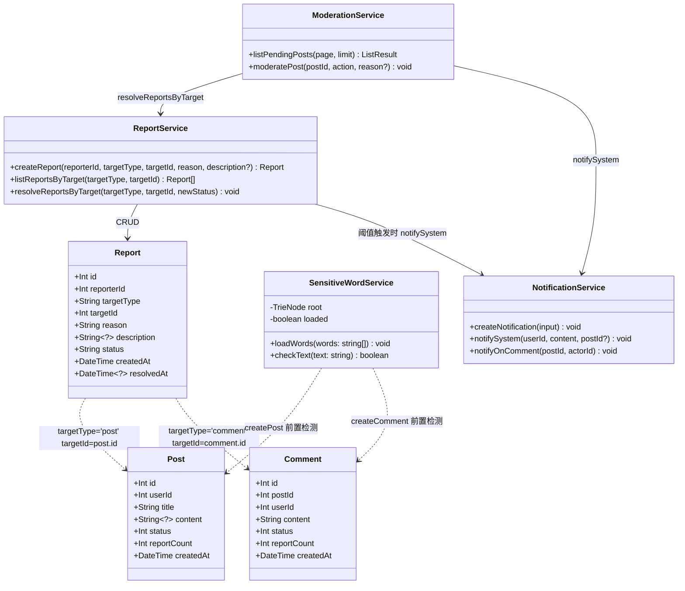
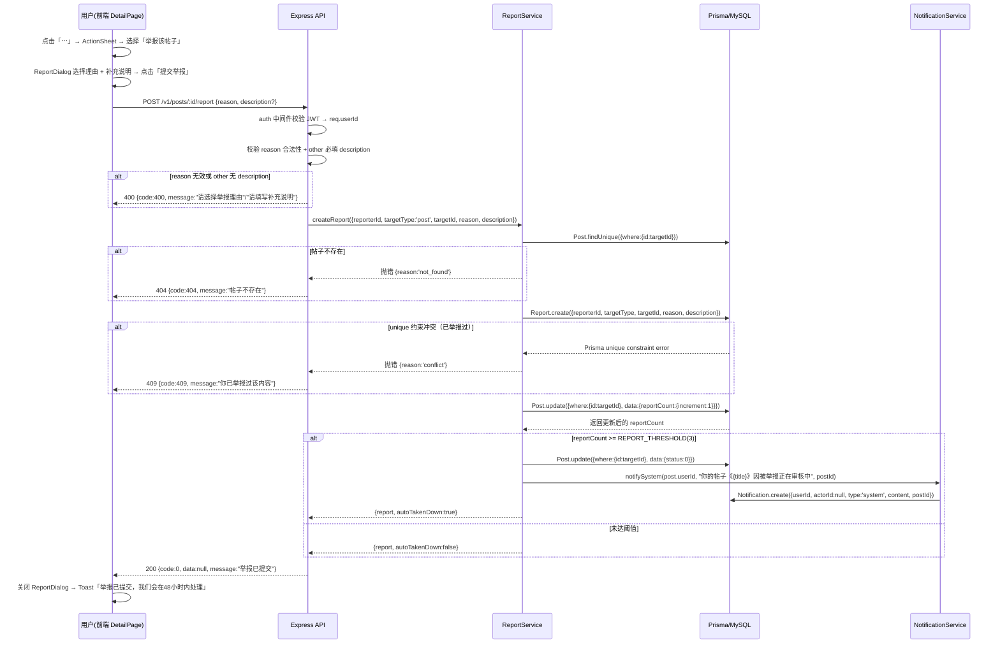
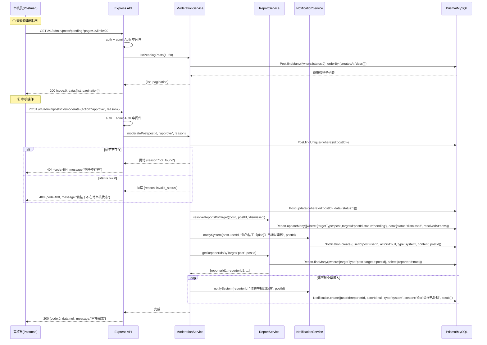
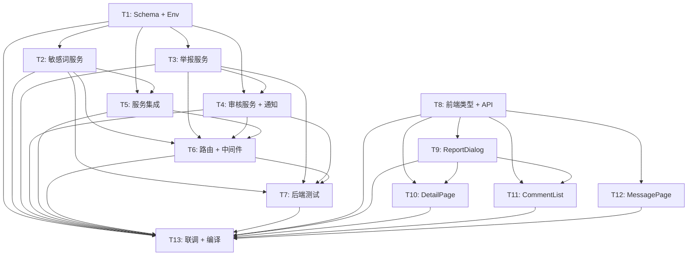

# 系统设计：内容审核 & 举报系统

> 项目：大蓝书 HarmonyOS NEXT 应用（男性生活经验社区）
> 版本：v1.0
> 日期：2025-07
> 关联文档：[PRD](./prd-content-moderation.md)
> 架构师：高见远

---

## 1. 实现方案总览

### 1.1 整体架构

本系统在现有「大蓝书」架构（Node.js + Express + TS + Prisma + MySQL 后端 / HarmonyOS NEXT ArkTS V1 前端）基础上，新增三道内容安全防线：

1. **敏感词前置过滤**：发帖/评论前由后端 `SensitiveWordService` 单例检测，命中即返回 400，不写入数据库。
2. **用户举报**：用户在帖子详情页/评论区通过「⋯」→ ActionSheet → 举报弹窗提交举报；举报累计达阈值（默认 3）自动下架（status=0）进入待审核队列。
3. **开发者审核**：开发者通过 admin API（Postman/curl）查看待审帖子并 approve/reject，系统自动通知作者和举报人。

数据流：`前端提交 → 敏感词检测 → 落库 status=1 → 用户举报 → reportCount++ → 达阈值 status=0 自动下架 → admin 审核 → status=1(恢复)/status=2(拒绝) → 系统通知`

### 1.2 关键技术选型

| 决策点 | 选型 | 理由 |
|--------|------|------|
| 敏感词检测 | **自实现 Trie 树**（非 Set、非外部包） | ToolGood.Words 是 C# 原生无 Node.js 版；Set+includes 在 5000+ 词时 O(n×m) 性能差；Trie 实现 O(n×L)（n=文本长度，L=最长词长度），代码量约 60 行，无外部依赖，性能与覆盖率均优于 Set |
| 敏感词库 | **纯文本文件** `backend/data/sensitive-words.txt` + `backend/data/gender-war-words.txt` | 每行一个词，启动时 fs.readFileSync 加载到 Trie，无热更新需求（P1 再做） |
| admin 鉴权 | **环境变量 `ADMIN_USER_IDS`** + `adminAuth` 中间件 | MVP 单人审核，校验 `req.userId` 是否在列表中，403 拒绝。复用现有 `auth` 中间件先解析 token |
| 举报阈值 | **环境变量 `REPORT_THRESHOLD`**（默认 3） | `reportService.createReport` 中 increment reportCount 后判断是否 >= 阈值 |
| 举报幂等 | **Prisma `@@unique([reporterId, targetType, targetId])`** | 数据库级保证同一用户对同一内容仅举报一次；冲突时捕获 Prisma error 返回 409 |
| 前端 ActionSheet | `this.getUIContext().showActionMenu()` | API 24 推荐方式；若不可用则降级为 CustomDialog（见风险评估） |
| 前端举报弹窗 | `@CustomDialog` 装饰器 + `CustomDialogController` | ArkTS V1 原生弹窗机制，支持自定义布局 |

### 1.3 敏感词库加载策略

```
后端进程启动
  → SensitiveWordService 单例初始化
  → fs.readFileSync('backend/data/sensitive-words.txt')  // 通用敏感词
  → fs.readFileSync('backend/data/gender-war-words.txt')  // 男女对立引战词
  → 合并去重 → 逐词插入 Trie 树
  → 全局单例就绪，后续请求直接调用 checkText()
```

- 文件路径基于 `process.cwd()`（即 `backend/` 目录）
- 若文件不存在，日志告警但不崩溃（降级为空词库，不拦截）
- 词库预计 5000-20000 词，Trie 内存占用 < 2MB

---

## 2. 文件列表及改动类型

### 后端 — 新增文件

| 文件 | 类型 | 说明 |
|------|------|------|
| `backend/src/services/sensitiveWordService.ts` | 新增 | 敏感词检测单例服务（Trie 树 + checkText） |
| `backend/src/services/reportService.ts` | 新增 | 举报 CRUD + 阈值触发自动下架 |
| `backend/src/services/moderationService.ts` | 新增 | 待审帖子列表 + 审核操作（approve/reject） |
| `backend/src/middleware/adminAuth.ts` | 新增 | admin 鉴权中间件 |
| `backend/src/routes/admin.ts` | 新增 | admin 审核 API 路由 |
| `backend/data/sensitive-words.txt` | 新增 | 通用敏感词库（种子文件，约 50 词） |
| `backend/data/gender-war-words.txt` | 新增 | 男女对立引战词库（种子文件，约 20 词） |
| `backend/src/services/sensitiveWordService.test.ts` | 新增 | 敏感词服务单元测试 |
| `backend/src/services/reportService.test.ts` | 新增 | 举报服务单元测试 |
| `backend/src/routes/admin.test.ts` | 新增 | admin 路由集成测试 |

### 后端 — 修改文件

| 文件 | 类型 | 说明 |
|------|------|------|
| `backend/prisma/schema.prisma` | 修改 | 新增 Report 模型 + Post.reportCount + Comment.status/reportCount |
| `backend/src/config/env.ts` | 修改 | 新增 adminUserIds、reportThreshold |
| `backend/src/services/postService.ts` | 修改 | createPost 接入敏感词前置检测 |
| `backend/src/services/commentService.ts` | 修改 | createComment 接入敏感词前置检测；listComments 过滤 status=1 |
| `backend/src/services/notificationService.ts` | 修改 | 新增 notifySystem 函数 |
| `backend/src/routes/posts.ts` | 修改 | 新增 POST /:id/report 路由 |
| `backend/src/routes/comments.ts` | 修改 | 新增 POST /comments/:id/report 路由 |
| `backend/src/app.ts` | 修改 | 挂载 admin 路由 |
| `backend/.env.example` | 修改 | 新增 ADMIN_USER_IDS、REPORT_THRESHOLD |

### 前端 — 新增文件

| 文件 | 类型 | 说明 |
|------|------|------|
| `entry/src/main/ets/components/ReportDialog.ets` | 新增 | 举报弹窗组件（理由单选 + 补充说明 + 提交/取消） |

### 前端 — 修改文件

| 文件 | 类型 | 说明 |
|------|------|------|
| `entry/src/main/ets/models/types.ets` | 修改 | 新增 ReportReason 类型 + ReportBody 接口 |
| `entry/src/main/ets/services/api.ets` | 修改 | 新增 reportPost/reportComment；修改 request 错误处理以透传后端 message |
| `entry/src/main/ets/pages/DetailPage.ets` | 修改 | 顶部「⋯」按钮 + ActionSheet + 举报弹窗 + 待审核横幅 + 敏感词 Toast |
| `entry/src/main/ets/components/CommentList.ets` | 修改 | 每条评论右侧「⋯」按钮 + ActionSheet + 举报回调 |
| `entry/src/main/ets/pages/MessagePage.ets` | 修改 | system 类型通知渲染样式优化（系统图标 + 背景色区分） |

**合计：新增 11 个文件，修改 14 个文件。**

---

## 3. 数据模型设计

### 3.1 新增 Report 模型（Prisma schema）

```prisma
// 举报记录表
model Report {
  id          Int       @id @default(autoincrement())
  reporterId  Int                          // 举报人 userId
  targetType  String    @db.VarChar(10)    // 'post' | 'comment'
  targetId    Int                          // 目标帖子或评论 ID
  reason      String    @db.VarChar(20)    // 举报理由枚举值（见 §9.2）
  description String?   @db.VarChar(200)   // 补充说明（reason='other' 时必填）
  status      String    @default('pending') @db.VarChar(20) // pending | resolved | dismissed
  createdAt   DateTime  @default(now())
  resolvedAt  DateTime?

  @@unique([reporterId, targetType, targetId])  // 同一用户对同一内容仅能举报一次（幂等）
  @@index([targetType, targetId])               // 按内容查举报记录
  @@index([status, createdAt])                  // 审核队列按状态+时间排序
}
```

### 3.2 Post 模型新增字段

```prisma
// 在现有 Post 模型中新增：
reportCount  Int  @default(0)  // 被举报累计次数（达阈值自动 status=0）
```

> Post 现有 `status Int @default(0)` 字段无需改动（0-待审核 1-已发布 2-已拒绝），语义完全复用。

### 3.3 Comment 模型新增字段

```prisma
// 在现有 Comment 模型中新增：
status       Int  @default(1)  // 1-正常 0-隐藏(待审核) 2-已删除
reportCount  Int  @default(0)  // 被举报累计次数
```

> **迁移注意**：Comment 表已有数据新增 `status` 字段，`@default(1)` 使存量评论自动标记为「正常」，无需手动数据修复。

### 3.4 关系图（Mermaid classDiagram）



### 3.5 建表迁移命令

```bash
cd backend
npx prisma db push    # 禁止 prisma migrate dev（bigbluebook 用户无 CREATE DATABASE 权限）
npx prisma generate   # 重新生成 client
# ⚠️ 改 schema 后必须重启后端进程（tsx watch 会自动重启），让新 PrismaClient 生效
```

---

## 4. 后端服务设计

### 4.1 sensitiveWordService.ts（新增 — 单例）

```typescript
// backend/src/services/sensitiveWordService.ts

// Trie 节点
interface TrieNode {
  children: Map<string, TrieNode>;
  isEnd: boolean;
}

class SensitiveWordService {
  private root: TrieNode;
  private loaded: boolean;

  constructor() {
    this.root = { children: new Map(), isEnd: false };
    this.loaded = false;
  }

  // 启动时调用：从文件加载词库并构建 Trie
  // filePaths: 词库文件路径数组（相对于 process.cwd()）
  loadFromFiles(filePaths: string[]): void {
    // 逐文件 readFileSync → split('\n') → trim → 过滤空行 → insert
    // 多文件合并去重
    // this.loaded = true
  }

  // 向 Trie 插入单个词（转小写）
  private insert(word: string): void { ... }

  // 检测文本是否包含任意敏感词
  // 返回 true=命中 false=未命中（不暴露具体命中词）
  checkText(text: string): boolean {
    // 1. text.toLowerCase()
    // 2. 遍历每个起始位置 i，沿 Trie 向下匹配
    // 3. 任一节点 isEnd=true → return true
    // 4. 全部遍历完无命中 → return false
  }

  isLoaded(): boolean { return this.loaded; }
}

// 全局单例
export const sensitiveWordService = new SensitiveWordService();
```

**调用契约**：
- `checkText(text: string): boolean` — 发帖检测 `title + ' ' + content`；评论检测 `content`
- 启动时在 `app.ts` 或 `index.ts` 中调用 `sensitiveWordService.loadFromFiles(['data/sensitive-words.txt', 'data/gender-war-words.txt'])`

### 4.2 reportService.ts（新增）

```typescript
// backend/src/services/reportService.ts
import { prisma } from '../prisma';
import { sensitiveWordService } from './sensitiveWordService';
import { notifySystem } from './notificationService';
import { env } from '../config/env';

export type TargetType = 'post' | 'comment';
export type ReportReason = 'political' | 'pornographic' | 'personal_attack' |
  'gender_war' | 'advertisement' | 'spam' | 'other';

// 创建举报（幂等：同一用户同一内容仅一次）
// 抛出错误：{ reason: 'conflict' } 重复举报；{ reason: 'not_found' } 目标不存在
export async function createReport(params: {
  reporterId: number;
  targetType: TargetType;
  targetId: number;
  reason: ReportReason;
  description?: string;
}): Promise<{ report: any; autoTakenDown: boolean }>;
// 逻辑：
// 1. 校验 reason='other' 时 description 必填
// 2. 校验目标是否存在（Post/Comment findUnique）
// 3. prisma.report.create({ ... }) — unique 约束冲突 → 抛 conflict
// 4. 递增目标 reportCount（Post.update 或 Comment.update）
// 5. 判断 reportCount >= env.reportThreshold → 更新 status=0 + notifySystem 作者
// 6. 返回 { report, autoTakenDown }

// 按目标查询举报记录（供审核使用）
export async function listReportsByTarget(
  targetType: TargetType,
  targetId: number
): Promise<any[]>;

// 批量更新某目标的所有 pending 举报状态（审核时调用）
export async function resolveReportsByTarget(
  targetType: TargetType,
  targetId: number,
  newStatus: 'resolved' | 'dismissed'
): Promise<void>;
// 逻辑：prisma.report.updateMany({
//   where: { targetType, targetId, status: 'pending' },
//   data: { status: newStatus, resolvedAt: new Date() }
// })

// 获取某目标的所有举报人 ID（用于审核后通知举报人）
export async function getReporterIdsByTarget(
  targetType: TargetType,
  targetId: number
): Promise<number[]>;
```

### 4.3 moderationService.ts（新增）

```typescript
// backend/src/services/moderationService.ts
import { prisma } from '../prisma';
import { resolveReportsByTarget, getReporterIdsByTarget } from './reportService';
import { notifySystem } from './notificationService';

// 待审核帖子列表（status=0）
export async function listPendingPosts(
  page: number = 1,
  limit: number = 20
): Promise<{ list: any[]; pagination: { page: number; limit: number; total: number } }>;
// 逻辑：prisma.post.findMany({
//   where: { status: 0 },
//   orderBy: { createdAt: 'desc' },
//   skip, take,
//   include: { user: { select: { id, nickname, avatar } } }
// })

// 审核帖子
// action: 'approve' → status=1, reports → dismissed
// action: 'reject'  → status=2, reports → resolved
// 抛出错误：{ reason: 'not_found' } 帖子不存在；{ reason: 'invalid_status' } 非待审状态
export async function moderatePost(
  postId: number,
  action: 'approve' | 'reject',
  reason?: string
): Promise<void>;
// 逻辑：
// 1. 查帖子，校验 status===0
// 2. Post.update({ status: action==='approve' ? 1 : 2 })
// 3. resolveReportsByTarget('post', postId, action==='approve' ? 'dismissed' : 'resolved')
// 4. 通知作者：
//    approve → notifySystem(post.userId, `你的帖子《${post.title}》已通过审核`, postId)
//    reject  → notifySystem(post.userId, `你的帖子《${post.title}》未通过审核${reason ? '，原因：' + reason : ''}`, postId)
// 5. 通知所有举报人：
//    reporterIds = await getReporterIdsByTarget('post', postId)
//    for (id of reporterIds) notifySystem(id, '你的举报已处理', postId)
//    （不透露审核结果，统一告知"已处理"）
```

### 4.4 notificationService.ts（修改 — 新增 notifySystem）

```typescript
// 在现有 notificationService.ts 中新增：

// 系统通知（actorId=null, type='system'）
export async function notifySystem(
  userId: number,
  content: string,
  postId?: number | null
): Promise<void>;
// 逻辑：createNotification({
//   userId,
//   actorId: null,
//   type: 'system',
//   content,
//   postId: postId ?? null
// })
```

> 现有 `createNotification` 函数已支持 `actorId: null` 和 `type: 'system'`，无需改动数据层。

### 4.5 postService.ts（修改）

```typescript
// createPost 修改：新增敏感词前置检测
export async function createPost(data: any, userId: number) {
  // 新增：敏感词检测
  const fullText = (data.title ?? '') + ' ' + (data.content ?? '');
  if (sensitiveWordService.checkText(fullText)) {
    const err = new Error('内容含敏感词，请修改后重试');
    (err as any).reason = 'sensitive_word';
    throw err;
  }
  // 原有逻辑不变
  return prisma.post.create({ data: { ..., status: 1 } });
}

// getPost 修改：include comments 时过滤 status=1
export async function getPost(id: number) {
  return prisma.post.findFirst({
    where: { id },
    include: {
      user: { select: { id: true, nickname: true, avatar: true } },
      comments: {
        where: { status: 1 },          // ← 新增：仅返回正常评论
        orderBy: { upCount: 'desc' },
        take: 50,
        include: { user: { select: { id: true, nickname: true, avatar: true } } },
      },
    },
  });
}

// listPosts 无需改动（已过滤 status: 1，举报下架 status=0 自动从信息流消失）
```

### 4.6 commentService.ts（修改）

```typescript
// createComment 修改：新增敏感词前置检测
export async function createComment(
  postId: number, userId: number, content: string,
  parentId?: number | null, isFact = 0
) {
  // 新增：敏感词检测
  if (sensitiveWordService.checkText(content)) {
    const err = new Error('内容含敏感词，请修改后重试');
    (err as any).reason = 'sensitive_word';
    throw err;
  }
  // 原有逻辑不变（status 默认 1，由 schema @default(1) 保证）
  const comment = await prisma.comment.create({ data: { postId, userId, content, parentId: parentId ?? null, isFact } });
  notifyOnComment(postId, userId).catch(() => {});
  return comment;
}

// listComments 修改：过滤 status=1
export async function listComments(postId: number, page = 1, limit = 50) {
  const skip = (page - 1) * limit;
  const where = { postId, status: 1 };  // ← 新增 status: 1
  const [list, total] = await Promise.all([
    prisma.comment.findMany({ where, orderBy: { upCount: 'desc' }, skip, take: limit,
      include: { user: { select: { id: true, nickname: true, avatar: true } } } }),
    prisma.comment.count({ where }),
  ]);
  return { list, pagination: { page, limit, total } };
}
```

### 4.7 env.ts（修改）

```typescript
// 在现有 env 对象中新增：
export const env = {
  // ... 现有字段不变 ...

  // 内容审核 & 举报系统
  adminUserIds: (process.env.ADMIN_USER_IDS ?? '')
    .split(',')
    .map((s) => parseInt(s.trim(), 10))
    .filter((n) => !isNaN(n) && n > 0),
  reportThreshold: Number(process.env.REPORT_THRESHOLD ?? 3),
};
```

### 4.8 adminAuth.ts（新增中间件）

```typescript
// backend/src/middleware/adminAuth.ts
import { Response, NextFunction } from 'express';
import { AuthRequest } from './auth';
import { fail, CODE } from '../utils/response';
import { env } from '../config/env';

// admin 鉴权中间件（必须在 auth 之后使用，依赖 req.userId）
export function adminAuth(req: AuthRequest, res: Response, next: NextFunction) {
  if (!req.userId || !env.adminUserIds.includes(req.userId)) {
    return fail(res, CODE.FORBIDDEN, '无管理员权限', 403);
  }
  return next();
}
```

---

## 5. API 路由设计

### 5.1 举报路由

#### POST /v1/posts/:id/report — 举报帖子

| 项目 | 内容 |
|------|------|
| 鉴权 | 登录态（auth 中间件） |
| Body | `{ reason: ReportReason, description?: string }` |
| 成功 | `{ code: 0, data: null, message: "举报已提交" }` |
| 重复举报 | `{ code: 409, data: null, message: "你已举报过该内容" }`（HTTP 409） |
| other 无 description | `{ code: 400, data: null, message: "请填写补充说明" }` |
| 帖子不存在 | `{ code: 404, data: null, message: "帖子不存在" }`（HTTP 404） |

挂载位置：`backend/src/routes/posts.ts`，在 `GET /:id` 之后注册。

#### POST /v1/comments/:id/report — 举报评论

| 项目 | 内容 |
|------|------|
| 鉴权 | 登录态 |
| Body | `{ reason: ReportReason, description?: string }` |
| 响应 | 同上（帖子→评论） |

挂载位置：`backend/src/routes/comments.ts`。

**路由处理逻辑（以帖子为例）**：

```typescript
// posts.ts 新增
router.post('/:id/report', auth, async (req: AuthRequest, res: Response) => {
  const postId = Number(req.params.id);
  const { reason, description } = req.body ?? {};

  // 校验 reason
  const validReasons = ['political', 'pornographic', 'personal_attack', 'gender_war', 'advertisement', 'spam', 'other'];
  if (!reason || !validReasons.includes(reason)) {
    return fail(res, CODE.BAD_REQUEST, '请选择举报理由');
  }
  // other 必填 description
  if (reason === 'other' && (!description || !description.trim())) {
    return fail(res, CODE.BAD_REQUEST, '请填写补充说明');
  }

  try {
    await reportService.createReport({
      reporterId: req.userId!,
      targetType: 'post',
      targetId: postId,
      reason,
      description: description?.trim() || undefined,
    });
    return ok(res, null, '举报已提交');
  } catch (e: any) {
    if (e.reason === 'conflict') return fail(res, CODE.CONFLICT, '你已举报过该内容', 409);
    if (e.reason === 'not_found') return fail(res, CODE.NOT_FOUND, '帖子不存在', 404);
    return fail(res, CODE.SERVER_ERROR, '举报失败', 500);
  }
});
```

### 5.2 审核 API（admin 鉴权）

路由文件：`backend/src/routes/admin.ts`，挂载于 `app.use('/v1/admin', adminRouter)`。

所有 admin 路由统一使用 `router.use(auth, adminAuth)` 前置中间件。

#### GET /v1/admin/posts/pending?page=&limit= — 待审帖子列表

| 项目 | 内容 |
|------|------|
| 鉴权 | auth + adminAuth |
| Query | `page`（默认 1）、`limit`（默认 20，最大 50） |
| 成功 | `{ code: 0, data: { list: Post[], pagination: {...} }, message: "success" }` |

#### POST /v1/admin/posts/:id/moderate — 审核帖子

| 项目 | 内容 |
|------|------|
| 鉴权 | auth + adminAuth |
| Body | `{ action: "approve" \| "reject", reason?: string }` |
| 成功 | `{ code: 0, data: null, message: "审核完成" }` |
| 帖子不存在 | `{ code: 404, ..., message: "帖子不存在" }` |
| 非待审状态 | `{ code: 400, ..., message: "该帖子不在待审核状态" }` |

```typescript
// admin.ts
const router = Router();
router.use(auth, adminAuth);

router.get('/posts/pending', async (req: AuthRequest, res: Response) => {
  const page = req.query.page ? Number(req.query.page) : 1;
  const limit = req.query.limit ? Number(req.query.limit) : 20;
  const data = await moderationService.listPendingPosts(page, limit);
  return ok(res, data);
});

router.post('/posts/:id/moderate', async (req: AuthRequest, res: Response) => {
  const postId = Number(req.params.id);
  const { action, reason } = req.body ?? {};
  if (!action || !['approve', 'reject'].includes(action)) {
    return fail(res, CODE.BAD_REQUEST, 'action 必须为 approve 或 reject');
  }
  try {
    await moderationService.moderatePost(postId, action, reason);
    return ok(res, null, '审核完成');
  } catch (e: any) {
    if (e.reason === 'not_found') return fail(res, CODE.NOT_FOUND, '帖子不存在', 404);
    if (e.reason === 'invalid_status') return fail(res, CODE.BAD_REQUEST, '该帖子不在待审核状态');
    return fail(res, CODE.SERVER_ERROR, '审核失败', 500);
  }
});

export default router;
```

### 5.3 app.ts 路由挂载

```typescript
// app.ts 新增
import adminRouter from './routes/admin';
import { sensitiveWordService } from './services/sensitiveWordService';

// 启动时加载敏感词库
sensitiveWordService.loadFromFiles(['data/sensitive-words.txt', 'data/gender-war-words.txt']);

// ... 现有路由不变 ...
app.use('/v1/admin', adminRouter);
```

### 5.4 .env.example 新增

```bash
# 内容审核 & 举报系统
ADMIN_USER_IDS=1
REPORT_THRESHOLD=3
```

---

## 6. 前端改动设计

### 6.1 types.ets — 新增类型

```typescript
// 举报理由枚举（与后端 ReportReason 单一来源对齐）
export type ReportReason = 'political' | 'pornographic' | 'personal_attack' |
  'gender_war' | 'advertisement' | 'spam' | 'other';

// 举报请求体
export interface ReportBody {
  reason: ReportReason;
  description?: string;
}

// 举报目标类型
export type ReportTargetType = 'post' | 'comment';
```

### 6.2 api.ets — 新增 API + 修改错误处理

**新增举报 API**：

```typescript
// POST /v1/posts/:id/report
export async function reportPost(id: number, body: ReportBody): Promise<void> {
  await api.post<null>('/v1/posts/' + id + '/report', body);
}

// POST /v1/comments/:id/report
export async function reportComment(id: number, body: ReportBody): Promise<void> {
  await api.post<null>('/v1/comments/' + id + '/report', body);
}
```

**修改 request 错误处理**（关键：让 400/409 等错误响应的 message 透传到前端）：

```typescript
// 现有逻辑：
// if (resp.responseCode !== 200) {
//   throw new Error('HTTP ' + resp.responseCode);
// }
// const result = resp.result as ApiResult<T>;
// if (result.code !== 0) {
//   throw new Error(result.message || '请求失败');
// }

// 修改为：先尝试解析 body 中的业务错误，再 fallback 到 HTTP 状态码
const result = resp.result as ApiResult<T>;
if (result && typeof result.code === 'number') {
  if (result.code !== 0) {
    throw new Error(result.message || '请求失败');
  }
  return result.data;
}
// fallback：非 JSON 响应或无 code 字段
if (resp.responseCode !== 200) {
  throw new Error('HTTP ' + resp.responseCode);
}
throw new Error('请求失败');
```

> 此改动使敏感词 400、重复举报 409、参数校验 400 等错误的后端 message 能透传到前端 catch 块，前端用 `(e as Error).message` 即可获取提示文案。

### 6.3 ReportDialog.ets — 举报弹窗组件（新增）

```typescript
// entry/src/main/ets/components/ReportDialog.ets
import { ReportReason } from '../models/types';

@CustomDialog
export struct ReportDialog {
  controller: CustomDialogController;
  targetType: string = 'post';   // 'post' | 'comment'
  targetId: number = 0;
  onSubmit: (reason: ReportReason, description: string) => void = () => {};

  @State selectedReason: ReportReason = 'political';
  @State description: string = '';
  @State submitting: boolean = false;

  // 理由列表（ArkTS V1 禁用对象字面量数组直接渲染，用具名 interface）
  private reasonList: ReasonItem[] = [
    { value: 'political', label: '涉政敏感' },
    { value: 'pornographic', label: '色情低俗' },
    { value: 'personal_attack', label: '人身攻击' },
    { value: 'gender_war', label: '男女对立引战' },
    { value: 'advertisement', label: '广告推广' },
    { value: 'spam', label: '垃圾信息' },
    { value: 'other', label: '其他（需填写说明）' },
  ];

  // 提交按钮是否可用
  private canSubmit(): boolean {
    if (this.submitting) return false;
    if (this.selectedReason === 'other') {
      return this.description.trim().length > 0;
    }
    return true;
  }

  build() {
    Column({ space: 16 }) {
      Text('举报').fontSize(18).fontWeight(600)
      Text('请选择举报理由：').fontSize(14).fontColor($r('app.color.text_secondary'))

      // 单选理由列表（ForEach + Radio）
      ForEach(this.reasonList, (item: ReasonItem) => {
        Row({ space: 8 }) {
          Radio({ value: item.value, group: 'reportReason' })
            .checked(this.selectedReason === item.value)
            .onChange((isChecked: boolean) => {
              if (isChecked) this.selectedReason = item.value;
            })
          Text(item.label).fontSize(15)
        }
      }, (item: ReasonItem) => item.value)

      // 补充说明
      Text('补充说明（选填）：').fontSize(14).fontColor($r('app.color.text_secondary'))
      TextArea({ placeholder: '请输入补充说明（选填，最多200字）', text: this.description })
        .maxLength(200)
        .height(80)
        .onChange((v: string) => { this.description = v; })

      // 按钮行
      Row({ space: 12 }) {
        Button('取消').layoutWeight(1).onClick(() => { this.controller.close(); })
        Button('提交举报')
          .layoutWeight(1)
          .enabled(this.canSubmit())
          .onClick(() => {
            this.submitting = true;
            this.onSubmit(this.selectedReason, this.description.trim());
          })
      }
    }
    .padding(20)
    .backgroundColor($r('app.color.card_bg'))
    .borderRadius(16)
  }
}

interface ReasonItem {
  value: ReportReason;
  label: string;
}
```

### 6.4 DetailPage.ets — 修改

#### 6.4.1 顶部导航右侧「⋯」按钮

```typescript
// 现有：Text('').width(48)
// 改为：
Text('⋯')
  .fontSize(22)
  .fontColor($r('app.color.text_primary'))
  .width(48)
  .textAlign(TextAlign.Center)
  .onClick(() => this.showPostActions())
```

#### 6.4.2 ActionSheet 弹出

```typescript
private showPostActions(): void {
  // 方案 A（首选）：getUIContext().showActionMenu
  this.getUIContext().showActionMenu({
    title: '操作',
    buttons: [
      { text: '举报该帖子', color: '#FF453A' },
      { text: '分享', color: '#333333' },
    ]
  }).then((index: number) => {
    if (index === 0) {
      this.reportController.open();
    } else if (index === 1) {
      this.onShare();
    }
  }).catch(() => {});

  // 方案 B（fallback，若 showActionMenu 不可用）：
  // 用 this.getUIContext().showAlertDialog() 或 CustomDialog 实现
}
```

#### 6.4.3 ReportDialog 控制器

```typescript
// DetailPage struct 内新增
private reportController: CustomDialogController = new CustomDialogController({
  builder: ReportDialog({
    targetType: 'post',
    targetId: this.pid,
    onSubmit: (reason: ReportReason, description: string) => {
      this.submitReport(reason, description);
    },
  }),
  alignment: DialogAlignment.Center,
  customStyle: false,
});

private async submitReport(reason: ReportReason, description: string): Promise<void> {
  try {
    await reportPost(this.pid, { reason, description: description || undefined });
    this.reportController.close();
    safeShowToast(this.getUIContext(), { message: '举报已提交，我们会在48小时内处理' });
  } catch (e) {
    const msg: string = (e as Error).message;
    this.reportController.close();
    safeShowToast(this.getUIContext(), { message: msg });  // 透传后端错误（如"你已举报过该内容"）
  }
}
```

#### 6.4.4 待审核横幅（作者查看自己 status=0 帖子）

```typescript
// 在帖子内容区域顶部、标签之前插入
if (this.post.status === 0 && this.post.userId === getUserId()) {
  Row({ space: 8 }) {
    Text('⏳').fontSize(14)
    Text('该帖子正在审核中，仅你自己可见')
      .fontSize(13)
      .fontColor('#FF9500')
  }
  .width('100%')
  .padding({ left: 12, right: 12, top: 8, bottom: 8 })
  .backgroundColor('#FFF8E1')
  .borderRadius(8)
}
```

需 import `getUserId` from `'../utils/auth'`。

#### 6.4.5 敏感词 Toast（评论提交）

```typescript
// onSendComment 的 catch 块修改
async onSendComment(): Promise<void> {
  // ...
  try {
    await createComment(this.post.id, { content: text });
    // ...
  } catch (e) {
    // 透传后端错误 message（如"内容含敏感词，请修改后重试"）
    safeShowToast(this.getUIContext(), { message: (e as Error).message });
  }
}
```

### 6.5 CommentList.ets — 修改

#### 6.5.1 新增举报回调属性

```typescript
@Component
export struct CommentList {
  @Prop comments: Comment[] = [];
  // 新增：举报回调（由 DetailPage 传入，打开 ReportDialog）
  reportCommentHandler: (commentId: number) => void = (_id: number) => {};
  // ...
}
```

#### 6.5.2 每条评论右侧「⋯」按钮

```typescript
// 在评论 Row 的 Column（layoutWeight(1)）之后新增
Text('⋯')
  .fontSize(18)
  .fontColor($r('app.color.text_secondary'))
  .width(32)
  .textAlign(TextAlign.Center)
  .onClick(() => {
    this.getUIContext().showActionMenu({
      title: '操作',
      buttons: [
        { text: '举报该评论', color: '#FF453A' },
      ]
    }).then((index: number) => {
      if (index === 0 && c.id !== undefined) {
        this.reportCommentHandler(c.id);
      }
    }).catch(() => {});
  })
```

#### 6.5.3 DetailPage 传入回调

```typescript
// DetailPage build() 中
CommentList({
  comments: this.post.comments ?? [],
  reportCommentHandler: (commentId: number) => {
    this.openCommentReport(commentId);
  },
})
```

```typescript
// DetailPage 新增评论举报逻辑
private commentReportId: number = 0;

private commentReportController: CustomDialogController = new CustomDialogController({
  builder: ReportDialog({
    targetType: 'comment',
    targetId: this.commentReportId,
    onSubmit: (reason: ReportReason, description: string) => {
      this.submitCommentReport(reason, description);
    },
  }),
  alignment: DialogAlignment.Center,
});

private openCommentReport(commentId: number): void {
  this.commentReportId = commentId;
  this.commentReportController.open();
}

private async submitCommentReport(reason: ReportReason, description: string): Promise<void> {
  try {
    await reportComment(this.commentReportId, { reason, description: description || undefined });
    this.commentReportController.close();
    safeShowToast(this.getUIContext(), { message: '举报已提交，我们会在48小时内处理' });
  } catch (e) {
    this.commentReportController.close();
    safeShowToast(this.getUIContext(), { message: (e as Error).message });
  }
}
```

### 6.6 MessagePage.ets — system 通知样式优化

现有 MessagePage 已处理 `type='system'` 的图标（`typeIcon` 返回 '📢'），但 system 通知 `actor` 为 null 时头像区域逻辑可优化：

```typescript
// notificationRow builder 中，头像区域修改：
if (item.type === 'system') {
  // 系统通知：固定图标 + 品牌色背景圆
  Circle({ width: 40, height: 40 })
    .fill($r('app.color.brand_primary'))
  Text('📢')
    .fontSize(18)
    .fontColor(Color.White)
    .position({ x: 10, y: 9 })
} else if (item.actor && item.actor.avatar) {
  // 普通通知：用户头像
  Image(item.actor.avatar)...
} else {
  // 普通通知：昵称首字兜底
  ...
}
```

---

## 7. 程序调用流程（Mermaid 时序图）

### 7.1 用户举报帖子完整时序



### 7.2 开发者审核帖子完整时序



> **reject 流程**与 approve 对称：status→2，reports→resolved，作者通知「未通过审核」+ reason，举报人仍仅通知「你的举报已处理」。

---

## 8. 任务列表（按实现顺序，含依赖关系）

```
T1:  Prisma Schema + 环境变量配置
     文件: backend/prisma/schema.prisma, backend/src/config/env.ts, backend/.env.example
     依赖: 无
     优先级: P0

T2:  敏感词服务 + 词库文件
     文件: backend/src/services/sensitiveWordService.ts, backend/data/sensitive-words.txt, backend/data/gender-war-words.txt
     依赖: T1
     优先级: P0

T3:  举报服务
     文件: backend/src/services/reportService.ts
     依赖: T1
     优先级: P0

T4:  审核服务 + 系统通知扩展
     文件: backend/src/services/moderationService.ts, backend/src/services/notificationService.ts
     依赖: T1, T3
     优先级: P0

T5:  后端服务集成 — 发帖/评论接入敏感词 + 评论过滤
     文件: backend/src/services/postService.ts, backend/src/services/commentService.ts
     依赖: T1, T2
     优先级: P0

T6:  后端路由 + admin 中间件 + 敏感词库启动加载
     文件: backend/src/middleware/adminAuth.ts, backend/src/routes/admin.ts, backend/src/routes/posts.ts, backend/src/routes/comments.ts, backend/src/app.ts
     依赖: T2, T3, T4, T5
     优先级: P0

T7:  后端 Jest 测试
     文件: backend/src/services/sensitiveWordService.test.ts, backend/src/services/reportService.test.ts, backend/src/routes/admin.test.ts
     依赖: T2, T3, T4, T6
     优先级: P1

T8:  前端类型定义 + API 封装 + request 错误处理修改
     文件: entry/src/main/ets/models/types.ets, entry/src/main/ets/services/api.ets
     依赖: 无（可与 T1-T7 并行）
     优先级: P0

T9:  ReportDialog 举报弹窗组件
     文件: entry/src/main/ets/components/ReportDialog.ets
     依赖: T8
     优先级: P0

T10: DetailPage 集成 — 举报入口 + ActionSheet + 待审核横幅 + 敏感词 Toast
     文件: entry/src/main/ets/pages/DetailPage.ets
     依赖: T8, T9
     优先级: P0

T11: CommentList 集成 — 评论举报入口
     文件: entry/src/main/ets/components/CommentList.ets, entry/src/main/ets/pages/DetailPage.ets
     依赖: T8, T9
     优先级: P0

T12: MessagePage 系统通知样式优化
     文件: entry/src/main/ets/pages/MessagePage.ets
     依赖: T8
     优先级: P1

T13: 前后端联调 + assembleHap 编译验证
     文件: 全项目
     依赖: T1-T12
     优先级: P0
```

### 任务依赖图



---

## 9. 共享知识（跨文件约定）

### 9.1 响应格式

所有 API 响应统一 `{ code: number, data: T, message: string }` 格式：
- `code: 0` = 成功
- `code: 400` = 参数错误 / 敏感词命中
- `code: 401` = 未登录
- `code: 403` = 无权限（非 admin）
- `code: 404` = 内容不存在
- `code: 409` = 重复举报
- `code: 500` = 服务器错误

### 9.2 举报理由枚举（前后端共用）

| 枚举值 | 显示文案 | 说明 |
|--------|----------|------|
| `political` | 涉政敏感 | 涉政敏感言论 |
| `pornographic` | 色情低俗 | 色情低俗内容 |
| `personal_attack` | 人身攻击 | 恶意攻击、辱骂他人 |
| `gender_war` | 男女对立引战 | 煽动男女对立的言论 |
| `advertisement` | 广告推广 | 软文、带货链接 |
| `spam` | 垃圾信息 | 无实质内容的刷屏/灌水 |
| `other` | 其他 | 需填写补充说明（必填） |

- 后端定义：`backend/src/services/reportService.ts` 中的 `ReportReason` 类型
- 前端定义：`entry/src/main/ets/models/types.ets` 中的 `ReportReason` 类型
- 两端枚举值必须完全一致

### 9.3 状态码约定

**Post.status**：0=待审核（被举报下架） / 1=已发布 / 2=已拒绝

**Comment.status**：1=正常 / 0=隐藏（被举报下架） / 2=已删除

**Report.status**：pending=待处理 / resolved=举报成立（内容违规） / dismissed=举报驳回（内容未违规）

### 9.4 环境变量

| 变量 | 默认值 | 说明 |
|------|--------|------|
| `ADMIN_USER_IDS` | 无 | 逗号分隔的审核员 userId，如 `1` 或 `1,2,3` |
| `REPORT_THRESHOLD` | 3 | 举报自动下架阈值 |

### 9.5 敏感词库文件

- 路径：`backend/data/sensitive-words.txt`（通用敏感词）+ `backend/data/gender-war-words.txt`（男女对立引战词）
- 格式：每行一个词，UTF-8 无 BOM
- 加载时机：后端进程启动时（`app.ts` 中调用 `sensitiveWordService.loadFromFiles`）
- 不暴露命中词：`checkText` 仅返回 boolean，前后端均不记录/展示具体命中词

### 9.6 通知文案约定

| 场景 | 接收人 | 文案 |
|------|--------|------|
| 帖子被举报下架 | 帖子作者 | `你的帖子《{title}》因被举报正在审核中` |
| 审核通过 | 帖子作者 | `你的帖子《{title}》已通过审核` |
| 审核拒绝 | 帖子作者 | `你的帖子《{title}》未通过审核` + （有 reason 时追加 `，原因：{reason}`） |
| 举报处理完成 | 举报人 | `你的举报已处理` |

> 按主理人决策 Q7：举报人仅告知「举报已处理」，不透露通过/拒绝结果；但被举报内容被拒时通知作者「未通过审核」。

### 9.7 前端错误处理约定

修改 `api.ets` 的 `request` 函数后，所有非 `code:0` 的业务错误都会以 `throw new Error(result.message)` 抛出。前端各调用点 catch 块统一用 `(e as Error).message` 获取提示文案并 `safeShowToast`。

### 9.8 AppStorage key 命名

无新增 AppStorage key。举报弹窗状态为组件内部 `@State`，不跨页面共享。

---

## 10. 待明确事项

| # | 问题 | 影响 | 建议 |
|---|------|------|------|
| 1 | `showActionMenu` API 在 API 24 中是否可用 | 前端 ActionSheet 实现 | 工程师 T10 实现时先验证；若不可用，降级为 CustomDialog 实现 ActionSheet 效果 |
| 2 | 评论被举报下架后无审核恢复机制（P1-04 未纳入 P0） | 被举报评论永久隐藏 | MVP 可接受；P1 补 `POST /v1/admin/comments/:id/moderate` |
| 3 | 敏感词库种子文件内容需确认 | 词库覆盖率 | 架构师提供约 50 个通用 + 20 个引战种子词；上线前需扩充至完整 ToolGood.Words 词库 |
| 4 | `prisma db push` 对 Comment 新增 `status` 字段是否影响现有测试 | 既有 52 个 jest 测试 | 测试 mock 了 prisma，不依赖真实 DB，理论上不受影响；T7 需验证 |

---

## 11. 风险评估

### 11.1 Prisma Schema 迁移风险 — 🟡 中

**风险**：Comment 表新增 `status Int @default(1)` 字段，存量数据需赋默认值。

**影响**：`prisma db push` 会自动为存量行填充 `@default(1)`，存量评论自动标记为「正常」。但 push 过程中若表锁则短暂阻塞读写。

**缓解**：在低峰期执行 `prisma db push`；执行后验证 `SELECT COUNT(*) FROM Comment WHERE status != 1` 为 0。

### 11.2 既有 Jest 测试回归风险 — 🟢 低

**风险**：修改 `postService.createPost`、`commentService.createComment`、`commentService.listComments` 可能破坏既有测试。

**分析**：
- `postService.test.ts` 仅测试 `listPosts`（未改动），不涉及 `createPost`
- `commentService` 无现有测试文件
- 测试 mock 了 prisma，`sensitiveWordService` 在测试中需 mock 或使用空词库

**缓解**：T7 中新增测试时，mock `sensitiveWordService.checkText` 返回 false（不命中），确保既有逻辑路径不受影响。在 `createPost`/`createComment` 测试中需补充 mock sensitiveWordService。

### 11.3 敏感词检测性能 — 🟢 低

**风险**：词库过大导致检测延迟。

**分析**：Trie 树检测复杂度 O(n×L)，n=文本长度（帖子正文通常 < 5000 字），L=最长词长度（通常 < 10）。20000 词库 Trie 内存 < 2MB。单次检测 < 1ms。

**缓解**：启动时加载到内存单例，无请求级 IO。若后续词库超 50000 词，可考虑 Aho-Corasick 自动机优化（当前不必要）。

### 11.4 ArkTS V1 严格模式编译风险 — 🟡 中

**风险点**：

| 风险 | 概率 | 缓解 |
|------|------|------|
| `showActionMenu` API 不存在或签名不同 | 中 | T10 先验证；降级方案：CustomDialog 实现 |
| `@CustomDialog` + `CustomDialogController` 在严格模式下的限制 | 低 | 项目已有弹窗使用先例（如有），参照现有模式 |
| `Radio` 组件 `onChange` 回调签名 | 低 | 参照 HarmonyOS 官方文档 |
| `ReportDialog` 中 `onSubmit` 函数属性传递 | 低 | ArkTS V1 支持函数类型属性，需显式标注类型 |
| `CommentList` 新增 `reportCommentHandler` 函数属性 | 低 | 同上 |

**缓解策略**：T13 编译验证时集中排查 ArkTS 编译错误，参照项目已知坑清单逐项检查。

### 11.5 前端 request 函数修改的回归风险 — 🟡 中

**风险**：修改 `api.ets` 的 `request` 函数错误处理逻辑，可能影响现有的错误处理路径。

**分析**：现有代码中 `resp.responseCode !== 200` 时抛 `Error('HTTP ' + code)`，修改后改为先解析 body。对于 401（未登录）响应，body 为 `{ code: 401, message: "未登录" }`，修改后抛 `Error("未登录")` 而非 `Error("HTTP 401")`。

**影响**：现有前端 catch 块均使用固定文案 Toast（如"操作失败，请先登录"），不检查 error.message 内容，因此行为不变。但 `isNetworkConnectionError` 检查不受影响（它检查的是 catch 块中的原始错误，不是 request 内部逻辑）。

**缓解**：T13 联调时重点验证登录态失效、网络断开等异常场景。

### 11.6 举报幂等的并发风险 — 🟢 低

**风险**：同一用户快速双击提交举报，两个请求同时到达后端。

**缓解**：Prisma `@@unique([reporterId, targetType, targetId])` 约束在数据库层保证幂等，第二个请求触发 unique constraint error，被 catch 后返回 409。无需应用层锁。
