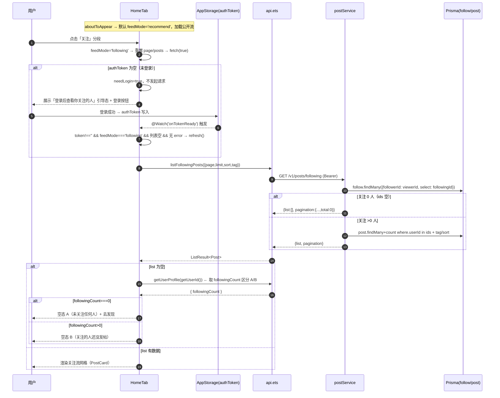

# 设计文档 · 关注流 feed（大蓝书 · 增量）

> 文档类型：增量架构设计（聚焦**变更部分**，对应当期 PRD `prd-follow-feed.md` 的 P0 范围）
> 作者：高见远（架构师）
> 关联系统：HarmonyOS NEXT 前端（ArkTS/ArkUI V1）· 后端 Node.js + Express + Prisma + MySQL（端口 3000）
> 范围：本期仅 P0（关注流切换 + 未登录引导 + 空态）。P1（圈子入口/红点）、P2（排序优化/性能）仅记录，不做。
> 主理人已拍板：Q1 完整继承过滤器（tag/sort 叠加，keyword 走搜索页）；Q2 仅首页顶部分段；Q3 复用 `getUserProfile(me).followingCount` 区分空态 A/B；Q4 默认「推荐」、不跨会话记忆。

---

## 1. 实现方案 + 框架选型

**一句话方案**：后端新增一个**鉴权**端点 `GET /v1/posts/following`，内部复用 `postService.listPosts` 仅追加一段 `following` 分支（`follow.findMany` 取被关注者 id 列表 → `where.userId in ids`），公开流 `GET /v1/posts` 零改动、零回归。前端在 `HomeTab` 顶栏之上新增一行「推荐 / 关注」分段控件，与现有三子 Tab（排序）、`TagNav`（标签）正交叠加；关注流走新封装的 `listFollowingPosts`，并复用 `MessagePage` 的 `@StorageLink('authToken') @Watch` 登录监听模式与 `getUserProfile(数字id).followingCount` 做空态 A/B 区分。

**框架选型**：零新依赖、零新表、零迁移。

| 层 | 技术 | 是否新增依赖 | 说明 |
| --- | --- | --- | --- |
| 后端 | Express + Prisma 原生 `follow.findMany` | 否 | 仅用已存在的 Prisma client，`Follow` 模型已落库（标量外键，无 `@relation`，用 `followerId`/`followingId` 直接查询） |
| 后端 | `auth` 中间件（`req.userId` 注入） | 否 | `posts.ts:3` 已导入，直接挂到新路由 |
| 前端 | ArkUI 内置 `Segmented`/条件渲染/`@StorageLink`/`@Watch` | 否 | 全部为 ArkUI 框架原生能力 |
| 前端 | `ToDo`/`router`/`AppStorage` | 否 | 沿用现有导航与存储约定 |

---

## 2. 文件列表（标注 新增 / 修改）

| 文件 | 动作 | 改动点摘要 |
| --- | --- | --- |
| `backend/src/services/postService.ts` | **修改** | `ListParams` 增加 `following?/viewerId?`；`listPosts` 在 `where` 组装后、`findMany` 前插入 following 分支（取 `follow` id 列表 / 空直返 / `userId in ids`） |
| `backend/src/routes/posts.ts` | **修改** | 新增 `router.get('/following', auth, handler)`，**必须注册在 `GET /:id` 之前**（即 `posts.ts:23` 之前） |
| `entry/src/main/ets/services/api.ets` | **修改** | 新增 `listFollowingPosts(params)`，请求 `GET /v1/posts/following`，返回 `ListResult<Post>`；复用现有 `toQuery`/`api.get` |
| `entry/src/main/ets/components/HomeTab.ets` | **修改** | 新增 `@State feedMode` + 顶部分段控件；`fetch` 按 `feedMode` 分支；`@StorageLink+@Watch` 登录引导；关注流专属空态 A/B + 未登录引导态；`feedMode` 切换重置 |
| `entry/src/main/ets/utils/auth.ets` | **确认无需改** | `getUserId()`（取当前登录 id，供 `viewerId`）、`getToken()` 已就绪，直接复用 |

---

## 3. 数据结构与接口

### 3.1 后端 `ListParams` 类型增量（postService.ts:5-12）

在现有字段后追加两个可选字段；函数体仅在 `following && viewerId` 为真时进入分支（沿用 PRD §6 伪码）：

```ts
export interface ListParams {
  page?: number;
  limit?: number;
  sort?: SortType;
  tag?: string;
  author?: number;
  keyword?: string;
  following?: boolean;   // 新增：走关注流分支
  viewerId?: number;     // 新增：当前登录用户 id（来自 auth 中间件 req.userId）
}
```

`listPosts` 内插入分支（位置：`where` 组装之后、`findMany` 之前）：

```ts
if (params.following && params.viewerId) {
  const follows = await prisma.follow.findMany({
    where: { followerId: params.viewerId },
    select: { followingId: true },
  });
  const ids = follows.map((f) => f.followingId);
  if (ids.length === 0) {
    return { list: [], pagination: { page, limit, total: 0 } };
  }
  where.userId = { in: ids };
}
```

> 分支内**不**与 `params.author` 冲突：`following` 流不传 `author`，`where.userId` 仅被该分支赋值一次。

### 3.2 新增端点契约表：`GET /v1/posts/following`

| 项 | 值 |
| --- | --- |
| 方法 | `GET` |
| 路径 | `/v1/posts/following` |
| 鉴权 | **必须**挂 `auth` 中间件（缺/过期 token → HTTP 401 + `code 401`，由中间件统一返回） |
| 注册位置 | `backend/src/routes/posts.ts` 中 `router.get('/:id', ...)` **之前**（避免被 `:id=following` 拦截） |
| Query 参数 | `page`(默认1)、`limit`(默认20，≤50)、`sort`(hot\|latest\|recommend)、`tag`(标签名，可选)、`keyword`(可选，本期首页流内不传，端点能力保留) |
| 内部调用 | `postService.listPosts({ following:true, viewerId: req.userId, page, limit, sort, tag, keyword })` |
| 成功响应 | HTTP 200，`{ code:0, data:{ list: Post[], pagination:{ page, limit, total } }, message:'' }`（`Post` 含 `user` 字段，复用现有 `include`） |
| 空关注集 | `list` 空、`total:0`，HTTP 200（**不查 post 表**，省一次 `count`） |
| 错误响应 | 401（未登录）/ 其他由 `fail()` 返回；**不会**因 `/following` 被当作 `:id` 而返回详情 404/401（路由顺序保证） |
| 前端解析 | 直用 `ListResult<Post>`，零改解析 |

### 3.3 前端 `listFollowingPosts` 函数签名（api.ets）

```ts
// GET /v1/posts/following?page=&limit=&sort=hot|latest|recommend&tag=
export function listFollowingPosts(params: {
  page?: number;
  limit?: number;
  sort?: SortType;
  tag?: string;
} = {}): Promise<ListResult<Post>> {
  const path = '/v1/posts/following' + toQuery([
    ['page', params.page],
    ['limit', params.limit],
    ['sort', params.sort],
    ['tag', params.tag],
  ]);
  return api.get<ListResult<Post>>(path);
}
```

> 参数与 `listPosts`（`ListPostsParams`）对称；`keyword` 不在此封装（走搜索结果页，Q1）。`request` 已自动带 `Authorization: Bearer`，鉴权透传零成本。

---

## 4. 程序调用流程（时序图）

### 4.1 HomeTab 切「关注」主线（含未登录引导 / 空态 A/B）



### 4.2 后端关注流数据来源（补充流程图，对应 PRD §4.4）

```mermaid
flowchart TD
    R[GET /v1/posts/following auth] --> S[listPosts following:true viewerId]
    S --> T[prisma.follow.findMany followerId=viewerId select followingId]
    T --> U{ids 空?}
    U -- 是 --> V[return list:[] total:0]
    U -- 否 --> W[where.userId in ids + tag/sort]
    W --> X[prisma.post.findMany + count]
    X --> Y[{list, pagination}]
```

---

## 5. 任务列表（按实现顺序，含依赖，标注后端/前端）

> 严格对应 PRD 的 P0-1～P0-5。顺序即工程师可直接执行的提交顺序；依赖项标在同列「依赖」。

| 序 | 编号 | 端 | 任务 | 依赖 | 验收要点 |
| --- | --- | --- | --- | --- | --- |
| 1 | **B1** | 后端 | `postService.ts` 加 following 分支：`ListParams` 增 `following?/viewerId?`；`listPosts` 在 `where` 组装后插入 follow.findMany 取 id 列表 / 空直返 / `where.userId in ids` | — | 关注 0 人返 `{list:[],total:0}`；关注多人仅返其公开帖；`tag/sort` 叠加生效；公开流零回归 |
| 2 | **B2** | 后端 | `posts.ts` 新增 `router.get('/following', auth, handler)`，解析 `page/limit/sort/tag/keyword` 后调用 `listPosts({following:true, viewerId: req.userId, ...})`，`ok(res, data)` 返回 | B1 | `GET /following` 注册在 `GET /:id` **之前**；缺 token → 401；契约表与 §3.2 一致 |
| 3 | **B3** | 前端 | `api.ets` 新增 `listFollowingPosts(params)`，复用 `toQuery`/`api.get`，返 `ListResult<Post>` | — | 签名与 §3.3 一致；请求 `/v1/posts/following`；自动带 Bearer |
| 4 | **F1** | 前端 | `HomeTab` 加 `feedMode` + 顶部分段控件 + `fetch` 分支：新增 `@State feedMode:'recommend'|'following'='recommend'`；顶栏之上加「推荐\|关注」分段；`fetch(reset)` 按 `feedMode` 调 `listPosts`/`listFollowingPosts`（sort/tag/page/limit 透传不变）；`aboutToAppear` 默认加载推荐流 | B3 | 分段切换即时生效；三子 Tab/TagNav 两流均生效；关注流仅含被关注者帖 |
| 5 | **F2** | 前端 | `HomeTab` 未登录引导态：照搬 `MessagePage` 的 `@StorageLink('authToken') @Watch('onTokenReady') token`；切关注且 `token===''` → `needLogin=true`、不拉数据；`onTokenReady()` 在 `token!=='' && feedMode==='following' && 列表空 && 无 error` 时自动 `refresh()`；「登录」按钮复用现有登录入口 | F1 | 未登录点关注显示引导态不报错；登录后自动加载关注流；不出现 401 刷屏 |
| 6 | **F3** | 前端 | `HomeTab` 空态 A/B 区分 + 去发现：关注流空列表（非 error）时，调 `getUserProfile(getUserId()).followingCount`（`getUserId()` 来自 `utils/auth.ets`）；`followingCount===0`→空态 A「去发现」；`>0`→空态 B「催更」；「去发现」跳圈子 Tab/他人主页 | F2, B3 | 两空态文案区分正确；去发现可达；关注流与推荐流空/错误态不互相污染 |
| 7 | **F4** | 前端 | `HomeTab` 空态/错误态复用与 `feedMode` 切换重置：列表区渲染顺序为「未登录引导 → 加载中 → 错误+重试 → 空态(关注流 A/B / 推荐流通用) → 网格」；切 `feedMode`/`sortIndex`/`tagIndex` 时统一 `refresh()`（重置 page、清空 posts、重置 followingCount 缓存）；错误态复用现有「⚠️+加载失败+重试」 | F1,F2,F3 | 复用现有 Loading/错误态组件；切换流不残留上一流数据；重试可用 |

> 说明：B1→B2 后端可独立联调（用 curl / Postman 带 token 验 `GET /following`）；B3 与 F1 同步；F2/F3/F4 为 `HomeTab` 内同一文件的连续改动，列开仅为清晰对应 PRD 条目，落地时在同一次编辑内完成即可。

---

## 6. 依赖包列表

**无**。（后端仅 Prisma 原生 `follow.findMany`；前端仅 ArkUI 内置组件与状态装饰器；无 `package.json` 变更、无 `oh-package.json5` 变更。）

---

## 7. 共享知识（跨文件约定 / 易错点）

> 这些约定贯穿前后端多处，工程师实现时务必遵守，避免返工。

1. **路由顺序坑（后端致命）**：`posts.ts` 的 `GET /following` **必须写在 `GET /:id` 之前**。Express 按注册顺序匹配，`/following` 会被 `:id` 当成 `id='following'` 命中详情路由 → 报 401/404 或解析错误。正确顺序：`GET /` → `GET /following` → `GET /:id` → `POST /` → `DELETE /:id`。
2. **`follow.findMany` 取 id 列表**：查询用 `where:{ followerId: viewerId }`，`select:{ followingId:true }`，再 `follows.map(f=>f.followingId)` 得 `ids`；`ids` 空则**直接返回空结果、不查 post 表**（省一次 `count`）。
3. **`Follow` 模型无 `@relation`**：是标量外键，`followerId`/`followingId` 直接作为字段查询，不要写 `follower`/`following` 关联导航。
4. **ArkTS V1 禁用对象展开/可选链**：`{ ...obj }`、对象/数组可选链（`a?.b?.c`）在严格模式会编译报错；判断空用普通 `if`、`this.list = this.list.concat(...)` 重赋值（参考 `MessagePage` 的 `slice()`+重赋值写法）。数组重赋值才触发 `@State` 刷新。
5. **数组重赋值触发刷新**：`this.posts = res.list`（reset）或 `this.posts = this.posts.concat(res.list)`（loadMore）——必须整体重赋值，不能用 `push`（ArkTS V1 `@State` 不感知 `push`）。
6. **`@StorageLink('authToken') @Watch('onTokenReady')` 登录模式**：统一照搬 `MessagePage.ets:36-52`。`aboutToAppear` 中 `if(getToken()!=='')` 才首次加载；`onTokenReady()` 仅在 `token!=='' && 列表空 && 无 error` 时补加载，避免重复拉取。
7. **`getUserProfile` 传数字 id、不自关**：`api.ets:406-409` 注释明确——**不要传 `'me'`**（`/v1/users` 下 `authRouter` 双挂 `/me` 会抢先命中返回缺计数的原始 user）。当前用户 id 用 `auth.ets` 的 `getUserId()`（返回 number，来自 `AppStorage['authUserId']`），调用形如 `getUserProfile(getUserId())`。
8. **空态 A/B 区分靠 `getUserProfile(me).followingCount`**：`/following` 返回 `total===0` 时，额外调一次 `getUserProfile(getUserId())` 读 `followingCount`：`0`→空态 A（去发现），`>0`→空态 B（催更）。该值为现有接口字段，无新接口。
9. **关注流 = 公开流过滤器 + `userId in 关注集合`**：`tag`/`sort` 在关注流内叠加生效（Q1）；`keyword` 不在此流（走搜索结果页）。`fetch` 分支仅切换数据源（`listPosts`/`listFollowingPosts`），`sort/tag/page/limit` 透传不变。
10. **`viewerId` 来源 = `auth` 中间件注入的 `req.userId`**：路由 handler 直接读 `req.userId`（参考 `POST /` 的 `req.userId!`），无需前端传 uid；前端 `listFollowingPosts` 不传 uid。
11. **默认「推荐」、不跨会话记忆**（Q4）：`feedMode` 初值 `'recommend'`，`aboutToAppear` 加载公开流；不写入 `PersistentStorage`/`AppStorage` 持久化，重启即回推荐。

---

## 8. 待明确事项

**无**。PRD 四项待拍板（Q1 过滤器叠加 / Q2 入口 / Q3 空态 A·B 区分 / Q4 默认与记忆）已由主理人按 PM 推荐全数拍板，设计据此闭环，本期仅做 P0，无遗留需用户决策项。P1（圈子入口、红点、关注时间排序）、P2（智能排序、IN 查询性能）按 PRD 记录，不在本期排期。
