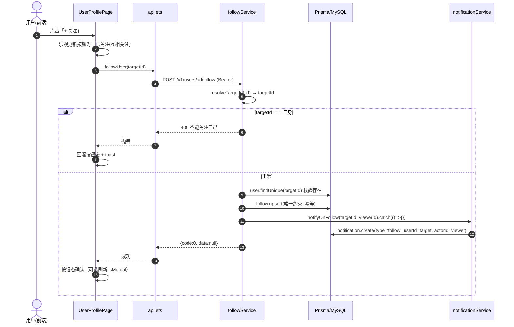
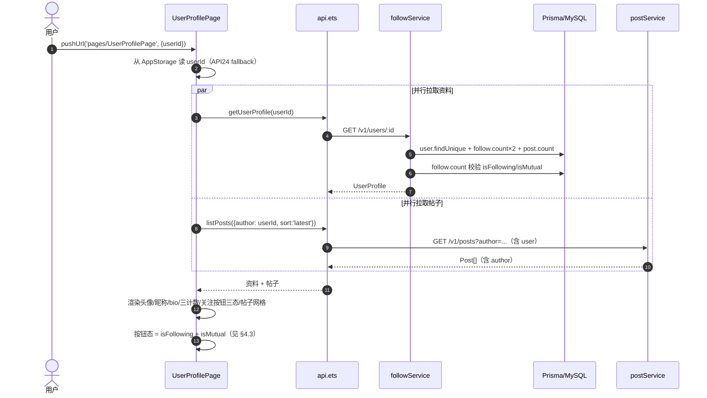

# 架构设计 · 关注 / 他人主页（大蓝书 · 增量）

> 作者：高见远（架构师）
> 输入：PRD `entry/Docs/prd-follow-profile.md`（许清楚）
> 主理人已拍板 PRD 待确认项（按 PM 推荐），本文据此设计，不再回头问 PM。
> 约束：仅产出设计文档，**不修改源码**（写本文件除外）。

---

## 0. 已拍板决策（来自主理人齐活林）

| 待确认项 | 决策 | 对设计的影响 |
| :--- | :--- | :--- |
| Q1 关注数/粉丝数 | **运行时聚合**（`prisma.follow.count`），不新增 User 冗余列 | 零计数维护；`User` 不加 `followingCount/followerCount` 列 |
| Q2 他人主页粉丝/关注可点 | **允许**，统一端点 `GET /v1/users/:id/following` 与 `/followers` | 「我的」传自己 id 复用同一逻辑 |
| Q3 简介编辑 UI | **本期不做**；仅 `User.bio` 字段 + 他人主页只读展示 | `updateMe` 预留 `bio?`（端点已存在，仅扩展持久化） |
| Q4 关注通知 | **发通知**（type='follow'）；**取关不撤回**；**取关二次确认弹窗** | 后端触发 `notificationService`；前端用 `UIContext.showAlertDialog` |
| Q5 PostCard 作者数据 | 已确认 `postService.listPosts` **已 `include user`** | 后端零改动，前端直接渲染作者区 |
| Q6 关注流 feed | **P2，本期不做** | 不排期 |

---

## 1. 实现方案 + 框架选型

**沿用现有技术栈，不引入任何新依赖。**

- 后端：Node.js + Express + Prisma（MySQL）+ TypeScript。新增 `Follow` 模型与 `User.bio` 列，通过 `prisma migrate` 落库；新增 `routes/users.ts` + `services/followService.ts`；复用现有 `auth` 中间件、`notificationService`、`utils/response`（`ok/fail/CODE`）。
- 前端：HarmonyOS NEXT ArkTS/ArkUI。新增 `UserProfilePage.ets`、`MyFollowPage.ets`；改造 `PostCard.ets`（作者区）、`ProfilePage.ets`（关注/粉丝入口）；复用现有 `api.ets` 的 `request` 封装、`utils/auth` 登录态、`utils/toast`、已有 `UIContext.showAlertDialog` / `@StorageLink` / `@Watch` 模式。
- **零新依赖确认**：后端仅用 Prisma 原生 `upsert`/`deleteMany`/`count`/`include`，无需新 npm 包；前端全部用 ArkUI 内置能力（`router`、`UIContext`、`@StorageLink`、`@Watch`、`ForEach`/`Grid`），无需新 ohpm 包。→ **依赖包列表见 §6「无」**。

**关键架构取舍**：
- `Follow` 模型建**正向关系**（`follower` / `following` → `User`），**不**在 `User` 上建反向数组（与 `Notification` 不建 `@relation` 的轻量取向一致，便于 `include` 取用户快照，且未来扩展关注流/互关态无需改表）。
- 关注/取关**幂等**：关注用 `upsert`（唯一约束 `(followerId, followingId)`），取关用 `deleteMany`（不存在不报错），保证重复操作安全。
- 关注通知触发走 `.catch(() => {})` 吞错，绝不阻断关注主流程（与 `interactService` 一致）。

---

## 2. 文件列表（相对仓库根）

| 文件 | 状态 | 说明 |
| :--- | :--- | :--- |
| `backend/prisma/schema.prisma` | **修改** | 新增 `Follow` 模型；`User` 增加 `bio String?` 列 |
| `backend/src/services/notificationService.ts` | **修改** | 新增 `notifyOnFollow(receiverId, actorId)` 辅助（复用 `createNotification`） |
| `backend/src/services/followService.ts` | **新增** | 关注/取关/资料/列表核心逻辑 |
| `backend/src/routes/users.ts` | **新增** | 5 个端点（profile / follow / unfollow / following / followers） |
| `backend/src/app.ts` | **修改** | `app.use('/v1/users', userRouter)` 挂载（在 authRouter 之后） |
| `backend/src/services/authService.ts` | **修改** | `updateProfile` 兼容 `bio?` 持久化（Q3 预留，端点已存在） |
| `backend/src/routes/auth.ts` | **修改** | `PUT /me` 透传 `bio` 至 `updateProfile` |
| `entry/src/main/ets/models/types.ets` | **修改** | `User.bio`；新增 `UserProfile`/`FollowUser`/`FollowListResult`/`FollowToggleResult` |
| `entry/src/main/ets/services/api.ets` | **修改** | 新增 `getUserProfile`/`followUser`/`unfollowUser`/`listFollowing`/`listFollowers`；`UpdateMeBody` 加 `bio?` |
| `entry/src/main/ets/pages/UserProfilePage.ets` | **新增** | 他人主页 |
| `entry/src/main/ets/pages/MyFollowPage.ets` | **新增** | 关注/粉丝列表页（mode 参数） |
| `entry/src/main/ets/components/PostCard.ets` | **修改** | 底部作者区 + 点击进他人主页 |
| `entry/src/main/ets/pages/ProfilePage.ets` | **修改** | 信息卡下加「关注 N / 粉丝 N」入口行 + bio 只读展示 |
| `entry/src/main/resources/base/profile/main_pages.json` | **修改** | 注册 `pages/UserProfilePage`、`pages/MyFollowPage`（先核实注册机制，见 §8） |

---

## 3. 数据结构与接口

### 3.1 Prisma Schema（`schema.prisma` 增量）

```prisma
// ===== User 增加 bio（在现有 User 模型内）=====
model User {
  // ... 现有字段不变 ...
  bio        String?  @db.VarChar(120) // 新增：个人简介
  // ... 其余字段保持 ...
}

// ===== 新增 Follow 关系表（独立表，轻量，不含 User 反向数组）=====
model Follow {
  id         Int      @id @default(autoincrement())
  followerId Int
  follower   User     @relation(fields: [followerId], references: [id], onDelete: Cascade)
  followingId Int
  following  User     @relation(fields: [followingId], references: [id], onDelete: Cascade)
  createdAt  DateTime @default(now())

  @@unique([followerId, followingId]) // 同一人不能重复关注同一人（幂等基础）
  @@index([followingId])              // 查粉丝列表
}
```

> 迁移命令：`npx prisma migrate dev --name add_follow_and_user_bio`（开发库）；走 CI/生产用 `prisma migrate deploy`。生成客户端：`npx prisma generate`。

### 3.2 关键 TS 类型（`types.ets` 增量）

```ts
// User 增加 bio
export interface User {
  id?: number;
  nickname?: string;
  avatar?: string;
  gender?: number;
  bio?: string;          // 新增：个人简介
  followTags?: string[];
}

// 他人/自己资料（GET /v1/users/:id 响应）
export interface UserProfile {
  id: number;
  nickname: string;
  avatar: string | null;
  bio: string | null;
  gender: number | null;
  postCount: number;       // 已发布帖子数（prisma.post.count where status=1）
  followingCount: number;  // runtime 聚合 prisma.follow.count
  followerCount: number;   // runtime 聚合 prisma.follow.count
  isFollowing: boolean;    // 当前登录用户是否已关注 target
  isMutual: boolean;       // 是否互关（双方互相关注）
}

// 关注/粉丝列表项（GET /v1/users/:id/following|followers）
export interface FollowUser {
  id: number;
  nickname: string;
  avatar: string | null;
  bio: string | null;
  isFollowing: boolean;    // viewer 是否已关注该项用户（粉丝列表用于"回关"态）
}

export interface FollowListResult {
  list: FollowUser[];
  pagination: Pagination;  // { page, limit, total }
}

// 关注/取关返回：幂等统一 { code:0, data:null }（无结构，占位类型）
export type FollowToggleResult = null;

// UpdateMeBody 增加 bio（复用现有 PUT /v1/auth/me）
export interface UpdateMeBody {
  nickname?: string;
  avatar?: string;
  bio?: string;            // 新增：预留，本期无编辑 UI
}
```

### 3.3 REST 接口契约表

> 统一响应：`{ code: number, data: T, message: string }`。鉴权：`Authorization: Bearer <token>`（缺失/过期 → `code 401` + HTTP 401，由 `auth` 中间件统一返回）。
> 路径中 `:id` 可为数字或字符串 `me`（解析为当前登录用户）。

| 方法 | 路径 | 鉴权 | 入参 | 出参 `data` | 说明 / 错误码 |
| :--- | :--- | :--- | :--- | :--- | :--- |
| POST | `/v1/users/:id/follow` | Bearer | 路径 `:id`（目标用户，可 `me`） | `null` | 关注；`:id`=自己或解析为自身 → `400「不能关注自己」`；目标不存在 → `404`；重复关注**幂等成功** |
| DELETE | `/v1/users/:id/follow` | Bearer | 路径 `:id` | `null` | 取消关注；未关注**幂等成功**（不报错） |
| GET | `/v1/users/:id` | Bearer | 路径 `:id` | `UserProfile` | 他人/自己资料（含聚合计数 + 关系）；不存在 → `404` |
| GET | `/v1/users/:id/following?page=1&limit=20` | Bearer | 路径 `:id` + query | `FollowListResult` | 关注列表（分页） |
| GET | `/v1/users/:id/followers?page=1&limit=20` | Bearer | 路径 `:id` + query | `FollowListResult` | 粉丝列表（分页，`isFollowing` 用于"回关"态） |
| PUT | `/v1/auth/me`（已存在，扩展） | Bearer | body `{ nickname?, avatar?, bio? }` | `User` | 扩展支持 `bio` 持久化（Q3 预留） |

**复用既有、本期零新增的接口**：
- 他人帖子列表：复用 `GET /v1/posts?author=<id>&page=&limit=&sort=latest`（已 `include user`，Q5 已满足）。
- 关注通知：复用 `GET /v1/notifications`、`GET /v1/notifications/unread-count`（消息中心已闭环，`type='follow'` 已支持）。

---

## 4. 程序调用流程（时序图）

### 4.1 关注他人（含通知触发）



### 4.2 他人主页加载



### 4.3 关注按钮三态（前端状态机）

| 状态 | 判定来源 | 文案 | 点击行为 |
| :--- | :--- | :--- | :--- |
| 未关注 | `isFollowing=false` | `+ 关注` | `POST follow` → 转「已关注/互相关注」 |
| 已关注 | `isFollowing=true && isMutual=false` | `已关注` | `DELETE follow` → 弹二次确认 → 转「未关注」 |
| 互相关注 | `isFollowing=true && isMutual=true` | `互相关注` | `DELETE follow` → 弹二次确认 → 转「未关注」 |

> 取关二次确认用 `this.getUIContext().showAlertDialog(...)`（见 §7），确定才发 `DELETE`。

---

## 5. 任务列表（有序 · 含依赖 · 后端/前端归属）

> 执行顺序：先 B 系（后端落库+接口），再 F 系（前端）。F1 可与 B 系并行（仅改类型）。每个任务标注归属与依赖。

| # | 任务 | 归属 | 依赖 | 交付物 / 验收要点 |
| :--- | :--- | :--- | :--- | :--- |
| **B1** | `schema.prisma` 增加 `Follow` 模型 + `User.bio` 列，执行 `prisma migrate dev` 并 `prisma generate` | 后端 | — | 库表就绪；`prisma.follow` / `prisma.user` 类型含新字段 |
| **B2** | `notificationService.ts` 新增 `notifyOnFollow(receiverId, actorId)`：查 actor 昵称 → `createNotification({type:'follow', userId: receiverId, actorId, content:'${nickname} 关注了你'})` | 后端 | B1 | 复用 `createNotification`，与 `notifyOnComment` 同构 |
| **B3** | 新增 `followService.ts`：`followUser`/`unfollowUser`/`getUserProfile`/`listFollowing`/`listFollowers`（实现见 §3 逻辑；`followUser` 末尾调 `notifyOnFollow(...).catch(()=>{})`） | 后端 | B1, B2 | 5 个纯函数，幂等、含存在性校验、runtime 计数 |
| **B4** | 新增 `routes/users.ts`（5 端点，`auth` 中间件 + `resolveTargetId` 兼容 `me`），在 `app.ts` 以 `app.use('/v1/users', userRouter)` 挂载于 `authRouter` **之后** | 后端 | B3 | 端点可达；`/me` 优先匹配不冲突 |
| **B5** | `authService.updateProfile` 兼容 `bio?` 持久化；`routes/auth.ts` 的 `PUT /me` 透传 `bio` | 后端 | B1 | `PUT /v1/auth/me` 可写 `bio`（Q3 预留，无 UI） |
| **F1** | `types.ets`：`User.bio` + 新增 `UserProfile`/`FollowUser`/`FollowListResult`/`FollowToggleResult`；`UpdateMeBody` 加 `bio?` | 前端 | — | 类型就绪（可与 B 并行） |
| **F2** | `api.ets` 新增 `getUserProfile(id)`/`followUser(id)`/`unfollowUser(id)`/`listFollowing(id,page,limit)`/`listFollowers(id,page,limit)`；`updateMe` 的 `UpdateMeBody` 已含 `bio?` | 前端 | F1 | 封装复用现有 `request`/`toQuery` |
| **F3** | `PostCard.ets` 底部加作者区（`post.user.avatar`+`post.user.nickname`），整体可点 → `pushUrl('pages/UserProfilePage',{userId:post.user.id})`；作者为本人时跳「我的」或直接忽略 | 前端 | F1, F2 | 作者区在所有使用 PostCard 处生效（首页/圈子/他人主页） |
| **F4** | 新增 `UserProfilePage.ets`：顶栏（返回+分享，无设置/无编辑）、头像/昵称/bio、三计数（关注/粉丝可点→`MyFollowPage`）、关注按钮三态（§4.3 + `showAlertDialog` 取关确认）、帖子网格（复用 `listPosts({author})`）、空态 | 前端 | F1, F2 | 视觉与「我的」一致；无任何编辑/收藏入口；取关二次确认 |
| **F5** | 新增 `MyFollowPage.ets`：`mode: 'following' | 'followers'`，调 `listFollowing`/`listFollowers`（传自身 id 或他人 id），列表项点击进 `UserProfilePage`；粉丝项 `isFollowing=false` 显示「+ 回关」并可直接 `POST follow`；空态引导 | 前端 | F1, F2, F4 | 分页/空态；回关态正确 |
| **F6** | `ProfilePage.ets`：信息卡下加「关注 N / 粉丝 N」入口行（读自身 `followingCount/followerCount`，来自 `getUserProfile(me)` 或既有 `getMe` 扩展），点击进 `MyFollowPage`（mode 对应）；可选 bio 只读展示 | 前端 | F1, F2, F5 | 数字与实际一致；跳转正确 |
| **F7** | `main_pages.json` 注册 `pages/UserProfilePage`、`pages/MyFollowPage`（**先核实当前注册机制**，见 §8） | 前端 | F4, F5 | 两页可被 `router.pushUrl` 路由 |

**依赖图（拓扑）**：
```
B1 ─┬─ B2 ─┐
    ├─ B3 ─┴─ B4 ─┐
    └─ B5 ─────────┤
F1 ─┬─ F2 ─┬─ F3   │
    │       ├─ F4 ─┼─ F7
    │       ├─ F5 ─┘
    │       └─ F6
```
后端可整链先行（B1→B2→B3→B4，B5 独立并行）；前端 F1 起手，F2 后 F3/F4/F5/F6 可基本并行，F7 收尾。

---

## 6. 依赖包列表

**无。** 后端仅用 Prisma/Express 原生能力；前端仅用 ArkUI 内置 API。不需新增任何 npm / ohpm 包。

---

## 7. 共享知识（跨文件约定，工程师务必遵守）

1. **路由挂载顺序与 `:id`/`me` 冲突规避**：`authRouter` 与新的 `userRouter` 都挂在 `/v1/users`，`authRouter` 在前且已定义 `/me`、`/me/bookmarks`、`/me/followed-tags`。新增端点一律用 `:id`（如 `GET /:id`、`POST /:id/follow`、`GET /:id/following`），并在 handler 内用 `resolveTargetId(req, raw)` 解析：
   ```ts
   function resolveTargetId(req: AuthRequest, raw: string): number {
     if (raw === 'me') return req.userId!;
     const n = Number(raw);
     if (!Number.isInteger(n) || n <= 0) {
       throw new FollowError('无效的用户 id', CODE.BAD_REQUEST, 400);
     }
     return n;
   }
   ```
   `GET /v1/users/me` 仍由 authRouter 的 `/me` 命中，**不会**落到 `:id`，无需特殊处理；`/me/following` 等则由 `userRouter` 的 `:id` 命中且 `resolveTargetId` 转成当前用户。

2. **通知触发统一 `.catch(() => {})`**：在 `followService.followUser` 末尾调用 `notifyOnFollow(targetId, viewerId).catch(() => {})`，与 `interactService` 的 `notifyOnInteract(...).catch(() => {})` 完全一致——通知失败绝不阻断关注主流程。

3. **未读红点 / 跨页共享状态模式**：消息 Tab 红点用 `@StorageLink('unreadMessageCount')`，由 `MessagePage` 拉取后回写 `AppStorage`，`Index` 订阅即刷新（见 `MessagePage.ets:36`、`Index.ets:16`）。关注数/粉丝数不属于未读红点，属页面本地 `@State`，无需全局存储；若后续要做「新粉丝」红点，复用同一 `AppStorage` 通道（新增 key 并在 `auth.ets` 中 `PersistentStorage.persistProp` 注册）。

4. **登录后才加载（`@StorageLink` + `@Watch`）**：他人主页/列表页若存在「未登录进页面、登录后才拉数据」场景，照搬 `MessagePage` 模式：
   ```ts
   @StorageLink('authToken') @Watch('onTokenReady') token: string = '';
   aboutToAppear(): void { if (getToken() !== '') this.loadFirst(); }
   onTokenReady(): void { if (this.token !== '' && this.list.length === 0 && this.error === '') this.loadFirst(); }
   ```
   本项目 `ensureLogin()` 桩已自动登录，多数场景 `aboutToAppear` 直接拉即可；该模式用于防范「页面早于登录态构建」的竞态。

5. **`UIContext.showAlertDialog` 正确写法（取关二次确认）**：用 `this.getUIContext().showAlertDialog({...})`，**严禁**已废弃的 `AlertDialog.show` 或 `.alertDialog` 修饰符。参考 `AccountBindingPage.ets:144`：
   ```ts
   this.getUIContext().showAlertDialog({
     title: '取消关注？',
     message: '取消关注后将不再接收对方动态。',
     primaryButton: { value: '确定', action: () => { this.doUnfollow(); } },
     secondaryButton: { value: '取消', action: () => {} },
   });
   ```

6. **跨页传参 fallback（API 24 `router.getParams` 失效）**：`UserProfilePage` / `MyFollowPage` 用 `router.pushUrl({ url, params: { userId / mode } })` 跳转时，**同时** `AppStorage.setOrCreate('targetUserId', String(id))`；页面内读取优先 `router.getParams()`，失效时 `AppStorage.get('targetUserId')` 兜底（照搬 `DetailPage.ets:109`、`SearchResultPage.ets:28` 的 `detailPostId` / `searchKeyword` 模式）。`MyFollowPage` 的 `mode` 同理用 `AppStorage` 兜底。

7. **follow 按钮幂等处理（前端乐观更新 + 失败回滚）**：
   - 点击关注：先本地把按钮态切到「已关注/互相关注」并禁用，再发请求；成功保持，失败 `catch` 回滚态 + `safeShowToast` 提示。
   - 点击取关：先 `showAlertDialog` 确认 → 确认后才发 `DELETE`；成功切回「未关注」，失败回滚。
   - 后端 `upsert` / `deleteMany` 已保证幂等，前端无需额外防重（但禁用态可防连点）。

8. **统一响应与错误码**：所有 handler 用 `ok(res, data)` / `fail(res, CODE.XXX, msg, httpStatus)`（来自 `utils/response`）；自定义错误建议抛 `FollowError`（参考 `AccountError` 结构：`{ code, message, httpStatus }`），在路由 `handleError` 中归一转换。

---

## 8. 待明确事项（仅剩需用户拍板的）

1. **bio 编辑 UI 是否全留 P2（已基本拍板，确认即可）**：主理人按 PM 推荐已定「本期不做编辑 UI，仅 `bio` 字段 + 他人主页只读」。本报告据此将 `bio` 持久化（B5）与只读展示（F4/F6）排进本期，**编辑输入框留 P2**。若希望顺带在「我的」做低成本简介编辑框（复用已扩展的 `updateMe`），请提出，否则默认 P2。
2. **`UserProfile.postCount` 是否本期返回**：本报告默认在 `GET /v1/users/:id` 用 `prisma.post.count({where:{userId:target, status:1}})` 一并返回帖子数（低成本）。若前端他人主页帖子数想用 `listPosts` 的 `total` 代替、避免额外 count，可去掉该字段——属实现细节，不影响排期。
3. **页面注册机制核实（执行 F7 前必做）**：当前 `src/main/resources/base/profile/main_pages.json` 仅列 6 页，但 `ProfilePage`/`MessagePage`/`PublishPage` 实际可路由——可能为陈旧配置或另有注册通道。F7 开工前先确认路由注册实际来源（如 `module.json5` 的 abilities / 另一份 `main_pages`），再追加 `UserProfilePage` / `MyFollowPage`，避免遗漏导致跳转白屏。

> 其余 PRD 待确认项（Q1–Q6）已由主理人拍板，见 §0，无需再议。
