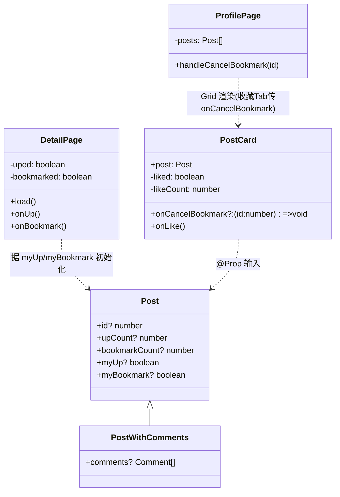
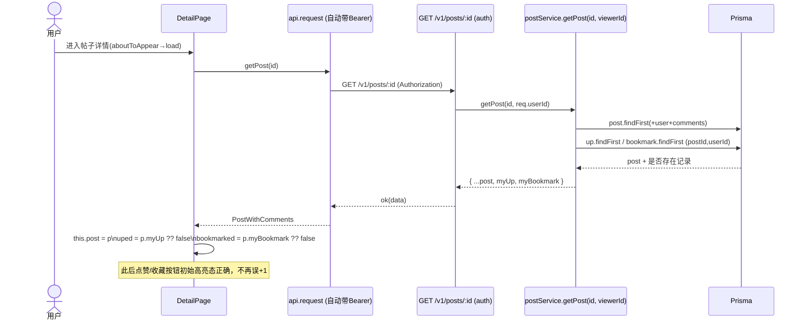

# 「点赞 & 收藏闭环」轻量设计 + 任务分解（P0）

> 文档主理人：架构师 高见远
> 项目：大蓝书（HarmonyOS NEXT ArkTS + ArkUI API 24 / V1 严格模式）前端 + Node.js + Express + TS + Prisma + MySQL 后端
> 根目录：`/Users/itxiaobai/HarmonyProject1`
> 范围：仅填补已核验的真实缺口（P0-1 / P0-2 / P0-3），**不新建页面、不新建后端路由、不改动 Prisma schema**。

---

## 1. 实现方案 + 框架选型

### 1.1 现状核验（关键事实）
- 后端点赞/收藏的「写」能力 **已完整**：`interactService.upPost/cancelUp/bookmarkPost/cancelBookmark` 均为 upsert 幂等；路由 `interact.ts` 挂在 `/v1`，均带 `auth`。
- 收藏列表端点 `GET /v1/auth/me/bookmarks?page=&limit=20` 已实现（路由 `auth.ts:54-55`，`listBookmarks` 在 `postService.ts:139`）。
- 前端 `api.ets` 已封装 `upPost(234)` / `cancelUpPost(238)` / `bookmarkPost(243)` / `cancelBookmarkPost(247)` / `listMyBookmarks(303)`。
- **缺口根因**：`postService.getPost(id)` 不接收 `viewerId`，`listPosts` 虽已声明 `viewerId?:number`（参数 `ListParams` 第 15 行）但**只用于关注流分支，从未用来计算 `myUp`/`myBookmark`**。导致 `DetailPage` 的 `uped`/`bookmarked` 永远从 `false` 初始化 → 已点赞帖子进详情再点「顶」会重复 `upPost`，`upCount +1` → 计数膨胀/取消错乱。

### 1.2 框架选型
- **沿用现有栈，零新增依赖**：后端 Express + Prisma + jsonwebtoken；前端 ArkTS + ArkUI（`@kit.ArkUI`、`@kit.NetworkKit` 均已存在）。
- 计算 `myUp`/`myBookmark` 的方式：**不改动 schema，利用已存在的 `Up` / `Bookmark` 模型直接查询**（见 1.3）。
- 不需要 `prisma db push` / 迁移：`Post` 模型在 `schema.prisma:58-59` 已有 `ups Up[]` 与 `bookmarks Bookmark[]` 反向关系，但我们**不依赖关系查询**，而是直接用 `prisma.up` / `prisma.bookmark` 按 `userId + postId` 查询，避免 schema 改动带来的迁移风险。

### 1.3 myUp / myBookmark 计算策略（性能权衡）
- **单帖 `getPost(id, viewerId?)`**：若 `viewerId` 存在，并发执行
  `prisma.up.findFirst({ where: { postId: id, userId: viewerId } })`
  `prisma.bookmark.findFirst({ where: { postId: id, userId: viewerId } })`，
  存在则 `myUp=true` / `myBookmark=true`（2 次查询，常量级）。
- **列表 `listPosts(params)`**：避免 N+1。拿到 `list` 后，若 `viewerId` 且 `list.length>0`，**批量**执行两次：
  `prisma.up.findMany({ where: { postId: { in: ids }, userId: viewerId }, select: { postId: true } })`
  `prisma.bookmark.findMany({ where: { postId: { in: ids }, userId: viewerId }, select: { postId: true } })`，
  用 `Set` 聚合后给每个 post 打 `myUp`/`myBookmark`。**整页仅 +2 次查询，与列表长度无关**。
- 当 `viewerId` 缺失（理论上不会，见 1.4）时**短路返回原列表**，保证无 token 调用不报错、且不触发多余查询。

### 1.4 路由鉴权策略（重要）
- 给 `GET /v1/posts` 与 `GET /v1/posts/:id` **增加 `auth` 中间件**，后端从 `req.userId` 取 `viewerId`。
- 依据：① 主理人已拍板「后端本期返回 `myUp`/`myBookmark`」；② 应用内始终处于登录态（`ensureLogin` 兜底），`interact` 端点本就强制 `auth`，强制鉴权与既有安全模型一致；③ 时序图明确要求「详情页进入 → GET /v1/posts/:id（带 auth）」。
- **回归风险已排查**：现有 `posts.test.ts` 仅测 `POST /v1/posts`（本就带 auth），`posts.following.test.ts` 已测关注流带 auth；给 GET 路由加 `auth` **不会破坏现有测试**。
- 备选（仅在产品要求「匿名可浏览公开信息流」时启用，见 §8）：把 `auth` 换成「软鉴权」——有合法 token 才填 `req.userId`，无 token 不 401。本期按强制 `auth` 实现。

---

## 2. 文件列表（相对路径，新建/修改分开）

### 修改文件
| 层 | 文件相对路径 | 改动要点 |
|---|---|---|
| 后端 service | `backend/src/services/postService.ts` | `getPost` 增 `viewerId?` 参数并计算 `myUp`/`myBookmark`；`listPosts` 在返回前批量打标 |
| 后端 route | `backend/src/routes/posts.ts` | `GET /`（第 22 行）与 `GET /:id`（第 53 行）加 `auth`，传入 `req.userId` |
| 后端 test | `backend/src/services/postService.test.ts` | mock 扩 `prisma.up.findMany` / `prisma.bookmark.findMany`；新增打标断言 |
| 后端 test | `backend/src/routes/posts.test.ts` | 新增 GET 详情/列表「带 auth 返回 myUp/myBookmark」用例（可选，建议放此文件） |
| 前端 model | `entry/src/main/ets/models/types.ets` | `Post` 接口新增 `myUp?: boolean` / `myBookmark?: boolean` |
| 前端 page | `entry/src/main/ets/pages/DetailPage.ets` | `load()` 中用 `post.myUp`/`post.myBookmark` 初始化 `uped`/`bookmarked` |
| 前端 component | `entry/src/main/ets/components/PostCard.ets` | 点赞区改为可点击按钮 + 乐观更新/回滚；新增 `onCancelBookmark` 回调支持「取消收藏」 |
| 前端 page | `entry/src/main/ets/pages/ProfilePage.ets` | 收藏 Tab 的 `PostCard` 传入 `onCancelBookmark`；新增 `handleCancelBookmark` |

### 无需修改（已确认）
- `entry/src/main/ets/services/api.ets`：`listPosts` / `getPost` / `listFollowingPosts` / `listMyBookmarks` / `upPost` 等**签名与入参均无需改动**——`request()` 自动带 `Authorization` Bearer，后端从 token 取 `viewerId`。无需新增参数。
- `backend/prisma/schema.prisma`：无需改动，无需迁移。
- `backend/src/services/interactService.ts`、`backend/src/routes/interact.ts`、`backend/src/routes/auth.ts`：写能力已具备，不改。

---

## 3. 数据结构 / 接口

### 3.1 前端 `Post` 接口（types.ets:38-54）新增字段
```ts
export interface Post {
  id?: number;
  userId?: number;
  title?: string;
  content?: string;
  coverImage?: string;
  images?: string[];
  genre?: Genre;
  tags?: string[];
  structuredData?: StructuredData;
  upCount?: number;
  bookmarkCount?: number;
  commentCount?: number;
  status?: number;
  createdAt?: string;
  user?: User;
  // —— 新增：当前登录用户对帖子的互动态（后端按 viewerId 计算返回）——
  myUp?: boolean;        // 我是否点赞
  myBookmark?: boolean;  // 我是否收藏
}
```
> `PostWithComments extends Post`（`api.ets:93`）自动继承，详情页无需额外声明。

### 3.2 后端返回体变更（向后兼容，纯增量字段）
- `getPost(id, viewerId?)` 返回：`{ ...原 post（含 user/comments）, myUp: boolean, myBookmark: boolean }`；无 `viewerId` 时返回原对象（无这两个字段，兼容旧调用）。
- `listPosts` 返回：`{ list: Array<post & { myUp, myBookmark }>, pagination }`；无 `viewerId` 时 `list` 为原数组。

### 3.3 Prisma 关系（结论：不改动）
`Post.ups Up[]`（schema:58）、`Post.bookmarks Bookmark[]`（schema:59）已存在；`Up`/`Bookmark` 均有 `@@unique([userId, postId])`。本期**不新增关系、不迁移**，直接用 `prisma.up`/`prisma.bookmark` 按标量字段查询，最小变更面。

### 3.4 关键类 / 组件关系（mermaid classDiagram）


---

## 4. 调用流程时序图（mermaid）

### 4.1 详情页进入 → 后端算 myUp/myBookmark → 前端初始化（修复 P0-1）


### 4.2 信息流 PostCard 点赞 → 乐观更新 → 失败回滚（P0-2）
```mermaid
sequenceDiagram
  actor U as 用户
  participant C as PostCard
  participant API as api.request
  participant R as POST/DELETE /v1/posts/:id/up

  U->>C: 点击点赞按钮
  C->>C: liked = !liked; likeCount ±1 (乐观)
  alt 当前未赞 → 点赞
    C->>API: upPost(id)
  else 当前已赞 → 取消
    C->>API: cancelUpPost(id)
  end
  API->>R: POST/DELETE /v1/posts/:id/up (auth)
  alt 成功
    R-->>API: 200/204 ok
    API-->>C: resolve
  else 失败(未登录/网络)
    R-->>API: 401 / 网络错误
    API-->>C: reject
    C->>C: 回滚 liked / likeCount
    C->>C: safeShowToast("操作失败，请先登录")
  end
```

### 4.3 T8 联调验收路径（P0-3，已存在能力）
```
GET /v1/posts/:id (auth) ── 返回 myUp/myBookmark
GET /v1/posts?... (auth) ── 列表每项带 myUp/myBookmark
POST /v1/posts/:id/up   (auth) ── 幂等点赞
DELETE /v1/posts/:id/up  (auth) ── 取消点赞
POST /v1/posts/:id/bookmark   (auth) ── 幂等收藏
DELETE /v1/posts/:id/bookmark  (auth) ── 取消收藏
GET /v1/auth/me/bookmarks?page=1&limit=20 (auth) ── 收藏列表(分页20)
前端封装：upPost/cancelUpPost/bookmarkPost/cancelBookmarkPost/listMyBookmarks
前端收藏Tab：ProfilePage 复用 PostCard 网格(分页/空态/错误态已存在)
```

---

## 5. 任务列表（有序、含依赖、按实现顺序）

> 约定：后端 T1/T2 互不依赖可并行；前端 T4 独立于后端；T5/T6 依赖 T4 与后端返回；T7 依赖 T6；T8 为端到端验收，依赖全部。

### T1 【后端】getPost 返回 myUp / myBookmark —— P0
- 文件：`backend/src/services/postService.ts`
- 改动点：函数 `getPost`（第 84 行）签名改为 `getPost(id: number, viewerId?: number)`；在 `findFirst` 之后、返回之前，按 §1.3 并发查 `prisma.up.findFirst` / `prisma.bookmark.findFirst` 并 `return { ...post, myUp: !!up, myBookmark: !!bm }`；无 `viewerId` 时短路返回 `post`。
- 路由配合：`backend/src/routes/posts.ts` 的 `GET /:id`（第 53-59 行）加 `auth`，`getPost(id)` → `getPost(id, req.userId)`（`auth` 已在第 3 行 import）。
- 依赖：无。
- 验收：带合法 token 请求详情，已点赞帖 `myUp=true`；未点赞 `false`。

### T2 【后端】listPosts 返回 myUp / myBookmark（含关注流）—— P0
- 文件：`backend/src/services/postService.ts`、`backend/src/routes/posts.ts`
- 改动点：`listPosts`（第 19 行）在 `Promise.all([findMany,count])` 之后（第 69-80 行之间）插入批量打标逻辑（见 §1.3，`viewerId && list.length>0` 时 `prisma.up.findMany`/`prisma.bookmark.findMany` + `Set` 聚合），返回 `list` 为带标数组。关注流分支已传 `viewerId`（第 47 行），天然生效。
- 路由配合：`GET /`（第 22 行）加 `auth`，在 `listPosts({...})` 调用（第 24-31 行）加入 `viewerId: req.userId`。
- 依赖：无（与 T1 可并行）。
- 验收：信息流/关注流列表每项带 `myUp`/`myBookmark` 且正确；无 token 返回 401（符合 §1.4）。

### T3 【后端】加/确认后端测试 —— P1
- 文件：`backend/src/services/postService.test.ts`（必改）、`backend/src/routes/posts.test.ts`（建议增 GET 用例）
- 改动点：
  - `postService.test.ts` 的 `jest.mock('../prisma', ...)` 需扩充 `up: { findMany: jest.fn() }`、`bookmark: { findMany: jest.fn() }`；新增用例：1) `getPost(id, viewerId)` 命中 up/bookmark 返回 `myUp:true/myBookmark:true`；2) `listPosts({viewerId})` 对 `ids` 批量打标正确（用 `mockResolvedValue` 提供 up/bookmark 的 `postId` 列表断言 `myUp` 映射）；3) 无 `viewerId` 时**不调用** `up.findMany`/`bookmark.findMany` 且原样返回（保证现有「返回结构」用例不破）。
  - `posts.test.ts` 新增：`GET /v1/posts/:id` 带 auth 返回 `data.myUp`；`GET /v1/posts` 带 auth 列表项含 `myUp`。
- 依赖：T1、T2。
- 验收：`npm test`（jest）全绿。

### T4 【前端】types.ets 增加 myUp / myBookmark —— P0
- 文件：`entry/src/main/ets/models/types.ets`
- 改动点：`Post` 接口（第 38-54 行）末尾新增 `myUp?: boolean;`、`myBookmark?: boolean;`。
- 依赖：无。
- 验收：编译通过（ArkTS V1 严格）。

### T5 【前端】DetailPage 据返回值初始化 uped / bookmarked —— P0
- 文件：`entry/src/main/ets/pages/DetailPage.ets`
- 改动点：`load()` 中 `this.post = p;`（第 168 行）之后，增加两行：
  `this.uped = p.myUp ?? false;`
  `this.bookmarked = p.myBookmark ?? false;`
  （`uped`/`bookmarked` 的 `@State` 声明第 103-104 行保持 `false` 初值即可）。
- 依赖：T1（后端返回）、T4（类型字段）。
- 验收：已点赞帖进详情，点赞按钮初始高亮；点一次「顶」`upCount` 不再 +1 翻倍。

### T6 【前端】PostCard 点赞按钮 + 乐观更新/回滚 —— P0
- 文件：`entry/src/main/ets/components/PostCard.ets`
- 改动点：
  1. 顶部 import 增加：`import { upPost, cancelUpPost } from '../services/api';`、`import { safeShowToast } from '../utils/toast';`。
  2. 新增成员：`@State liked: boolean = false;`、`@State likeCount: number = 0;`；以及一个**无装饰器**的回调属性 `onCancelBookmark?: (id: number) => void = undefined;`（供收藏 Tab 复用，见 T7）。
  3. `aboutToAppear()` 中初始化：`this.liked = this.post.myUp ?? false; this.likeCount = this.post.upCount ?? 0;`。
  4. 把第 59 行只读 `Text('⭐ ' + formatCount(this.post.upCount))` 替换为**可点击点赞按钮**（Column：emoji `👍` + `formatCount(this.likeCount)`，文字色按 `this.liked` 高亮），`onClick(() => this.onLike())`。
  5. 新增 `async onLike()`：复制 `DetailPage.onUp`（第 205-224 行）的乐观更新+回滚模式——`willLike=!liked`；先改本地 `liked`/`likeCount`；`await upPost(id)/cancelUpPost(id)`；catch 中回滚并 `safeShowToast(this.getUIContext(), { message: '操作失败，请先登录' })`。
  6. 第 62 行 `💬 commentCount` 保持只读不动。
- 依赖：T4（类型字段）。
- 验收：信息流卡片点赞即时高亮、计数 ±1；断网/未登录回滚并 toast。

### T7 【前端】收藏网格 PostCard 支持「取消收藏」—— P0
- 文件：`entry/src/main/ets/components/PostCard.ets`（复用 T6 的 `onCancelBookmark`）、`entry/src/main/ets/pages/ProfilePage.ets`
- 改动点：
  - `PostCard.ets`：当 `this.onCancelBookmark` 非 `undefined` 时，在卡片底部渲染「取消收藏」文字按钮，`onClick(() => { if (this.post.id !== undefined) this.onCancelBookmark!(this.post.id); })`。
  - `ProfilePage.ets`：顶部 import 增加 `import { cancelBookmarkPost } from '../services/api';`、`import { safeShowToast } from '../utils/toast';`；新增方法 `private async handleCancelBookmark(id: number): Promise<void>`——`try { await cancelBookmarkPost(id); this.posts = this.posts.filter(p => p.id !== id); } catch(e){ safeShowToast(...); }`；在 `Grid` 的 `PostCard({ post: post })`（第 255 行）处改为：**仅「我收藏」Tab（`this.tabIdx === 1`）传入** `onCancelBookmark: (id: number) => { this.handleCancelBookmark(id); }`，「我发布」Tab 传 `undefined`。
- 依赖：T6（PostCard 回调机制就绪）、已存在 `cancelBookmarkPost`（api.ets:247）。
- 验收：收藏 Tab 点「取消收藏」→ 调 `DELETE /v1/posts/:id/bookmark` → 卡片从网格移除；重复取消幂等不报错。

### T8 【联调】确认已存在能力端到端跑通 —— P0（验收）
- 范围：4 个互动接口 + 收藏列表端点 + 前端 api 封装 + ProfilePage 收藏 Tab，按 §4.3 逐项走通。
- 依赖：T1、T2、T3、T4、T5、T6、T7。
- 验收清单：① 详情页据 `myUp`/`myBookmark` 正确初始化，已点赞不再 +1；② 信息流卡片点赞乐观更新+回滚；③ 收藏 Tab 可取消收藏并即时移出；④ 收藏列表分页 20 正常；⑤ 后端 jest 全绿。

---

## 6. 依赖包列表
**无需新增任何依赖。**
- 后端：`express` / `jsonwebtoken` / `@prisma/client` / `jest`+`ts-jest`（均已在 `backend/package.json`）。
- 前端：HarmonyOS 系统库 `@kit.ArkUI`、`@kit.NetworkKit`（项目已依赖）；`safeShowToast`/`formatCount` 等工具已存在。

---

## 7. 共享知识 / 跨文件约定（ArkTS V1 坑 & 团队约定）
- **myUp 语义**：仅代表「当前 `viewerId`（=登录用户）是否对该帖点赞/收藏」的单用户布尔，**不是全局计数**。全局计数仍用 `upCount`/`bookmarkCount`。
- **乐观更新 + 回滚模式（统一）**：先改本地 `@State` → `await` 网络 → 失败则**反向改回** `@State` 并 `safeShowToast(this.getUIContext(), { message: '操作失败，请先登录' })`。DetailPage.onUp(205)、onBookmark(226) 与 PostCard.onLike 必须保持同一模式，回滚顺序与正向相反。
- **@State 命名避开保留字/易混名**：PostCard 内本地点赞计数不要命名为 `upCount`（与 `post.upCount` 易混、且 `@State` 与 `@Prop post` 共存易读错），本设计用 `liked` / `likeCount`。
- **@Prop 是单向拷贝**：PostCard 内部改 `liked`/`likeCount` **不会**回写父级 `ProfilePage.posts`；持久态以「详情页重新拉取」或「T7 显式 `filter` 移除」为准，不要在卡片内尝试反向同步父数组。
- **函数型属性不加装饰器**：`onCancelBookmark?: (id:number)=>void = undefined;` 是普通成员（无 `@State`/`@Prop`），由组件字面量 `PostCard({ post, onCancelBookmark: ... })` 赋值，ArkTS V1 合法。
- **aboutToAppear 初始化**：`@State liked/likeCount` 不能在声明处读 `@Prop post`（V1 限制），必须在 `aboutToAppear()` 里用 `this.post.myUp ?? false` 初始化；`ForEach` 重建实例时会重跑 `aboutToAppear`，刷新列表后状态正确复位。
- **后端 viewerId 来源**：一律从 `auth` 中间件写入的 `req.userId` 取，前端**不**额外传参；`api.request` 自动带 Bearer。
- **幂等约定**：`upPost`/`bookmarkPost` 服务端 upsert，`cancelUp`/`cancelBookmark` 先查后删；前端重复点击安全。
- **错误透传**：`api.request`（api.ets:26）把后端 `{code,message}` 透传到 `catch`，PostCard/DetailPage 直接 `toast(message)` 即可。

---

## 8. 待明确事项（如有）
1. **公开信息流是否必须匿名可浏览？** 本期按「`GET /` 与 `GET /:id` 强制 `auth`」实现（§1.4）。若产品要求未登录也能看信息流，需把 `auth` 换成软鉴权（有合法 token 才填 `req.userId`，无 token 不 401），后端打标逻辑不变。请在 T1/T2 开工前确认。
2. **收藏 Tab 取消收藏后的计数**：T7 仅从本地 `posts` 数组移除卡片，不单独刷新 `bookmarkCount` 全局展示（卡片无该展示位）；如需同步「我收藏」计数角标，待 PM 明确后再补。
3. **PostCard 在「我发布」Tab 的点赞按钮**：决策 ③ 为「信息流只加点赞、收藏留详情页」。本设计让 PostCard 始终显示点赞按钮（发布 Tab 也显示，属合理复用），仅「取消收藏」按钮按 Tab 条件渲染。若产品要求发布 Tab 完全隐藏点赞，再调整 `onCancelBookmark` 传入逻辑即可。
