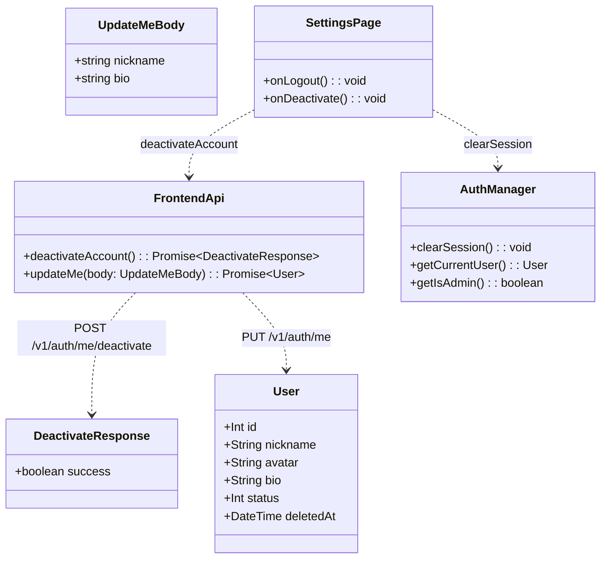
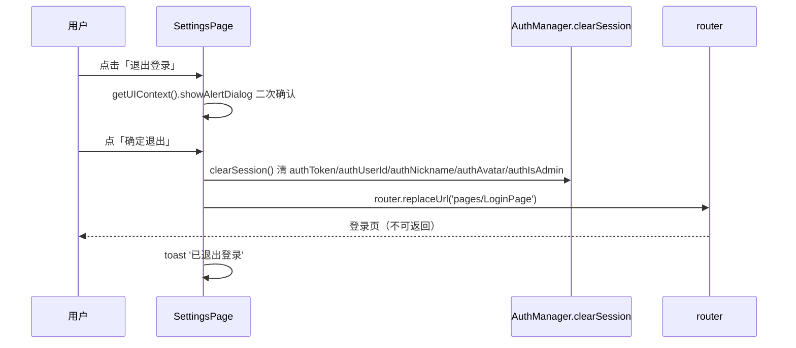
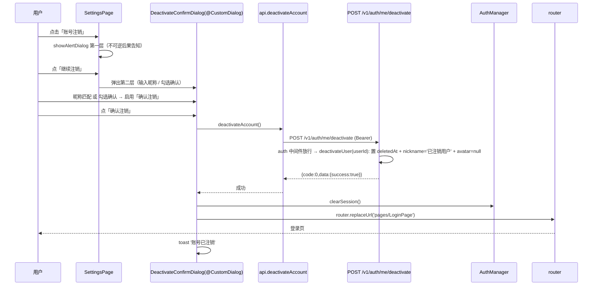
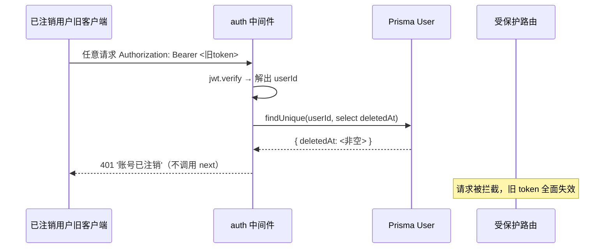
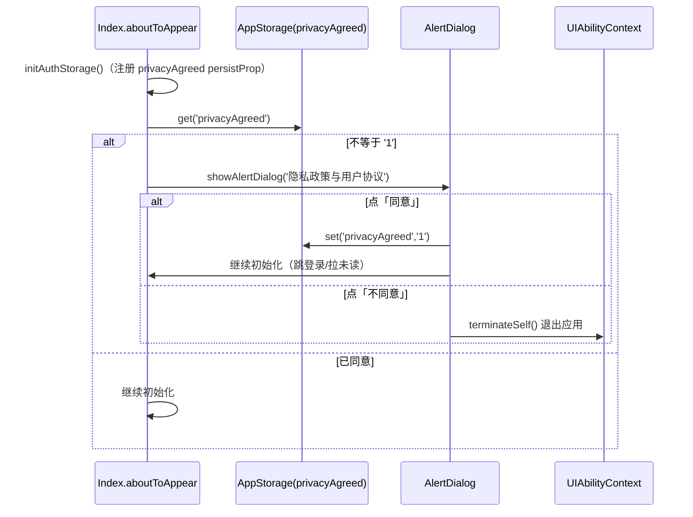
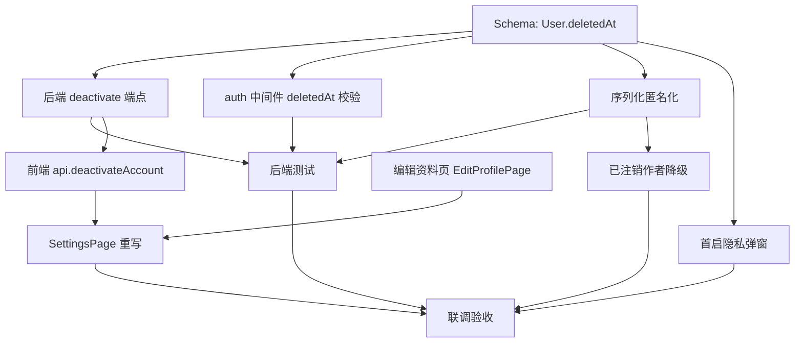

# 设计文档 · 设置模块（大蓝书）

> 版本：V1.0（架构师高见远，落实主理人已拍板 5 项决策）
> 关联 PRD：`entry/Docs/prd-settings.md`
> 技术栈：HarmonyOS NEXT 原生 ArkTS/ArkUI（API 24，ArkTS V1 严格模式）前端 + Node.js + Express + TypeScript + Prisma + MySQL 后端（端口 3000）
> 现状基线（已读真实代码确认）：`SettingsPage.ets` 为 89 行 stub；`api.ets` 无 logout/deactivate 封装；`auth.ets` 用导出函数式 `AuthManager`（`clearSession()` 清 token/昵称/头像，**未清 `authIsAdmin`**）；`User` 模型无软删字段；后端鉴权为无状态 JWT，无任何注销/登出端点；全项目无隐私弹窗。

---

## 1. 实现方案 + 框架选型

### 1.1 框架选型
**不引入任何新依赖，完全沿用现有栈。**
- 前端：ArkTS/ArkUI（API 24，V1 严格模式），复用 `AuthManager`（`utils/auth.ets`）、`api.ets`、`router`、`getUIContext().showAlertDialog`、CustomDialog。
- 后端：Express + Prisma + MySQL，沿用 `ok/fail/CODE` 响应、`auth` 中间件、`authService`/`postService`/`followService`/`notificationService`。
- 测试：沿用 `jest` + `ts-jest`（package.json `test` 脚本，co-located `*.test.ts`）。

### 1.2 核心方案（落实主理人 5 项决策）

| 决策 | 方案 |
|---|---|
| **Q1 注销端点** | 新增 `POST /v1/auth/me/deactivate`（软删，不用 DELETE）。挂载于 `authRouter`，因此 `/v1/auth/me/deactivate` 与 `/v1/users/me/deactivate` 均可达。 |
| **Q2 注销处理** | 软删 `User`：`User` 加 `deletedAt DateTime?`；`deactivateUser` 置 `deletedAt` + 匿名化 `nickname='已注销用户'` + 清空 `avatar`。**保留 posts/comments（FK 不变）**。经核实 `nickname` 无 `@@unique` 约束（schema 第 19 行），故可直接赋固定串，无唯一冲突风险。 |
| **Q3 不做 token 黑名单** | `auth` 中间件解析出 `userId` 后，**多查一次 `User`**，若 `deletedAt` 非空则 `401 '账号已注销'`，使旧 token 在所有接口失效。 |
| **Q4 头像不改** | 编辑资料仅改昵称/简介（复用 `PUT /v1/auth/me`）；本期 `EditProfilePage` 不提供头像上传入口。 |
| **Q5 隐私弹窗** | 项目确无隐私弹窗（grep 无 privacy/agreement）→ 本次在 `Index.ets aboutToAppear` 补**最小化首启隐私协议弹窗**：`AppStorage` 标记 `privacyAgreed`（`PersistentStorage` 持久化），未同意则 `AlertDialog`（同意/不同意；不同意 `terminateSelf()` 退出）。文案用占位，提示后续替换真实链接。 |

### 1.3 关键设计取舍
- **已注销作者降级**：采用「后端序列化时匿名化」方案——所有包含 `user` 的返回体，若 `deletedAt` 非空，统一返回 `{ nickname:'已注销用户', avatar:null, deleted:true }`。前端 `PostCard`/`CommentList`/`UserProfilePage` 据 `user.deleted` 渲染灰色占位头像 + 「已注销用户」并禁用跳转。集中封装在新增的 `backend/src/utils/userView.ts`（`USER_PUBLIC_SELECT` + `publicUserView`），避免 N 处散落判断。
- **`auth` 中间件变 async**：每次受保护请求多一次 `prisma.user.findUnique({ select:{ deletedAt:true } })`。主理人已确认性能可接受。
- **`clearSession()` 增强**：补清 `authIsAdmin`，避免登出后残留管理员态。

---

## 2. 文件列表（新建 / 修改分开，精确到文件）

### 2.1 新建文件
| 文件路径 | 作用 |
|---|---|
| `backend/src/utils/userView.ts` | 公共用户视图序列化工具：`USER_PUBLIC_SELECT`、`DELETED_NICKNAME`、`publicUserView()`，集中实现匿名化。 |
| `entry/src/main/ets/pages/EditProfilePage.ets` | 编辑资料页（昵称/简介，复用 `updateMe`），轻量页（非弹窗）。 |
| `backend/src/middleware/auth.test.ts` | 新增：`auth` 中间件对 `deletedAt` 用户拒绝（401）的测试。 |

### 2.2 修改文件
| 文件路径 | 关键改动点 |
|---|---|
| `backend/prisma/schema.prisma` | `User` 模型新增 `deletedAt DateTime?`（第 26 行 `updatedAt` 之后）。 |
| `backend/src/middleware/auth.ts` | `auth()` 改为 async，解析 userId 后查 `User.deletedAt`，非空则 401。 |
| `backend/src/services/authService.ts` | 新增 `deactivateUser(userId)`（置 deletedAt + 匿名化）。 |
| `backend/src/routes/auth.ts` | 新增 `POST /me/deactivate`（第 53 行 `PUT /me` 之后）。 |
| `backend/src/services/postService.ts` | 4 处 `user` select 改 `USER_PUBLIC_SELECT` 并在返回时 `publicUserView`：listPosts(L75)、getPost(L121/L126)、listByUser(L178)、listBookmarks(L195)。 |
| `backend/src/services/followService.ts` | `getUserProfile`(L74-85) 与 `listFollows`(L119/L122/L141-147) 匿名化。 |
| `backend/src/services/notificationService.ts` | actor 查询 select(L75) 加 `deletedAt`，构建 actorMap(L78) 时匿名化。 |
| `entry/src/main/ets/models/types.ets` | `User`(L4-12) 加 `deleted?: boolean`；`UserProfile`(L126-137) 加 `deleted?: boolean`。 |
| `entry/src/main/ets/services/api.ets` | 新增 `deactivateAccount()`（第 298-300 行 `updateMe` 附近）。 |
| `entry/src/main/ets/utils/auth.ets` | `clearSession()`(L47-52) 补清 `authIsAdmin`；`initAuthStorage()`(L67-74) 与模块级 persistProp(L7-12) 注册 `privacyAgreed`。 |
| `entry/src/main/ets/pages/SettingsPage.ets` | 整体重写：分区结构 + 退出登录二次确认 + 账号注销双重确认（含 `@CustomDialog`）+ 底部红色按钮。 |
| `entry/src/main/ets/pages/Index.ets` | `aboutToAppear`(L19-28) 顶部插入首启隐私弹窗逻辑。 |
| `entry/src/main/ets/components/PostCard.ets` | 作者区(L77-97)与 `goUser()`(L27-33) 处理 `user.deleted`。 |
| `entry/src/main/ets/components/CommentList.ets` | `avatar` builder(L12-29) 与昵称(L45) 处理 `user.deleted`。 |
| `entry/src/main/ets/pages/UserProfilePage.ets` | 头像(L250-256)/昵称(L234/L258)/关注按钮(L276-282) 处理 `profile.deleted`。 |
| `backend/src/services/authService.test.ts` | 扩展：deactivateUser 置 deletedAt + 匿名化 + 旧 token 失效断言。 |

---

## 3. 数据结构 / 接口

### 3.1 数据模型变更（Prisma）
```prisma
model User {
  id         Int      @id @default(autoincrement())
  openId     String?  @unique @db.VarChar(64)
  unionID    String?  @unique @db.VarChar(64)
  nickname   String   @db.VarChar(32)   // 无 @@unique，注销可直接赋 '已注销用户'
  avatar     String?  @db.VarChar(255)
  gender     Int?     @default(1)
  bio        String?  @db.VarChar(120)
  followTags Json?
  status     Int      @default(1) // 1-正常 0-封禁
  createdAt  DateTime @default(now())
  updatedAt  DateTime @updatedAt
  deletedAt  DateTime? // ★新增：软删时间，置位即视为「已注销」，旧 token 失效
  // ... 关系数组不变
}
```
> 注意：改动后必须 `npx prisma generate`（重新生成客户端类型）再 `npx prisma db push`（主理人指定不用 migrate）。

### 3.2 后端新增 / 变更接口

**新增 `POST /v1/auth/me/deactivate`**（auth 中间件保护）
- 请求体：无（仅需 Bearer token）。
- 响应：`{ code:0, data:{ success:true }, message:'success' }`
- 失败：token 缺失/过期 → 401；非自身 → 不可能（仅操作 `req.userId`）。

**复用 `PUT /v1/auth/me`**（`UpdateMeBody`）
```ts
export interface UpdateMeBody { nickname?: string; avatar?: string; bio?: string; }
```
编辑资料仅传 `{ nickname, bio }`，不传 `avatar`（Q4）。

**序列化影响（所有含 user 的返回体）**
- 正常：`user = { id, nickname, avatar }`
- 已注销：`user = { id, nickname:'已注销用户', avatar:null, deleted:true }`

### 3.3 前端 api.ets 新增
```ts
// POST /v1/auth/me/deactivate（无参，自动带 Bearer；成功后前端自行清 token）
export function deactivateAccount(): Promise<{ success: boolean }> {
  return api.post<{ success: boolean }>('/v1/auth/me/deactivate');
}
```

### 3.4 前端是否新页面
**是**：新增轻量页 `entry/src/main/ets/pages/EditProfilePage.ets`（编辑资料用独立页，非弹窗，规避 ArkTS V1 AlertDialog 无法内嵌 TextInput 的限制）。设置页「编辑资料」行 `router.pushUrl({ url:'pages/EditProfilePage' })`。

### 3.5 类图（核心实体 / 接口）


---

## 4. 调用流程时序图（mermaid）

### ① 退出登录（前端清 token + 二次确认）


### ② 账号注销（后端软删 + 前端双重确认）


### ③ auth 中间件对 deletedAt 用户拒绝（旧 token 失效）


### ④ 首启隐私弹窗（Index.aboutToAppear）


---

## 5. 任务列表（有序、含依赖、按实现顺序）

> 编号沿用主理人清单 T1–T11。优先级：P0 = 本期必须。

### T1 后端 schema：User 加 deletedAt（P0）
- **源文件**：`backend/prisma/schema.prisma`
- **改动点**：`User` 模型（L15-35）`updatedAt`（L26）之后新增 `deletedAt DateTime? // 软删时间，置位即已注销`。
- **执行**：`npx prisma generate` → `npx prisma db push`（主理人指定不用 migrate）→ 重启后端（`tsx watch` 会自动重载，但需重新生成 client）。
- **依赖**：无
- **优先级**：P0

### T2 后端新增 `POST /v1/auth/me/deactivate`（P0）
- **源文件**：`backend/src/routes/auth.ts`、`backend/src/services/authService.ts`
- **改动点**：
  - `authService.ts` 新增函数（放在 `updateProfile` L83 之后）：
    ```ts
    const DELETED_NICKNAME = '已注销用户';
    export async function deactivateUser(userId: number) {
      return prisma.user.update({
        where: { id: userId },
        data: { deletedAt: new Date(), nickname: DELETED_NICKNAME, avatar: null },
      });
    }
    ```
  - `auth.ts` 在 `PUT /me`（L53）之后新增（注意先 `import { ..., deactivateUser } from '../services/authService'`）：
    ```ts
    // 账号注销（软删）：POST /v1/auth/me/deactivate
    router.post('/me/deactivate', auth, async (req: AuthRequest, res: Response) => {
      await deactivateUser(req.userId!);
      return ok(res, { success: true });
    });
    ```
- **依赖**：T1
- **优先级**：P0

### T3 后端 `auth` 中间件：deletedAt 校验（P0）
- **源文件**：`backend/src/middleware/auth.ts`
- **改动点**：`auth()`（L11-23）改为 async，verify 后查 `User.deletedAt`：
  ```ts
  import { prisma } from '../prisma';
  export async function auth(req: AuthRequest, res: Response, next: NextFunction) {
    const header = req.headers.authorization;
    if (!header || !header.startsWith('Bearer ')) return fail(res, CODE.UNAUTHORIZED, '未登录', 401);
    let payload: { userId: number };
    try { payload = jwt.verify(header.slice(7), env.jwtSecret) as { userId: number }; }
    catch { return fail(res, CODE.UNAUTHORIZED, '登录已过期', 401); }
    let user;
    try { user = await prisma.user.findUnique({ where: { id: payload.userId }, select: { deletedAt: true } }); }
    catch { return fail(res, CODE.SERVER_ERROR, '鉴权失败', 500); }
    if (!user || user.deletedAt) return fail(res, CODE.UNAUTHORIZED, '账号已注销', 401);
    req.userId = payload.userId;
    return next();
  }
  ```
- **依赖**：T1
- **优先级**：P0

### T4 后端序列化匿名化（已注销作者降级）（P0）
- **新建**：`backend/src/utils/userView.ts`
  ```ts
  import { Prisma } from '@prisma/client';
  export const DELETED_NICKNAME = '已注销用户';
  export const USER_PUBLIC_SELECT = { id: true, nickname: true, avatar: true, deletedAt: true } satisfies Prisma.UserSelect;
  export interface PublicUserView { id: number; nickname: string; avatar: string | null; deleted?: boolean; }
  export function publicUserView(u: { id: number; nickname: string; avatar: string | null; deletedAt?: Date | null } | null | undefined): PublicUserView | null {
    if (!u) return null;
    if (u.deletedAt) return { id: u.id, nickname: DELETED_NICKNAME, avatar: null, deleted: true };
    return { id: u.id, nickname: u.nickname, avatar: u.avatar };
  }
  ```
- **改动点**：
  - `postService.ts`：4 处 `select: { id:true, nickname:true, avatar:true }` 改为 `USER_PUBLIC_SELECT`，返回时 `user: publicUserView(p.user)`。
    - `listPosts`（L75 + L104-108）：`taggedList = list.map(p => ({ ...p, myUp: upSet.has(p.id), myBookmark: bmSet.has(p.id), user: publicUserView(p.user) }))`
    - `getPost`（L121/L126）：返回前 `user: publicUserView(post.user)`，`comments: post.comments.map(c => ({ ...c, user: publicUserView(c.user) }))`
    - `listByUser`（L178）：`user: publicUserView(...)` 映射
    - `listBookmarks`（L195）：`post.user` 经 `publicUserView` 映射
  - `followService.ts`：
    - `getUserProfile`（L74-85）：若 `user.deletedAt` 则返回 `{ id, nickname: DELETED_NICKNAME, avatar: null, bio: null, gender: null, deleted: true, postCount, followingCount, followerCount, isFollowing:false, isMutual:false }`；否则附加 `deleted:false`。
    - `listFollows`（L119 select 加 `deletedAt:true`；L122 构建 `userMap` 时若 `u.deletedAt` 则 `{ nickname: DELETED_NICKNAME, avatar: null, bio: null, deleted: true }`；L141-147 列表项保留 `isFollowing`，`nickname/avatar/bio` 用匿名化后值）。
  - `notificationService.ts`：`actor` 查询 select（L75）加 `deletedAt:true`；构建 `actorMap`（L78）时若 `a.deletedAt` 则匿名化（复用 `DELETED_NICKNAME`）。
- **依赖**：T1
- **优先级**：P0

### T5 后端测试（P0）
- **源文件**：`backend/src/services/authService.test.ts`（扩展）、`backend/src/middleware/auth.test.ts`（新建）
- **覆盖**：
  - `deactivateUser`：调用后置 `deletedAt` 非空、`nickname==='已注销用户'`、`avatar===null`。
  - `auth` 中间件：用已注销用户 token 命中受保护路由返回 401；正常用户放行。
  - 序列化：构造已注销作者，断言 `publicUserView` / `getUserProfile` 返回匿名化字段且 `deleted===true`。
- **依赖**：T1, T2, T3, T4
- **优先级**：P0

### T6 前端 api.ets：加 `deactivateAccount()`（P0）
- **源文件**：`entry/src/main/ets/services/api.ets`
- **改动点**：在 `updateMe`（L298-300）附近新增（见 §3.3）。
- **依赖**：T2（语义对齐，代码可先行写）
- **优先级**：P0

### T7 前端 SettingsPage 重写（P0）
- **源文件**：`entry/src/main/ets/pages/SettingsPage.ets`（整体重写）
- **结构**：
  - 顶栏「设置」+ 返回。
  - 分区卡片：① 账号与安全 = 编辑资料(`pushUrl EditProfilePage`) / 账号绑定(`pushUrl AccountBindingPage`) /（仅 `isAdmin`）内容审核台(`pushUrl ModerationPage`)；② 通用 = 通知设置(P1 占位 toast) / 清除缓存(P1 占位 toast)；③ 关于 = 关于·版本(占位) / 隐私政策(占位)。
  - 底部红色区：「退出登录」（AlertDialog 二次确认 → `clearSession()` + `replaceUrl LoginPage` + toast）｜「账号注销」（警示更强，双重确认见下）。
  - 账号注销：`showAlertDialog` 第一层（意图确认）→ 弹 `@CustomDialog DeactivateConfirmDialog`（输入昵称匹配 或 勾选确认 → 启用红色「确认注销」）→ `deactivateAccount()` 成功 → `clearSession()` + `replaceUrl LoginPage` + toast；失败 → `safeShowToast` 错误。
- **依赖**：T6, T8（编辑资料导航目标由 T8 提供）
- **优先级**：P0

### T8 前端 编辑资料页（P0）
- **新建**：`entry/src/main/ets/pages/EditProfilePage.ets`
- **结构**：`@Entry @Component` 轻量页；预填 `getCurrentUser()` 的 nickname/bio；昵称 `TextInput`（≤20、非空校验）、简介 `TextArea`（≤100）；保存调 `updateMe({ nickname, bio })`；成功 → `setSession` 回写本地 + `router.back()` + toast；失败 → `safeShowToast`。头像仅展示（不可改，Q4）。
- **依赖**：无（复用现有 `updateMe`/`setSession`）
- **优先级**：P0

### T9 前端 首启隐私弹窗（P0，合规）
- **源文件**：`entry/src/main/ets/pages/Index.ets`、`entry/src/main/ets/utils/auth.ets`
- **改动点**：
  - `auth.ets`：模块级 persistProp（L7-12）与 `initAuthStorage()`（L67-74）均加 `PersistentStorage.persistProp('privacyAgreed', '0')`。
  - `Index.ets` `aboutToAppear`（L19-28）**顶部**插入：若 `AppStorage.get<string>('privacyAgreed') !== '1'` 则 `showPrivacyDialog()` 并 `return`（不跳登录/拉数据）。同意 → `setOrCreate('privacyAgreed','1')` 后继续原初始化；不同意 → `getContext(this).terminateSelf()`（需 `import { getContext } from '@kit.ArkUI'` 及 `common.UIAbilityContext` 类型）。
- **依赖**：T1（仅因 persistProp 注册，实际无强依赖，可最先做）
- **优先级**：P0

### T10 前端 已注销作者降级（P0）
- **源文件**：`PostCard.ets`、`CommentList.ets`、`UserProfilePage.ets`、`models/types.ets`
- **改动点**：
  - `types.ets`：`User`(L4-12) 加 `deleted?: boolean`；`UserProfile`(L126-137) 加 `deleted?: boolean`。
  - `PostCard.ets`：作者区(L77-97) 若 `this.post.user?.deleted` → 渲染灰色占位圆（`$r('app.color.card_bg')` 或固定灰）+ 文本「已注销用户」；`goUser()`(L27-33) 当 `deleted` 时不跳转。
  - `CommentList.ets`：`avatar` builder(L12-29) 与昵称(L45) 当 `c.user?.deleted` → 灰色占位 + 「已注销用户」。
  - `UserProfilePage.ets`：`profile.deleted` 时头像(L250-256) 走灰色占位、昵称显示「已注销用户」、隐藏/禁用关注按钮(L276-282)。
- **依赖**：T4（依赖后端返回 `deleted` 字段语义）
- **优先级**：P0

### T11 联调验收（P0）
- **源文件**：跨模块
- **验收**：登出（清态+跳登录+旧 token 失效）、注销（双重确认+软删+旧 token 401+作者降级显示）、编辑资料（昵称/简介回写）、首启隐私弹窗（同意持久化/不同意退出）、已注销作者全局降级。
- **依赖**：T1–T10
- **优先级**：P0

### 5.1 任务依赖图


---

## 6. 依赖包列表
**本期无需新增任何依赖。**
- 后端测试沿用已安装的 `jest` + `ts-jest` + `@types/jest`（package.json devDependencies）。
- 前端无需新 SDK（`@CustomDialog`、`getUIContext().showAlertDialog`、`getContext` 均属 `@kit.ArkUI`/`@kit.AbilityKit` 现有 API）。

---

## 7. 共享知识 / 跨文件约定

### 7.1 ArkTS V1 严格模式坑（必须规避）
- **禁止解构**：`PostCard`/`CommentList` 等组件内不得对 `@Prop`/`@State` 对象做解构；用显式字段访问（`c.user?.deleted`）。
- **`@State` 命名**：避免与保留字/装饰器冲突；`@State` 声明处不读 `@Prop`（如 `PostCard.aboutToAppear` 初始化，L21-24）。
- **确认弹窗**：用 `this.getUIContext().showAlertDialog({...})`（见 `CommentList.ets` L75 写法），勿用已废弃全局 `AlertDialog.show`。
- **带输入的二次确认**：`AlertDialog` **无法内嵌 `TextInput`/`Checkbox`**，账号注销第二层必须用 `@CustomDialog`（`CustomDialogController` 驱动）实现输入昵称 + 勾选确认 + 禁用态按钮。
- **退出应用**：从 Component 调 `getContext(this) as common.UIAbilityContext` 后 `terminateSelf()`（隐私弹窗「不同意」用）。
- **导航**：登出/注销后务必 `router.replaceUrl({ url: 'pages/LoginPage' })`（不可返回）；跳转用 `router.pushUrl`。

### 7.2 `deletedAt` 语义（前后端统一）
- `deletedAt` 为空 = 正常用户；非空 = 已注销（软删）。
- 注销**保留** posts/comments（FK 不变，仍指向该行）；仅 `nickname` 匿名化、`avatar` 清空。
- `auth` 中间件对 `deletedAt` 非空用户一律 401，使旧 token 全面失效（替代 token 黑名单）。
- 序列化层统一经 `userView.publicUserView` 输出 `{ nickname:'已注销用户', avatar:null, deleted:true }`，前端据 `deleted` 渲染降级 UI。

### 7.3 匿名化昵称唯一性
- 经核实 schema `User.nickname`（L19）**无 `@@unique`**，且无任何 `@@unique([nickname,...])`，故 `deactivateUser` 可直接赋固定串 `'已注销用户'`，**无唯一冲突风险**，无需拼 userId/随机串后缀。
- 前端展示统一为「已注销用户」（与后端返回值一致），不依赖后缀解析。

### 7.4 `clearSession` 约定
- 登出/注销统一调用 `clearSession()`；T7 增强后清 `authToken/authUserId/authNickname/authAvatar/authIsAdmin` 五项，确保管理员态不残留。

### 7.5 隐私弹窗持久化约定
- `privacyAgreed` 经 `PersistentStorage` 持久化，值 `'1'`=已同意；仅首启（未同意）弹窗。

---

## 8. 待明确事项（如有）
1. **隐私政策/用户协议真实链接**：本期用占位文案，后续需在 `Index.ets` 弹窗与「关于·隐私政策」入口替换为真实 URL（可 `WebView` 或外部浏览器打开）。
2. **「关于·版本号」取值**：需确认从 `app.json5` 的 `versionName` 读取还是硬编码；本期先占位 `1.0.0`，建议后续从打包信息读取。
3. **P1 占位项**：通知设置/清除缓存/关于详情本期为占位入口（toast「敬请期待」），不阻塞 P0；如需真实实现另立任务。
4. **注销后他人主页访问**：已注销用户主页（UserProfilePage）按匿名化展示并隐藏关注按钮；是否允许继续浏览其帖子列表由 T10 默认保留（内容保留，Q2-A）。如产品希望完全隐藏可后续切 Q2-C（加 `Post/Comment.deletedAt` 标记）。
5. **`auth` 中间件额外查询的性能**：每条受保护请求 +1 次 `User` 查询（仅 `deletedAt`），主理人已确认可接受；若 future 高并发可加短期缓存，本期不做。

---
落盘路径：`entry/Docs/design-settings.md`
