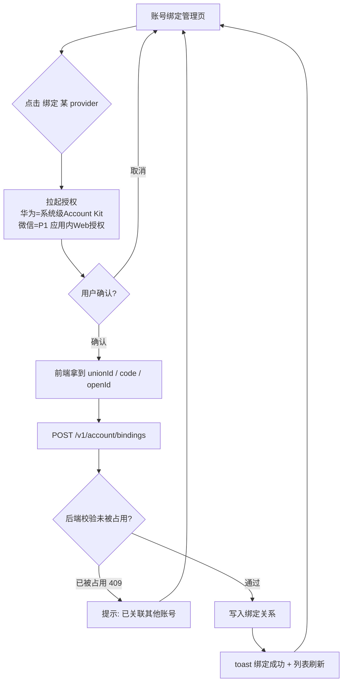
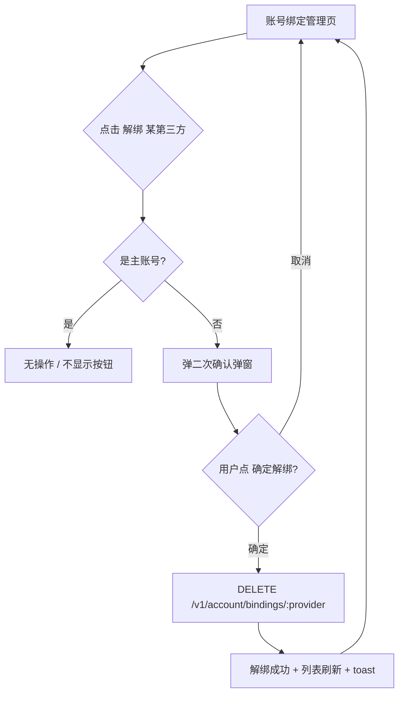

# PRD · 账号绑定管理页（大蓝书）

> 文档类型：简单 PRD（产品目标 + 用户故事 + 需求池 + UI 设计稿 + 待确认问题）
> 版本：V0.1 草稿（待架构师 / 用户拍板待确认问题）
> 作者：许清楚（产品经理）
> 关联系统：HarmonyOS NEXT 前端（ArkTS/ArkUI）· 后端 Node.js + Express + Prisma + MySQL（端口 3000）

---

## 1. 产品目标

让已登录的大蓝书用户在一个独立、统一的页面里查看并管理自己的第三方账号绑定关系（当前已落地的是「华为账号 unionID」，以及作为账号主键的「鸿蒙 openId」），支持绑定新的第三方账号、解绑已有绑定，并在解绑时防止用户失去全部登录方式。该页面是「账号与安全」能力的起点，既提升账号可找回性（换机/重装后可用华为一键登录），也为后续接入微信等更多登录渠道预留管理入口与数据基础。

---

## 2. 用户故事

1. **作为**已登录用户，**我希望**在「我的」里能看到自己当前绑定了哪些账号（如华为）及绑定时间，**以便**清楚自己的账号安全与可登录方式。
2. **作为**拥有多个登录渠道的用户，**我希望**一键绑定华为/微信等账号到大蓝书账号，**以便**换手机或重装后无需重新注册就能登录。
3. **作为**注重隐私的用户，**我希望**能解绑不再使用的第三方账号，**以便**减少账号关联面、降低信息泄露风险。
4. **作为**只绑定了一种方式的用户，**我希望**系统在解绑时阻止我解掉最后一个登录方式（或主账号），**以便**不会把自己锁在账号门外。
5. **作为**产品方，**我希望**绑定关系以可横向扩展的方式存储，**以便**未来接入新 provider 时无需改表结构即可上线。

---

## 3. 需求池

> 优先级：**P0 = 本期必须上线**；**P1 = 重要，本期或下期**；**P2 = 锦上添花**。
> 验收标准均基于现有架构：前端 ArkTS/ArkUI、后端端口 3000、统一响应 `{ code, data, message }`、鉴权 `Authorization: Bearer <token>`。

### P0（本期必须）

**P0-1 账号绑定管理页 + 入口**
- 描述：新增独立页面 `AccountBindingPage.ets`；在「我的」右上角「设置」进入的**设置页**（本期需补一个极简设置页，承载此入口）中放置「账号绑定」行，点击跳转。
- 验收标准：
  1. 「账号绑定」入口在「我的 → 设置」中可见、可点击、跳转正确。
  2. 页面顶部为大标题「账号绑定」+ 返回按钮。
  3. 未登录态不展示入口（沿用现有 `ensureLogin` 逻辑）。

**P0-2 绑定列表展示**
- 描述：进入页面后，接口 `GET /v1/account/bindings` 返回当前用户所有绑定，按固定顺序展示：鸿蒙（主账号，永驻）→ 华为 → 其他。每条展示 provider 名称、状态、绑定时间。
- 验收标准：
  1. 至少展示 provider 名称、绑定状态（已绑定/主账号）、绑定时间（如 2026-07-18 绑定）。
  2. 鸿蒙账号标识为「主账号」且不可解绑。
  3. 空数据（无第三方绑定）有引导态，而非白屏（见 UI 空状态）。

**P0-3 绑定华为账号**
- 描述：对未绑定的 provider 提供「绑定」入口；点击「绑定华为账号」→ 调用华为 Account Kit 拉起系统授权页 → 用户确认后前端拿到 unionID → 调 `POST /v1/account/bindings`（body 含 `provider=huawei`、`unionId`）→ 后端校验该 unionID 未被其他账号占用后关联到当前用户。
- 验收标准：
  1. 点击后正确拉起鸿蒙系统级华为授权页（非 WebView）。
  2. 绑定成功 toast 提示并列表即时刷新为「已绑定」。
  3. 若 unionID 已被其他账号绑定，后端返回 409，前端提示「该华为账号已关联其他大蓝书账号」。
  4. 绑定过程可取消，取消后状态不变。

**P0-4 解绑第三方账号（含二次确认 + 防锁死）**
- 描述：对已绑定的第三方（如华为）提供「解绑」按钮；点击后弹二次确认；确认后调 `DELETE /v1/account/bindings/:provider`。主账号（鸿蒙 openId）不可解绑。
- 验收标准：
  1. 解绑走二次确认弹窗（明确告知后果），需用户主动点「确定」才执行。
  2. 鸿蒙主账号行**无**解绑按钮（或灰显并标注「主账号不可解绑」）。
  3. 第三方解绑成功后列表刷新、toast 提示。
  4. 因主账号永驻，用户永远至少保留一种登录方式，天然满足「不能解绑最后一个」约束（详见待确认问题 Q4）。

**P0-5 后端绑定接口与数据模型（用户绑定关系表）**
- 描述：新增接口 `GET/POST/DELETE /v1/account/bindings`（见 P0-2/3/4），并按「待确认问题 Q2」的**推荐方案**落地独立绑定关系存储。
- 验收标准：
  1. 三个接口在 `Authorization` 缺失/过期时返回 `code 401` + HTTP 401。
  2. 绑定关系与当前登录用户严格绑定（不能越权操作他人绑定）。
  3. 返回数据结构含 `provider / externalId(脱敏) / boundAt / isPrimary`。

### P1（重要，本期或下期）

**P1-1 绑定微信账号**
- 描述：接入微信开放平台 OAuth（需后端 + 微信 SDK/Web 授权）。点击「绑定微信」→ 授权 → 关联当前账号。
- 验收标准：授权成功后微信出现在绑定列表；同一微信号不可重复绑定两个大蓝书账号。

**P1-2 绑定状态变更的消息/安全提示**
- 描述：绑定/解绑成功后，在「消息」页或站内给一条轻量安全提醒（如「你的账号于 xx 绑定了华为账号」）。

**P1-3 登录方式引导（找回账号）**
- 描述：在登录页提示「可用已绑定的华为账号一键登录」，强化绑定价值。

### P2（锦上添花）

**P2-1 绑定关系异常检测**
- 描述：检测到某第三方 token 失效/被解绑于第三方侧时，列表标注「已失效，建议重新绑定」。

**P2-2 登录设备管理**
- 描述：扩展为「账号与安全」页，含登录设备列表、踢出设备。

**P2-3 解绑二次验证（敏感操作密码/验证码）**
- 描述：解绑时若账号内有高价值资产（如已发帖/收藏），要求输入密码或短信验证码。

---

## 4. UI 设计稿

> 设计语言遵循产品文档：Apple 极简风、深色优先、卡片圆角 12pt、主品牌色 `#0A84FF`、卡片色 `#1C1C1E`、次要文字 `#8E8E93`、分割线 `#38383A`、最小点击区 44pt。

### 4.1 页面整体布局（ASCII）

```
┌──────────────────────────────────────────┐
│  ← 返回            账号绑定               │  ← 大标题 + 毛玻璃顶栏
├──────────────────────────────────────────┤
│                                            │
│  以下账号可用于登录大蓝书                    │  ← 辅助说明（13pt 次要色）
│                                            │
│  ┌────────────────────────────────────┐  │
│  │ 📱 鸿蒙账号      主账号              │  │  ← 主账号，不可解绑
│  │    2026-07-09 创建（本机登录）       │  │
│  └────────────────────────────────────┘  │
│  ┌────────────────────────────────────┐  │
│  │ 🔵 华为账号      已绑定              │  │  ← 已绑定第三方
│  │    2026-07-18 绑定         [解绑]   │  │
│  └────────────────────────────────────┘  │
│  ┌────────────────────────────────────┐  │
│  │ 🟢 微信            未绑定            │  │  ← 未绑定（P1）
│  │    绑定后可用微信快捷登录  [绑定]    │  │
│  └────────────────────────────────────┘  │
│                                            │
│  —————————— 分割线 ——————————            │
│                                            │
│  解绑后将无法使用该方式登录；               │
│  鸿蒙账号为主账号，不可解绑。               │  ← 底部安全提示
└──────────────────────────────────────────┘
```

### 4.2 列表项样式规范

| 元素 | 说明 |
| :--- | :--- |
| 左：图标 | provider 品牌色图标（鸿蒙/华为/微信），48×48，圆角 8pt |
| 中：名称 + 状态 | 第一行 provider 名（17pt Semibold）；第二行 绑定时间/未绑定提示（13pt 次要色） |
| 右：操作 | 已绑定第三方 → 文字按钮「解绑」（次要色）；未绑定 → 文字按钮「绑定」（品牌色）；主账号 → 静态标签「主账号」（次要色，无解绑） |
| 卡片 | 圆角 12pt，卡片色 `#1C1C1E`，卡片间距 ≥16pt，无阴影 |

### 4.3 空状态（无第三方绑定）

```
┌──────────────────────────────────────────┐
│           （图标：🔗 灰色）                │
│        暂未绑定第三方账号                  │
│   绑定后可在其他设备用华为/微信一键登录     │
│              [去绑定]                      │
└──────────────────────────────────────────┘
```
> 注：鸿蒙主账号永远存在，故「完全无账号」不会出现；空状态仅指「无第三方绑定」。

### 4.4 解绑二次确认弹窗（AlertDialog / CustomDialog）

```
┌──────────────────────────────────────────┐
│            解绑华为账号？                  │
│  解绑后你将无法使用华为账号登录大蓝书，     │
│  但仍可用鸿蒙主账号登录。                  │
│                                            │
│        [取消]              [确定解绑]      │
└──────────────────────────────────────────┘
```
- 「确定解绑」用警示色（红色系），需主动点击。
- 主账号行不出现此弹窗（无入口）。

### 4.5 交互流程图（绑定 / 解绑）

**绑定流程**



**解绑流程**



---

## 5. 待确认问题（需用户 / 架构师拍板）

### Q1 本期支持哪些第三方 provider？
- **现状**：华为（unionID）已落地；鸿蒙 openId 是账号主键（登录即存在）。
- **推荐**：
  - **本期（P0）**：鸿蒙主账号（展示，不可解绑）+ 华为账号（可绑定/解绑，unionID 已通）。
  - **微信**：纳入 **P1**（国内男性用户量大、价值高，但需微信开放平台注册 + OAuth + 应用签名，工作量明显）。
  - **Apple**：**本期不建议**。原因：Apple 登录仅提供 iOS/macOS/Web SDK，**鸿蒙 NEXT 原生无 Apple 登录能力**，技术不可行；且产品面向国内男性用户，优先级低。
- **请拍板**：是否同意「P0 仅华为 + 鸿蒙」「微信放 P1」「Apple 暂不做」？

### Q2 数据模型方向：User 表加多列 vs 独立绑定表？
- **方案 A（User 表加列）**：如 `wechatOpenId` / `appleSub` / `huaweiUnionId` 各一列。
  - 优点：查询简单、无需 join。
  - 缺点：每加一个 provider 要改表 + 迁移；列表展示需拼装；违背「绑定关系」语义。
- **方案 B（独立 `UserBinding` 表）**：`{ id, userId, provider, externalId, boundAt, isPrimary, extra }`，`(userId, provider)` 唯一。
  - 优点：天然支持「列出全部绑定/增删/统计绑定数」；加新 provider 只插一行、不改 schema；完全契合本功能诉求。
  - 缺点：查询需一次关联（单用户绑定极少，性能可忽略）。
- **产品侧倾向：推荐方案 B（独立 `UserBinding` 表）。**
- **兼容建议**：保留 `User.openId` 作为主键不变；保留现有 `User.unionID`（可选唯一）作为「华为主绑定」的兼容/快捷列，但**新绑定逻辑统一以 `UserBinding` 为准**，华为 unionID 在绑定时同时写入 `UserBinding`（并同步 `User.unionID`）。是否保留 `unionID` 冗余列由架构师裁定。
- **请拍板**：采用方案 B 并以上述兼容方式落地？

### Q3 绑定时的授权交互在前端如何呈现？
- **华为**：用鸿蒙 **Account Kit 系统级授权页**（非 WebView），用户确认后回 App 自动完成——体验最佳、最安全。
- **微信（P1）**：鸿蒙 NEXT 下微信 SDK 适配情况待确认；若不支持原生 SDK，则用**应用内 Web 组件弹层**跑 OAuth（避免跳浏览器丢上下文）。
- **推荐**：系统级授权（华为）优先；Web OAuth 用应用内弹层而非外部浏览器跳转。
- **请拍板**：华为走 Account Kit 系统授权页（确认）；微信 P1 落地形式（原生 SDK vs 应用内 Web 弹层）由前端在 P1 启动时复评。

### Q4 解绑后若是用户唯一登录方式，如何处理？
- **关键约束**：鸿蒙 `openId` 是账号主键，**主账号不可解绑、永远存在**，因此用户天然永远至少有一种登录方式。
- **推荐策略**：
  1. 鸿蒙主账号行**不提供解绑**（标注「主账号」）。
  2. 第三方绑定（华为/微信）可自由解绑，无需「保留最后一个」的硬下限——因为主账号永驻已满足该约束。
  3. 若未来架构演变为「允许纯微信注册（无鸿蒙主键）」，再启用通用约束：绑定数 ≤1 时禁用解绑并提示「请先绑定其他方式」。
- **请拍板**：采用「主账号不可解绑 + 第三方自由解绑」的简化策略？（本期推荐，且与现有主键设计一致）

### Q5（补充）入口页归属
- 推荐：在「我的」右上角「设置」（当前为占位 toast）进入的**极简设置页**中放置「账号绑定」入口行。本期 P0 需补一个最小设置页承载该入口。
- **请拍板**：同意「我的 → 设置 → 账号绑定」的入口路径？（或改为直接在「我的」页加一行入口）

---

## 6. 核心结论速览（给架构师 / 用户）

- **支持的 provider 范围建议**：P0 = 鸿蒙（主账号，展示不可解绑）+ 华为（可绑定/解绑）；微信纳入 P1；Apple 本期不做（鸿蒙无 SDK，技术不可行）。
- **数据模型倾向**：推荐**独立 `UserBinding` 表**（`userId + provider + externalId + boundAt + isPrimary`），横向扩展友好；保留 `User.openId` 主键与 `User.unionID` 兼容列，新逻辑以 `UserBinding` 为准。
- **P0 清单**：① 账号绑定管理页 + 设置入口；② 绑定列表展示（含主账号标识）；③ 绑定华为账号（Account Kit 系统授权）；④ 解绑第三方（二次确认 + 主账号不可解绑）；⑤ 后端 `GET/POST/DELETE /v1/account/bindings` 接口与绑定表落地。
- **解绑防锁死策略**：主账号（鸿蒙 openId）永驻不可解绑，用户始终至少有一种登录方式，满足「不能解绑最后一个」约束。
