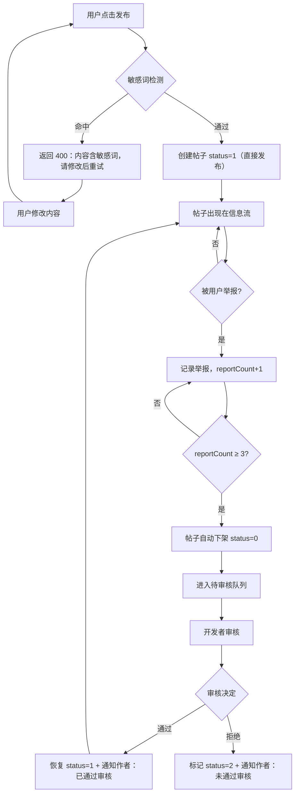
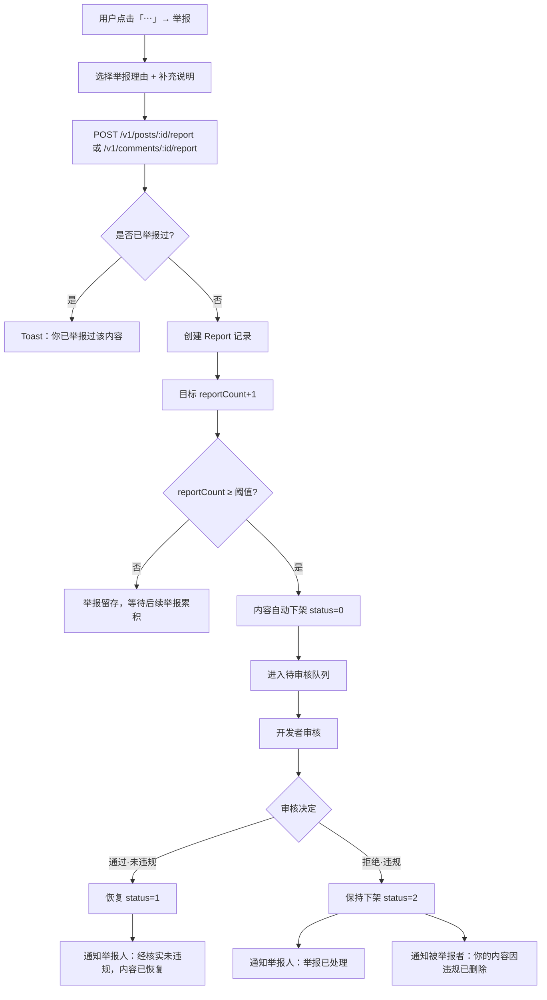

# PRD：内容审核 & 举报系统

> 项目：大蓝书 HarmonyOS NEXT 应用（男性生活经验社区）
> 版本：v1.0（简单版）
> 日期：2025-07
> 关联文档：产品文档 7.2 内容审核机制 / 7.3 社区公约

---

## 1. 产品目标

**一句话**：为「大蓝书」建立「敏感词前置过滤 + 用户举报 + 开发者审核」三道防线，确保 UGC 内容合规，满足应用商店上架审核要求。

**与上架合规的关系**：UGC 社交类应用上架 HarmonyOS 应用市场（及各类应用商店）的硬性要求包括「内容审核机制」「用户举报入口」「举报处理承诺」。个人开发者主体已无法上架 UGC 社交应用，必须用个体工商户/企业主体；即便主体合规，缺少审核与举报机制仍会被拒。本系统是上架过审的必要条件。

---

## 2. 用户故事

| # | 角色 | 故事 |
|---|------|------|
| US-1 | 普通用户 | 作为普通用户，我能在帖子详情页和评论区看到「举报」入口，选择举报理由后提交举报，并在举报处理完成后收到系统通知，以便我参与社区自治。 |
| US-2 | 发布者 | 作为发布者，我发帖或评论时如果命中敏感词，能立刻收到提示并修改内容重新提交，而不是事后被静默删除。 |
| US-3 | 开发者（审核员） | 作为开发者，我能通过 API 查看待审核帖子队列，逐条通过或拒绝，系统自动通知作者审核结果，以便我高效完成人工审核。 |
| US-4 | 被举报者 | 作为被举报内容的发布者，当我的内容因举报被下架审核时，我能收到系统通知告知原因和处理结果，而不是内容凭空消失。 |

---

## 3. 需求池

### P0（本次必做）

#### 前端

| ID | 需求 | 说明 |
|----|------|------|
| F-01 | 详情页举报入口 | 帖子详情页顶部导航栏右侧「...」按钮 → 弹出 ActionSheet → 选择「举报」 |
| F-02 | 评论区举报入口 | CommentList 每条评论右侧「...」按钮 → 弹出 ActionSheet → 选择「举报」 |
| F-03 | 举报弹窗 | 选择举报理由（单选）+ 补充说明（选填，"其他"时必填）+ 提交/取消 |
| F-04 | 举报提交反馈 | 提交成功 → Toast「举报已提交，我们会在48小时内处理」；重复举报 → Toast「你已举报过该内容」 |
| F-05 | 敏感词命中提示 | 发布/评论提交时，后端返回 400 → Toast「内容含敏感词，请修改后重试」（不暴露具体命中词） |

#### 后端

| ID | 需求 | 说明 |
|----|------|------|
| B-01 | Report 数据模型 | 新增 Report 表：举报人、目标类型(post/comment)、目标ID、理由、说明、状态、时间 |
| B-02 | Post 字段补充 | Post 新增 `reportCount Int @default(0)` 字段（被举报累计次数） |
| B-03 | Comment 字段补充 | Comment 新增 `status Int @default(1)`（1-正常 0-隐藏 2-已删除）+ `reportCount Int @default(0)` |
| B-04 | 举报 API — 帖子 | `POST /v1/posts/:id/report`，body: `{ reason, description? }`，登录态，幂等（同一用户同一帖子仅一次） |
| B-05 | 举报 API — 评论 | `POST /v1/comments/:id/report`，body: `{ reason, description? }`，登录态，幂等 |
| B-06 | 敏感词过滤服务 | 单例服务，启动时加载词库到内存；提供 `checkText(text): boolean` 方法；发帖/评论时调用 |
| B-07 | 发帖接入敏感词 | `createPost` 前调用敏感词检测，命中返回 400 `{ code: 400, message: "内容含敏感词，请修改后重试" }` |
| B-08 | 评论接入敏感词 | `createComment` 前调用敏感词检测，命中返回 400（同上） |
| B-09 | 审核 API — 待审队列 | `GET /v1/admin/posts/pending?page=&limit=`，返回 status=0 的帖子列表，需 admin 鉴权 |
| B-10 | 审核 API — 审核 | `POST /v1/admin/posts/:id/moderate`，body: `{ action: "approve"|"reject", reason? }`，需 admin 鉴权 |
| B-11 | 审核状态流转 | approve → status=1；reject → status=2；同时更新关联 Report 记录状态为 resolved |
| B-12 | system 通知 | 新增 `notifySystem(userId, content, postId?)` 函数；审核通过/拒绝时通知帖子作者；举报处理完成时通知举报人 |
| B-13 | 举报触发下架 | 被举报内容 reportCount 达阈值时自动 status=0（帖子从信息流隐藏，评论从列表隐藏） |
| B-14 | admin 鉴权中间件 | 环境变量 `ADMIN_USER_IDS` 配置审核员 userId（逗号分隔），中间件校验 `req.userId` 是否在列表中 |

### P1（本次可做）

| ID | 需求 | 说明 |
|----|------|------|
| P1-01 | 举报阈值配置化 | 阈值默认 3 次，通过环境变量 `REPORT_THRESHOLD` 可配置 |
| P1-02 | 发布器敏感词预览 | 用户在发布器输入标题/正文时，前端调用 `POST /v1/sensitive/check` 实时检测，命中词高亮提示 |
| P1-03 | 举报列表 API | `GET /v1/admin/reports?page=&limit=&status=pending`，审核员查看待处理举报列表 |
| P1-04 | 评论审核 API | `POST /v1/admin/comments/:id/moderate`，与帖子审核同构 |

### P2（本次不做）

| ID | 需求 | 说明 |
|----|------|------|
| P2-01 | 前端审核界面 | 审核员在 App 内操作审核（暂用 API 工具/Postman） |
| P2-02 | 第三方 AI 内容识别 | 接入百度/阿里内容安全 API，图片+文本智能审核 |
| P2-03 | 审核员工单系统 | 多审核员、工单分配、审核日志、SLA 超时提醒 |
| P2-04 | 用户信用体系 | 频繁恶意举报降权/封禁 |

---

## 4. UI 设计稿

### 4.1 详情页举报入口

```
┌──────────────────────────────────┐
│  ← 返回    帖子详情         ⋯   │  ← 顶部导航栏右侧「⋯」按钮
├──────────────────────────────────┤   点击弹出 ActionSheet：
│  [标签] 测评报告                 │
│  帖子标题                        │   ┌─────────────────┐
│  作者 · 2小时前                  │   │  举报该帖子      │
│  ──────────────                  │   │  分享            │
│  帖子正文内容...                 │   │  取消            │
│                                  │   └─────────────────┘
│  ──────────────                  │
│  评论 12                         │
│  ┌────────────────────────────┐  │
│  │ 👤 用户A    事实补充   ⋯  │  │ ← 评论右侧「⋯」按钮
│  │ 评论内容...                │  │   点击弹出 ActionSheet：
│  │ 1小时前 · 5 顶             │  │
│  └────────────────────────────┘  │   ┌─────────────────┐
│  ┌────────────────────────────┐  │   │  举报该评论      │
│  │ 👤 用户B              ⋯   │  │   │  取消            │
│  │ 评论内容...                │  │   └─────────────────┘
│  └────────────────────────────┘  │
├──────────────────────────────────┤
│  👍顶 12   📥抄作业 5   💬评论   🔗分享  │
└──────────────────────────────────┘
```

### 4.2 举报弹窗

```
┌─────────────────────────────────┐
│  举报                            │
├─────────────────────────────────┤
│  请选择举报理由：                │
│                                 │
│  ○ 涉政敏感                     │
│  ○ 色情低俗                     │
│  ○ 人身攻击                     │
│  ○ 男女对立引战                  │
│  ○ 广告推广                     │
│  ○ 其他（需填写说明）            │
│                                 │
│  补充说明（选填）：              │
│  ┌─────────────────────────────┐│
│  │                             ││
│  │                             ││
│  └─────────────────────────────┘│
│  最多200字                       │
│                                 │
│  [    取消    ] [   提交举报   ] │
└─────────────────────────────────┘
```

**交互规则**：
- 选择「其他」时，补充说明变为**必填**，否则提交按钮置灰
- 未选择任何理由时，提交按钮置灰
- 提交后弹窗关闭，Toast 提示「举报已提交，我们会在48小时内处理」
- 重复举报同一内容，Toast 提示「你已举报过该内容」

### 4.3 敏感词命中提示

```
发布/评论提交时命中敏感词：

  ┌─────────────────────────────────┐
  │  ⚠️ 内容含敏感词，请修改后重试   │  ← Toast，3秒自动消失
  └─────────────────────────────────┘

  输入框内容保留不清空，用户可自行修改
  不暴露具体命中词（防止绕过）
```

---

## 5. 业务流程图

### 5.1 发帖审核流程



### 5.2 举报处理流程



---

## 6. 举报理由清单

参考产品文档 7.3 社区公约，举报理由枚举如下：

| 枚举值 | 显示文案 | 对应公约条款 | 说明 |
|--------|----------|-------------|------|
| `political` | 涉政敏感 | — | 涉政敏感言论 |
| `pornographic` | 色情低俗 | — | 色情低俗内容 |
| `personal_attack` | 人身攻击 | 公约5·尊重事实 | 恶意攻击、辱骂他人 |
| `gender_war` | 男女对立引战 | 公约1·禁止性别对立 | 煽动男女对立的言论 |
| `advertisement` | 广告推广 | 公约4·禁止广告推广 | 软文、带货链接 |
| `spam` | 垃圾信息 | 公约3·禁止纯情绪宣泄 | 无实质内容的刷屏/灌水 |
| `other` | 其他 | — | 需填写补充说明（必填） |

> 枚举值用于后端存储与校验；显示文案用于前端弹窗渲染。前端与后端共用同一份枚举定义。

---

## 7. 敏感词库选择

### 推荐方案

| 优先级 | 词库 | 地址 | 说明 |
|--------|------|------|------|
| 首选 | ToolGood.Words | https://github.com/toolgood/ToolGood.Words | 高性能中文敏感词检测（C# 原生，提供词库文件可直接用）；内置非法词、广告词列表，支持 Aho-Corasick 多模式匹配 |
| 备选 | funnyWordList | https://github.com/fighting41love/funnyWordList | 中文敏感词大合集，覆盖面广，纯词表文件可直接加载 |
| 自建 | 男女对立引战词库 | 手动维护 | 上述开源词库不含此类别，需根据社区公约1自建，初期20-30个种子词 |

### 加载策略

- **启动时加载**：后端进程启动时读取词库文件，解析为内存 `Set<string>`（或 Trie 树）
- **单例服务**：全局单例 `SensitiveWordService`，避免每次请求重新加载
- **热更新**：词库文件变更后可通过 `POST /v1/admin/sensitive/reload` 重新加载（P1）

### 拦截方式

- **包含匹配**：文本中包含任意一个敏感词即拦截（`Set.has()` 或 `text.includes(word)`）
- **检测范围**：帖子的 `title` + `content`；评论的 `content`
- **大小写**：统一转小写后匹配（中文无大小写问题，主要针对英文混用）
- **返回策略**：命中即返回 400，**不暴露具体命中词**（前端仅展示通用提示）

### 性能考量

- 词库预计 5000-20000 词，内存占用 < 2MB
- 包含匹配 `text.includes(word)` 在大词库下 O(n×m) 性能差，推荐用 Trie/Aho-Corasick（ToolGood.Words 已实现）
- MVP 阶段若用 `Set` + 遍历，词库需控制在 5000 词以内；超出需切换 Trie 方案

---

## 8. 数据模型设计

### 8.1 新增 Report 表

```
model Report {
  id          Int       @id @default(autoincrement())
  reporterId  Int                          // 举报人
  targetType  String    @db.VarChar(10)    // 'post' | 'comment'
  targetId    Int                          // 目标帖子或评论 ID
  reason      String    @db.VarChar(20)    // 举报理由枚举（见第6节）
  description String?   @db.VarChar(200)   // 补充说明（other 时必填）
  status      String    @default('pending') @db.VarChar(20) // pending | resolved | dismissed
  createdAt   DateTime  @default(now())
  resolvedAt  DateTime?

  @@unique([reporterId, targetType, targetId])  // 同一用户对同一内容仅能举报一次
  @@index([targetType, targetId])               // 按内容查举报记录
  @@index([status, createdAt])                  // 审核队列按状态+时间排序
}
```

### 8.2 Post 字段补充

```
// Post 模型新增字段
reportCount  Int  @default(0)  // 被举报累计次数（达到阈值自动 status=0）
```

### 8.3 Comment 字段补充

```
// Comment 模型新增字段（Comment 当前无 status 字段，需新增）
status       Int  @default(1)  // 1-正常 0-隐藏(待审核) 2-已删除
reportCount  Int  @default(0)  // 被举报累计次数
```

> **注意**：Comment 模型当前没有 `status` 字段，需新增。CommentList 组件需过滤 `status=1` 的评论（隐藏 status=0/2 的）。

### 8.4 admin 鉴权

- 环境变量 `ADMIN_USER_IDS=1,2,3`（逗号分隔的 userId）
- 中间件 `adminAuth`：校验 `req.userId` 是否在 `ADMIN_USER_IDS` 中，否则返回 403
- MVP 阶段审核员为开发者一人，`ADMIN_USER_IDS=1`

---

## 9. API 设计

### 9.1 举报 API

| 方法 | 路径 | 鉴权 | 说明 |
|------|------|------|------|
| POST | `/v1/posts/:id/report` | 登录态 | 举报帖子，body: `{ reason: string, description?: string }` |
| POST | `/v1/comments/:id/report` | 登录态 | 举报评论，body: `{ reason: string, description?: string }` |

**响应**：
- 成功：`{ code: 0, data: null, message: "举报已提交" }`
- 重复举报：`{ code: 409, data: null, message: "你已举报过该内容" }`（HTTP 409）
- 理由为 other 但无 description：`{ code: 400, data: null, message: "请填写补充说明" }`

### 9.2 审核 API（admin 鉴权）

| 方法 | 路径 | 鉴权 | 说明 |
|------|------|------|------|
| GET | `/v1/admin/posts/pending?page=&limit=` | admin | 待审核帖子列表（status=0） |
| POST | `/v1/admin/posts/:id/moderate` | admin | 审核帖子，body: `{ action: "approve"|"reject", reason?: string }` |
| GET | `/v1/admin/reports?page=&limit=&status=` | admin | 举报记录列表（P1） |
| POST | `/v1/admin/comments/:id/moderate` | admin | 审核评论，body: `{ action: "approve"|"reject", reason?: string }`（P1） |

### 9.3 敏感词检测 API（P1）

| 方法 | 路径 | 鉴权 | 说明 |
|------|------|------|------|
| POST | `/v1/sensitive/check` | 登录态 | 检测文本是否含敏感词，body: `{ text: string }`，返回 `{ hasSensitive: boolean }`（不返回具体词） |

---

## 10. 待确认问题

| # | 问题 | PM 建议 | 影响 |
|---|------|---------|------|
| Q1 | 审核员是开发者一人还是多人？是否需要 admin 角色体系？ | MVP 单人审核，用 `ADMIN_USER_IDS` 环境变量，不做角色体系 | 影响 adminAuth 中间件设计 |
| Q2 | 举报阈值默认 3 次是否合理？ | 合理。初期日活低，3 次能快速触发；可通过 `REPORT_THRESHOLD` 环境变量调整 | 影响自动下架时机 |
| Q3 | 敏感词库选择哪个？ | 首选 ToolGood.Words（含 Trie 实现），补充自建男女对立引战词库 | 影响拦截性能与覆盖率 |
| Q4 | 帖子被拒绝后是否允许用户修改重发？ | MVP 不支持修改重发。被拒绝帖子保持 status=2，用户可重新发新帖 | 影响 Post 模型与前端 |
| Q5 | 评论是否也需要审核？还是仅举报触发审核？ | MVP 评论不前置审核（直接发布），仅敏感词过滤 + 举报触发审核 | 影响 createComment 逻辑 |
| Q6 | 被举报下架的帖子，作者自己是否仍可见？ | 可见。`getPost` 不过滤 status，作者能看到自己的帖子但信息流中隐藏。需确认是否给作者展示「待审核」标识 | 影响 DetailPage UI |
| Q7 | 举报处理后通知举报人，是否告知具体处理结果（通过/拒绝）？ | 建议告知「举报已处理」但不透露具体决定，保护被举报者隐私 | 影响 notifySystem 文案 |
| Q8 | Comment 新增 status 字段是否可接受（需数据库迁移）？ | 必须。Comment 当前无 status，举报下架需要该字段 | 影响 schema 迁移 |

---

## 11. 与现有功能的兼容性

### 11.1 Post 模型

- **现有**：`status Int @default(0)`（0-待审核 1-已发布 2-已拒绝），但 `postService.createPost` 强制 `status=1`
- **改动**：`createPost` 改为「敏感词通过后 status=1」（MVP 不强制人工前置审核，仅举报触发审核）
- **新增**：`reportCount Int @default(0)` 字段
- **listPosts**：已过滤 `status: 1`，举报下架（status=0）的帖子自动从信息流消失，无需改动

### 11.2 Comment 模型

- **现有**：无 `status` 字段，有 `isFact` 字段
- **新增**：`status Int @default(1)` + `reportCount Int @default(0)`
- **commentService.createComment**：新增敏感词检测前置
- **CommentList 组件**：需过滤 `status !== 1` 的评论（隐藏被举报下架的评论）

### 11.3 Notification 模型 & notificationService

- **现有**：`type` 已包含 `'system'`，`actorId` 可为 null（系统消息），但无 `notifySystem` 函数
- **新增**：`notifySystem(userId, content, postId?)` 函数，调用 `createNotification({ userId, actorId: null, type: 'system', content, postId })`
- **触发时机**：
  - 审核通过 → 通知作者：「你的帖子《xxx》已通过审核」
  - 审核拒绝 → 通知作者：「你的帖子《xxx》未通过审核，原因：xxx」
  - 举报处理完成 → 通知举报人：「你的举报已处理」
- **前端 MessagePage**：`'system'` 类型通知需有对应渲染样式（系统图标 + 无 actor 头像）

### 11.4 postService

- **createPost**：当前 `status: 1` → 改为敏感词检测通过后 `status: 1`（MVP 简化：不做人工前置审核，仅敏感词 + 举报触发审核）
- **getPost**：当前不过滤 status，作者仍可见被下架的帖子（保持不变）

### 11.5 commentService

- **createComment**：新增敏感词检测前置，命中返回 400
- **listComments**：需过滤 `status: 1`（隐藏被举报下架的评论）

### 11.6 前端 DetailPage

- **顶部导航**：右侧当前为空白 48px 占位 → 替换为「⋯」按钮
- **CommentList**：每条评论 Row 右侧新增「⋯」按钮
- **底部操作栏**：4 按钮（顶/抄作业/评论/分享）不变，举报入口不放在底部

### 11.7 API 路由

- 新增举报路由：可挂在 `posts.ts` 和 `comments.ts` 下，或独立 `reports.ts`
- 新增 admin 路由：独立 `admin.ts`，统一加 `adminAuth` 中间件
- 响应格式遵循现有 `ok()`/`fail()` 约定

---

## 附录：审核状态流转总览

```
                    ┌─────────────────────────────────────────────┐
                    │              Post.status 流转                │
                    └─────────────────────────────────────────────┘

    [新建] ──敏感词通过──→ status=1（已发布）
                             │
                         被举报≥阈值
                             │
                             ▼
                         status=0（待审核）
                             │
                     ┌───────┴───────┐
                  审核通过          审核拒绝
                     │               │
                     ▼               ▼
                 status=1         status=2
               （恢复展示）      （永久拒绝）

    ─────────────────────────────────────────────

                    ┌─────────────────────────────────────────────┐
                    │            Comment.status 流转              │
                    └─────────────────────────────────────────────┘

    [新建] ──敏感词通过──→ status=1（正常显示）
                             │
                         被举报≥阈值
                             │
                             ▼
                         status=0（隐藏待审）
                             │
                     ┌───────┴───────┐
                  审核通过          审核拒绝
                     │               │
                     ▼               ▼
                 status=1         status=2
               （恢复显示）      （已删除）

    ─────────────────────────────────────────────

                    ┌─────────────────────────────────────────────┐
                    │             Report.status 流转              │
                    └─────────────────────────────────────────────┘

    [提交举报] ──→ status=pending
                       │
              审核员处理帖子/评论后
                       │
                ┌──────┴──────┐
             内容未违规      内容违规
                │              │
                ▼              ▼
          status=dismissed  status=resolved
         （举报驳回）      （举报成立）
```
