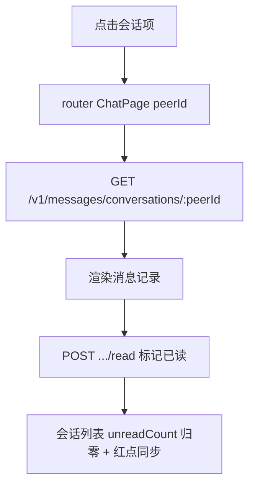

# PRD · 私信（Direct Message，大蓝书 · 增量）

> 文档类型：增量 PRD（聚焦**新增的私信能力**）——在已上线社区 App 基础上新增「用户间一对一私信」
> 版本：V0.1 草稿（待主理人 / 架构师拍板多处范围与权限问题）
> 作者：许清楚（产品经理）
> 关联系统：HarmonyOS NEXT 前端（ArkTS/ArkUI，API 24，V1 严格模式）· 后端 Node.js + Express + Prisma + MySQL（端口 3000）
> 增量基线：后端已落库 User/Post/Comment/Up/Bookmark/Tag/Follow/Blocklist/Notification/PrivacySettings/Report；前端 5 主 Tab（首页/分类/发布/消息/我的），其中「消息」`MessagePage` 是**通知中心**（评论/顶/收藏/关注提醒），`unreadMessageCount` 红点已打通。当前**没有任何私信模型、接口或前端页面**。

---

## 0. 代码勘察结论（关键：真实状态）

| 维度 | 现状 | 对私信 PRD 的影响 |
|---|---|---|
| 私信模型 | 后端 **无任何** Conversation / Message / DirectMessage 模型 | 纯绿地，需新建两张表 |
| 私信接口 | 后端 **无** `/v1/messages` 相关路由 | 需新建 messages 路由 + service |
| 隐私开关 | `PrivacySettings` 已含 `allowMessage Boolean @default(true)`（schema.prisma:240） | **可直接复用**作为「是否接收私信」的总开关，无需加字段 |
| 拉黑 | `Blocklist` 已存在（`(userId, blockedId)` 唯一） | 被拉黑者不能给对方发私信；复用现有 block 判定 |
| 关注关系 | `Follow` 表已存在（关注/互关可查） | 可作为「谁能给我发私信」的权限门槛（防骚扰，见 Q3） |
| 通知系统 | `Notification` + `NotificationPreference` 已存在，消息中心闭环 | 私信到达提醒**可复用**通知机制（新增 `type='message'`），或独立红点（见 Q5） |
| 前端消息 Tab | `Index` 底部 5 Tab；`MessagePage` 是通知中心，`unreadMessageCount` 红点 | 私信入口建议**内嵌消息 Tab 子 Tab**（通知/私信），复用红点，避免新增第 6 个 Tab |
| 内容安全 | 后端已有敏感词过滤（SensitiveWordService）、举报体系（Report 关联 targetType/targetId） | 私信正文应走敏感词过滤；私信举报可复用 Report（新增 `targetType='message'`） |

**结论**：私信是绿地模块，但隐私/拉黑/关注/通知/内容安全 5 块基建已具备，可大幅减少新建量。真正的决策点是**范围（是否本期）与权限门槛**。

---

## 1. 变更概述（一句话）

在「大蓝书」中新增**用户间一对一私信**：用户可从他人主页/帖子作者发起私信，在「消息」Tab 内新增「私信」子页查看会话列表与聊天记录、收发消息、标记已读；并复用现有隐私开关（`allowMessage`）、拉黑（`Blocklist`）、内容安全（敏感词）做防骚扰与合规。

---

## 2. 用户故事

1. **作为**社区成员，**我希望**能就某篇经验或某个作者私下一对一交流，**以便**深入讨论而不在公开评论区刷屏。
2. **作为**被私信者，**我希望**在「消息」里收到私信提醒并看到红点，**以便**不漏掉重要沟通。
3. **作为**注重隐私的用户，**我希望**能关掉「接收私信」开关、拉黑骚扰者，**以便**不被陌生人打扰（复用现有隐私/拉黑）。
4. **作为**产品方，**我希望**私信正文经过内容安全过滤与可举报，**以便**满足应用市场合规与涉政/色情风控要求。
5. **作为**产品方，**我希望**私信权限可设门槛（如仅互关/仅粉丝可发），**以便**降低新社区冷启动期的私信骚扰与灰产风险。

---

## 3. 需求池

> 优先级：**P0 = 本期必须**；**P1 = 重要，本期或下期**；**P2 = 锦上添花**。
> 验收基于现有架构：统一响应 `{ code, data, message }`、鉴权 `Authorization: Bearer <token>`、幂等计数沿用在用的事务模式。

### P0（本期必须）

**P0-1 新增 Conversation / Message 两表（数据模型）**
- 描述：会话与消息分离，避免单表自 join 性能差。
  ```prisma
  model Conversation {
    id          Int      @id @default(autoincrement())
    userAId     Int      // 参与双方，约定 userAId < userBId，避免 (A,B)/(B,A) 重复会话
    userBId     Int
    lastMessage String?  @db.VarChar(200)
    lastAt      DateTime @default(now())
    createdAt   DateTime @default(now())
    @@unique([userAId, userBId])
    @@index([userBId])
  }

  model Message {
    id             Int      @id @default(autoincrement())
    conversationId Int
    senderId       Int
    recipientId    Int
    content        String   @db.VarChar(2000)
    read           Boolean  @default(false)
    createdAt      DateTime @default(now())
    @@index([conversationId])
    @@index([recipientId, read]) // 未读查询走索引
  }
  ```
- 改动点：`prisma/schema.prisma` 新增两模型 + `prisma db push`（沿用仓库约定，禁 `migrate dev`）；不建 User 反向 `@relation`（与 `Notification`/`Blocklist` 轻量取向一致）。
- 验收：两表可写入；同一对用户的第二条消息落到**同一** Conversation（`userAId<userBId` 规范化后在 `upsert` 时命中唯一约束）。

**P0-2 发私信（后端接口 + 权限/安全校验）**
- 描述：`POST /v1/messages`，body `{ recipientId, content }`。后端按顺序校验：
  1. `recipientId` 存在且 ≠ 自己；
  2. **未被对方拉黑**（`Blocklist` 无 `{userId:recipientId, blockedId:me}`）——否则 `code 403`；
  3. **对方 `PrivacySettings.allowMessage===true`**——否则 `code 403`「对方未开启私信」；
  4. **权限门槛**（见 Q3，默认「所有人可发」或「仅互关/仅粉丝」）；
  5. **内容安全过滤**（复用 SensitiveWordService，命中则 `code 400` 提示「内容含敏感词」）；
  6. 规范化 `userAId/userBId` → `upsert` Conversation → 插入 Message（`read=false`）→ 可选写 `type='message'` 通知给接收方。
- 改动点：后端 `routes/messages.ts` + `services/messageService.ts`，复用 `auth` 中间件、`blockService.canInteract`、`privacyService`、`sensitiveWord`；前端 `api.ets` 新增 `sendMessage(recipientId, content)`。
- 验收：缺/过期 token→401；发给自己→400；被拉黑/对方关私信→403；敏感词→400；正常返回 `{ code:0, data: Message }`，Conversation 复用正确。

**P0-3 会话列表（后端 + 前端私信子页）**
- 描述：`GET /v1/messages/conversations?page=&limit=`，返回当前用户参与的会话：对方用户摘要（头像/昵称）+ `lastMessage` + `lastAt` + `unreadCount`（对方发来未读数）。
- 改动点：后端 `messages.ts` 列表端点（按 `userAId|userBId=me` 查 Conversation，聚合未读）；前端在 `MessagePage` 内新增「私信」子 Tab（`ConversationList` 区），点击进入 `ChatPage`。
- 验收：会话按 `lastAt` 倒序；未读数正确；空态「还没有私信，去认识有趣的人吧」。

**P0-4 聊天记录 + 发消息 UI（ChatPage.ets）**
- 描述：`GET /v1/messages/conversations/:peerId?page=&limit=`，返回与 `peerId` 的消息记录（含自己/对方，按时间升序）；页面底部输入框发送，调 `POST /v1/messages`，本地乐观追加 + 失败回滚。
- 改动点：后端 `messages.ts` 历史端点；前端新建 `ChatPage.ets`（消息气泡：自己右/品牌色，对方左/灰卡），发送走 P0-2。
- 验收：分页/刷新正常；发送即时上屏；断网回滚 + toast。

**P0-5 标记已读（后端 + 前端）**
- 描述：`POST /v1/messages/conversations/:peerId/read`，将对方发来的消息 `read=true`；进入 `ChatPage` 时调用。
- 改动点：后端 `messages.ts`；前端 `ChatPage` aboutToAppear 调 `markConversationRead(peerId)`。
- 验收：进入会话后未读清空、会话列表 unreadCount 归零、红点（见 Q5）同步。

**P0-6 私信入口（他人主页发起）**
- 描述：在 `UserProfilePage`（已建于关注 PRD）顶部操作区新增「私信」按钮（受 `allowMessage`/block 影响，不可发时禁用并提示）；从 PostCard 作者区亦可在二级菜单加「私信」。点击 → `ChatPage`（peerId=对方）。
- 改动点：前端 `UserProfilePage.ets` 加私信按钮 + 跳转；`api.ets` 已有 `sendMessage` 即可。
- 验收：按钮在对方关私信/拉黑我时置灰并说明原因；点击正常进会话。

### P1（重要，本期或下期）

**P1-1 未读红点合并到消息 Tab**
- 描述：将私信未读并入 `unreadMessageCount`（Index 消息 Tab 红点），或新增独立私信红点。推荐**并入现有红点**（见 Q5），减少 Tab 改动。
- 改动点：后端 `GET /v1/notifications/unread-count` 改为同时统计 `Message.read=false & recipientId=me`；前端 `Index` 红点逻辑基本不动。

**P1-2 私信举报**
- 描述：`Report` 新增 `targetType='message'`，复用现有举报接口与审核后台；ChatPage 长按消息 → 举报。
- 改动点：后端 `Report` 已支持 `targetType/targetId` 标量关联，仅前端在 ChatPage 加长按举报入口。

**P1-3 华为推送（私信实时提醒）**
- 描述：上架后接入华为 Push Kit，私信到达推系统通知（替代/增强 P0-2 写库的 `type='message'` 通知）。需 AGC 配置 + 设备 token。
- 改动点：后端 `messageService` 发消息后调 Push 服务；属上线增强，非功能必需。

**P1-4 图片/表情私信**
- 描述：私信支持发图（复用现有 COS 直传/预签名）与 emoji。content 扩为「文本+媒体」结构（Message 加 `type`/`mediaUrl?`）。
- 改动点：Message 模型加可选媒体字段；ChatPage 输入区支持选图。

### P2（锦上添花）

**P2-1 实时 WebSocket 长连**
- 描述：首期用「进页拉取 + 下拉刷新 + 可选定时轮询」即可（Q4 推荐首期轮询）；用户量大后再上 WebSocket 双向推送，降低服务端长连成本。

**P2-2 消息撤回 / 已读回执精细态**
- 描述：2 分钟内撤回、对方「已读」精确时间戳。属体验增强。

**P2-3 免打扰 / 会话置顶 / 拉黑会话**
- 描述：会话级免打扰、置顶、从会话列表移除（软删）。

---

## 4. UI 设计稿（文字描述）

> 设计语言遵循产品文档：Apple 极简风、深色优先、卡片圆角 12pt、主品牌色 `#0A84FF`、卡片色 `#1C1C1E`、次要文字 `#8E8E93`、分割线 `#38383A`、最小点击区 44pt。

### 4.1 消息 Tab 内嵌「通知 / 私信」双子 Tab（MessagePage 改造）

```
┌──────────────────────────────────────────────┐
│               消息                              │  ← 顶栏（全部已读）
├──────────────────────────────────────────────┤
│   [ 通知 ]   [ 私信 ]        ← 子 Tab 切换      │
├──────────────────────────────────────────────┤
│  （私信子 Tab）                                 │
│  ┌────────────────────────────────────────┐  │
│  │ [头像] 老李           昨天   [2]         │  │  ← 会话项：未读红点
│  │        在吗？想请教个选购问题…          │  │
│  └────────────────────────────────────────┘  │
│  ┌────────────────────────────────────────┐  │
│  │ [头像] 小王           周一              │  │
│  │        收到，谢谢老哥                    │  │
│  └────────────────────────────────────────┘  │
│  ……（分页/空态：还没有私信）                   │
└──────────────────────────────────────────────┘
```

### 4.2 聊天页（ChatPage.ets · ASCII）

```
┌──────────────────────────────────────────────┐
│  ← 返回              老李            ⋯(举报)    │
├──────────────────────────────────────────────┤
│                                                │
│        [ 在吗？想请教个选购问题 ]   ← 对方(左)  │
│  [ 我发在评论区了，你看看]              ← 自己(右,品牌色) │
│        [ 收到👍 ]                            │
│                                                │
├──────────────────────────────────────────────┤
│  [ 输入框……              发送 ]               │  ← 底部输入
└──────────────────────────────────────────────┘
```
- 气泡：自己右对齐、品牌色底白字；对方左对齐、卡片灰底。时间小字、已读态（P2）可标「已读」。
- 进入即 `markConversationRead`，未读清空、红点同步。

### 4.3 他人主页「私信」入口（P0-6 · UserProfilePage 改造）

```
┌──────────────────────────────────────────────┐
│  [头像] 老李                                  │
│         十年数码玩家…                          │
│   [ + 关注 ]   [ ✉ 私信 ]   ← 新增私信按钮     │
└──────────────────────────────────────────────┘
```
- 私信按钮：对方 `allowMessage=false` 或已拉黑我 → 置灰 + 点击提示原因；否则进 ChatPage。

### 4.4 关键交互流程（Mermaid）

**发送私信（含权限/安全校验）**

```mermaid
flowchart TD
    A[他人主页 私信 / ChatPage 输入] --> B[POST /v1/messages]
    B --> C{校验链}
    C -- 自己/不存在 400 --> Z1[提示]
    C -- 被对方拉黑 403 --> Z2[提示 对方已屏蔽你]
    C -- 对方关私信 403 --> Z3[提示 对方未开启私信]
    C -- 权限门槛不符 403 --> Z4[提示 仅互关可发]
    C -- 敏感词 400 --> Z5[提示 内容含敏感词]
    C -- 通过 --> D[upsert Conversation]
    D --> E[insert Message read=false]
    E --> F[写 type=message 通知 / 推华为Push(P1-3)]
    F --> G[前端乐观追加气泡]
```

**进入会话标记已读**



---

## 5. 待确认问题（需主理人拍板）

### Q1 私信是否纳入本期（MVP）？
- 当前 MVP 功能 P0 已全部完成，私信在原产品文档中列为 P2（见产品文档 2.1 消息通知为 P1、私信未列核心）。但面向大众上架后，用户间沟通是强留存能力。
- **请拍板**：① 本期做（按本 PRD P0 全套）；② 仅做最小版（发/收/列表，不做权限门槛精细化）；③ 下期再做。

### Q2 私信入口形态？
- 现有 5 Tab（首页/分类/发布/消息/我的），「发布」已占一 Tab。再加独立「私信」Tab 变 6 Tab，底部偏挤。
- **推荐**：**内嵌消息 Tab 双子 Tab（通知/私信）**，复用 `unreadMessageCount` 红点，零新增 Tab（本 PRD 采用此方案）。
- **请拍板**：内嵌子 Tab（推荐） vs 新增独立「私信」Tab。

### Q3 谁能给我发私信（权限门槛，防骚扰核心）？
- 选项：
  - A **所有人可发**（最开放，冷启动易骚扰/灰产）；
  - B **仅我关注的人 / 互关的人可发**（推荐，平衡开放与安全）；
  - C **仅粉丝可发**（最严）；
  - D 由接收方 `PrivacySettings.allowMessage` 总开关 + 可进一步选「所有人/互关/粉丝」（最灵活，但需扩展 PrivacySettings 字段）。
- 不论哪种，均叠加 `Blocklist`（被拉黑不能发）与 `allowMessage=false`（对方关私信不能发）。
- **请拍板**：默认门槛选哪个？是否要做 D 的精细化隐私选项（需扩 `PrivacySettings` 字段）？

### Q4 首期实时性：轮询 vs 长连？
- **推荐首期轮询**：进 ChatPage 拉取 + 下拉刷新 + 可选 30s 定时轮询；实现简单、零推送服务依赖，满足 MVP。
- 实时 WebSocket / 华为 Push 列为 P1-3 / P2-1，上架后视量接入。
- **请拍板**：首期采用轮询（推荐）？

### Q5 未读红点如何归并？
- 选项：① 并入现有 `unreadMessageCount`（消息 Tab 一个红点覆盖通知+私信，推荐）；② 私信独立红点（消息 Tab 内私信子 Tab 单独角标）。
- **请拍板**：① 并入（推荐） vs ② 独立。

### Q6 私信内容安全强度？
- 现有 SensitiveWordService 仅 70 词库（开发期）。面向大众上架，私信属 PII/涉政高风险面。
- **推荐**：私信正文**必过**敏感词过滤（P0-2 已含）+ 接入举报（P1-2）；词库上线前需扩充或接云鉴黄/文本内容安全服务。
- **请拍板**：确认私信走内容安全过滤（推荐必做）？词库扩充/云安全服务是否本期采购？

---

## 6. 核心结论速览（给架构师 / 主理人）

- **数据模型**：新建 `Conversation`（双方规范化 `userAId<userBId`，唯一约束复用会话）+ `Message`（senderId/recipientId/content/read，未读走复合索引）；轻量不建 User 反向 `@relation`。
- **后端接口（新增 `routes/messages.ts` + `messageService.ts`）**：
  - `POST /v1/messages` —— 发私信（权限链：自发/拉黑/关私信/门槛/敏感词 → 403/400；upsert Conversation + insert Message + 通知）
  - `GET /v1/messages/conversations` —— 会话列表（含未读聚合）
  - `GET /v1/messages/conversations/:peerId` —— 聊天记录
  - `POST /v1/messages/conversations/:peerId/read` —— 标记已读
  - 未读统计并入 `GET /v1/notifications/unread-count`（Q5 方案①）
- **复用现有基建（少新建）**：`PrivacySettings.allowMessage`（接收总开关）、`Blocklist`（防骚扰）、`Follow`（权限门槛）、`Notification`+`type='message'`（到达提醒）、`SensitiveWordService`（内容安全）、`Report`+`targetType='message'`（举报）。
- **前端新增/改动**：`MessagePage` 内嵌「通知/私信」双子 Tab（Q2 推荐）、`ChatPage.ets`（聊天）、`UserProfilePage` 加「私信」入口；`api.ets` 加 messages 系列；`Index` 红点逻辑基本不动（Q5 并入）。
- **优先级（建议）**：P0 = 模型 + 收发 + 会话列表 + 聊天 UI + 标记已读 + 他人主页入口 + 权限/安全校验；P1 = 红点并入 + 私信举报 + 华为推送 + 图片表情；P2 = WebSocket + 撤回/已读回执 + 免打扰。
- **关键待拍板**：Q1 是否本期 / Q2 入口形态 / Q3 权限门槛（防骚扰核心）/ Q4 轮询 vs 长连 / Q5 红点归并 / Q6 内容安全强度。
