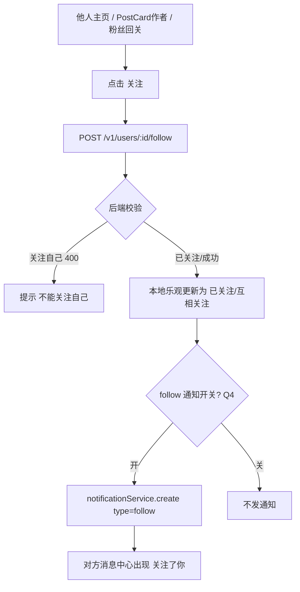
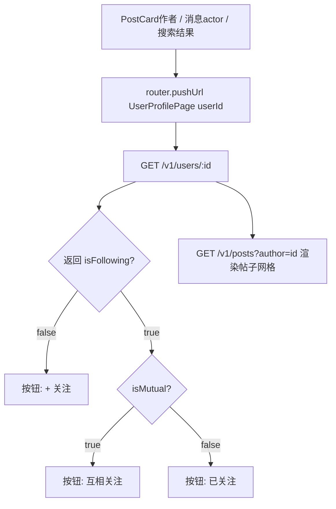

# PRD · 关注 / 他人主页（大蓝书 · 增量）

> 文档类型：增量 PRD（聚焦**变更部分**）——在已上线社区 App 基础上新增「关注关系 + 他人主页」
> 版本：V0.1 草稿（待架构师 / 用户拍板待确认问题）
> 作者：许清楚（产品经理）
> 关联系统：HarmonyOS NEXT 前端（ArkTS/ArkUI）· 后端 Node.js + Express + Prisma + MySQL（端口 3000）
> 增量基线：后端已落库 Post/User/Comment/Up/Bookmark/UserBinding/SearchHistory/Notification/Tag；前端已有 5 主 Tab + ProfilePage（我的）+ PostCard + 消息中心闭环（`type` 已含 `'follow'`）。

---

## 1. 变更概述（一句话）

在「大蓝书」社区中新增**用户间关注关系**与**他人主页**，打通社交闭环：用户可关注/取关他人、查看他人资料与帖子、查看关注/粉丝列表，并可复用现有通知系统接收「xxx 关注了你」。

---

## 2. 用户故事

1. **作为**社区成员，**我希望**能关注感兴趣的其他用户，**以便**在信息流中持续追踪我认可的人发布的生活经验。
2. **作为**内容消费者，**我希望**点击作者头像/昵称就能进入他的主页，看到他的简介与全部帖子，**以便**快速了解一个人并决定是否关注。
3. **作为**被关注者，**我希望**在「消息」里收到「xxx 关注了你」的通知，**以便**感知社交互动、回访对方主页。
4. **作为**已关注多人的用户，**我希望**在「我的」里能查看「我的关注 / 我的粉丝」列表，**以便**管理我的社交关系、回关或取关。
5. **作为**产品方，**我希望**关注关系以独立关系表存储（不污染 User 主表），**以便**未来做关注流 feed、互关态、关系推荐时无需改表结构。

---

## 3. 需求池

> 优先级：**P0 = 本期必须上线**；**P1 = 重要，本期或下期**；**P2 = 锦上添花**。
> 验收标准基于现有架构：前端 ArkTS/ArkUI、后端端口 3000、统一响应 `{ code, data, message }`、鉴权 `Authorization: Bearer <token>`。

### P0（本期必须）

**P0-1 新增 Follow 关系表（数据模型）**
- 描述：新增独立 `Follow` 表，承载「谁关注谁」。设计沿用在用的 `UserFollowTag` 模式（关系表 + `(followerId, followingId)` 唯一约束 + 幂等）。
  ```prisma
  model Follow {
    id         Int      @id @default(autoincrement())
    followerId Int      // 关注者
    followingId Int      // 被关注者
    createdAt  DateTime @default(now())
    @@unique([followerId, followingId]) // 同一人不能重复关注同一人
    @@index([followingId])              // 查粉丝列表
  }
  ```
- 前后端改动点：后端 `prisma/schema.prisma` 新增模型 + `prisma migrate`；`User` 反向关系可不加（保持轻量，参考 `Notification` 不建 `@relation` 的取舍）。**不新增 User 冗余列**（计数 runtime 聚合，见 Q1）。

**P0-2 关注 / 取消关注（后端接口 + 幂等）**
- 描述：
  - `POST /v1/users/:id/follow` —— 关注。重复关注幂等（已关注则直接返回成功，不报错、不重复插行）。不可关注自己（后端 400）。
  - `DELETE /v1/users/:id/follow` —— 取消关注。未关注时幂等（直接成功）。
  - 互相关注 = 双方各持一条 `Follow` 记录，是**状态**而非特殊接口，前端用双向查询判定「互关」。
- 前后端改动点：后端新增 `routes/users.ts`（或并入 `authRouter` 下 `/v1/users`）+ `services/followService.ts`，复用 `auth` 中间件；前端 `api.ets` 新增 `followUser(id)` / `unfollowUser(id)`。
- 验收标准：
  1. 缺/过期 token → `code 401` + HTTP 401。
  2. 关注自己 → `code 400` + 提示「不能关注自己」。
  3. 重复关注、重复取关均幂等成功；返回统一 `{ code:0, data:null }`。

**P0-3 他人主页资料接口 + 他人主页页**
- 描述：
  - `GET /v1/users/:id` —— 返回他人公开资料：
    ```jsonc
    {
      "id": 12, "nickname": "老李", "avatar": "...", "bio": "...",
      "gender": 1,
      "followingCount": 30, "followerCount": 128,
      "isFollowing": false,   // 当前登录用户是否已关注他
      "isMutual": false        // 是否互相关注（双方互关）
    }
    ```
  - 新增前端页 `UserProfilePage.ets`：展示头像/昵称/简介 + 关注数/粉丝数 + 关注/已关注切换按钮 + 其帖子列表（复用 `listPosts({ author: id })`，见 P0-4）。从 PostCard 作者、消息通知 actor、搜索结果等处跳转（带 `userId` 路由参数）。
- 前后端改动点：后端 `GET /v1/users/:id`（公开，登录即可；未登录返回 401 走登录引导）；前端新建 `UserProfilePage.ets`，`router.pushUrl({ url: 'pages/UserProfilePage', params: { userId } })`。
- 验收标准：
  1. 他人主页与「我的」主页视觉一致，且**无任何编辑/我的收藏入口**（区分他人 vs 自己）。
  2. 关注按钮三态正确（见 UI 4.2）。
  3. 他人无帖子时显示空状态，不白屏。

**P0-4 User 模型新增 `bio`（简介）字段**
- 描述：`User` 当前无简介字段，他人主页需展示简介 → 新增 `bio String? @db.VarChar(120)`。`GET /v1/auth/me` 与 `GET /v1/users/:id` 均返回 `bio`；`UpdateMeBody` 增加 `bio?` 允许「我的」页编辑简介（编辑 UI 是否本期做见 Q3）。
- 前后端改动点：后端 schema 新增列 + migrate + `authService.getMe`/`updateMe` 透传；前端 `types.ets` 的 `User` 增加 `bio?`，`api.ets` 的 `UpdateMeBody` 增加 `bio?`。

**P0-5 他人帖子列表（复用现有列表端点）**
- 描述：他人主页帖子区复用已存在的 `GET /v1/posts?author=<id>&page=&limit=&sort=latest`（ProfilePage 已用同一参数拉取「我发布」）。无需新端点，仅前端在 `UserProfilePage` 调用。
- 前后端改动点：后端**无新增接口**（仅确认 `author` 过滤对公开用户可用）；前端 `UserProfilePage` 调用 `listPosts({ author: targetId, sort: 'latest' })`。
- 验收标准：分页/刷新/「没有更多了」与 `ProfilePage` 行为一致。

### P1（重要，本期或下期）

**P1-1 「我的」主页增加「我的关注 / 我的粉丝」入口**
- 描述：在 `ProfilePage` 用户信息卡下方新增一行数据：左「关注 N」，右「粉丝 N」，均可点击进入对应列表页（P1-2）。数字取自我的资料/专用计数接口。
- 前后端改动点：前端 `ProfilePage.ets` 增加入口行 + 跳转；后端可复用 `GET /v1/users/me`（返回 `followingCount/followerCount`）或沿用 P0-3 的计数聚合。
- 验收标准：点击分别进入「我的关注」「我的粉丝」列表页；数字与实际一致。

**P1-2 关注列表 / 粉丝列表页（MyFollowPage.ets）**
- 描述：新增列表页，两种模式：
  - 我的关注：`GET /v1/users/me/following?page=&limit=`
  - 我的粉丝：`GET /v1/users/me/followers?page=&limit=`
  - 二者返回结构一致：`{ id, nickname, avatar, bio, isFollowing }`（粉丝列表的 `isFollowing` 用于展示「回关」态）。点击列表项进入对方 `UserProfilePage`。
- 前后端改动点：后端 `routes/users.ts` 两个列表端点（分页、聚合 `isFollowing`）；前端 `MyFollowPage.ets`（带 `mode: 'following' | 'followers'` 参数）。
- 验收标准：列表分页正常；粉丝项可显示「回关」态；空列表有引导态。

**P1-3 关注他人产生「xxx 关注了你」通知（复用 Notification）**
- 描述：在 `POST /v1/users/:id/follow` 成功后，复用现有 `notificationService` 创建一条 `type='follow'` 通知：`userId` = 被关注者，`actorId` = 当前用户，`content` = 服务端预渲染「xx 关注了你」。被关注者「消息」中心天然展示（`Notification` 表与消息端点已支持 `follow` 类型，**无需改通知模型/端点**）。
- 前后端改动点：后端 `followService` 调 `notificationService.create({ type:'follow', userId, actorId })`；前端**零改动**（消息中心已闭环，点击 actor 头像可进 `UserProfilePage`）。
- 验收标准：关注成功后对方在「消息」收到一条 `follow` 通知；取消关注的动作**不发通知、不撤回**（见 Q4）。

**P1-4 PostCard 作者名/头像可点击进入他人主页**
- 描述：当前 `PostCard` 仅展示封面/标题/点赞/评论数，**无作者信息**。需先在 `PostCard` 底部增加「作者头像 + 昵称」区块（数据来自 `post.user`，需确认 list 接口已 `include user`，见 Q5），点击进入该作者 `UserProfilePage`。
- 前后端改动点：前端 `PostCard.ets` 增加作者区 + 点击跳转；后端需确认 `GET /v1/posts` 列表已携带 `user` 字段（否则 `postService.list` 需 `include: { user: { select: { id,nickname,avatar } } }`）。
- 验收标准：首页/圈子/他人主页内的 PostCard 作者区可点；自己的帖子点作者不跳自己主页（或直接跳「我的」亦可）。

### P2（锦上添花）

**P2-1 关注流 feed（仅看关注的人）**
- 描述：新增「关注」信息流（首页 Tab 或独立入口），仅展示「我关注的人」近期帖子：`GET /v1/posts?feed=following`。本期通常不做，列为备选。
- 前后端改动点：后端按 `following` 集合做 `where: { userId: { in: [...] } }` 查询 + 分页（关注人多时考虑游标/IN 性能）；前端新增 feed 视图。

**P2-2 关注数/粉丝数冗余列 + 写时计数**
- 描述：若 runtime 聚合在粉丝量大时成瓶颈，可给 `User` 加 `followingCount`/`followerCount` 冗余列，在 `Follow` 写/删时 `increment/decrement`（同 `Tag.followCount` 模式）。属性能优化，非功能变更。

**P2-3 私信 / 互动入口（他人主页二级能力）**
- 描述：他人主页增加「私信」「分享主页」等，超出本期关注范围，仅记录。

---

## 4. UI 设计稿（文字描述）

> 设计语言遵循产品文档：Apple 极简风、深色优先、卡片圆角 12pt、主品牌色 `#0A84FF`、卡片色 `#1C1C1E`、次要文字 `#8E8E93`、分割线 `#38383A`、最小点击区 44pt。

### 4.1 他人主页布局（UserProfilePage.ets · ASCII）

```
┌──────────────────────────────────────────────┐
│  ← 返回                                  分享  │  ← 毛玻璃顶栏（无「设置」）
├──────────────────────────────────────────────┤
│                                                │
│   [头像64]   老李                           │  ← 头像 + 昵称 + 简介
│              ID: 12                            │
│              十年数码玩家，专注选购避坑          │  ← bio（简介，最多两行）
│                                                │
│   ┌──────────┐  ┌──────────┐  ┌──────────┐   │
│   │  帖子 56  │  │ 关注 30  │  │ 粉丝 128 │   │  ← 三项数据，关注/粉丝可点
│   └──────────┘  └────┬─────┘  └────┬─────┘   │
│                        (→我的关注)    (→我的粉丝)
│                                                │
│            [ + 关注 ]   ← 三态按钮（见 4.2）    │
│                                                │
│  ────────────── 分割线 ──────────────          │
│                                                │
│  他的帖子（双列网格，复用 PostCard）            │
│   ┌────────┐  ┌────────┐                       │
│   │ cover  │  │ cover  │                       │
│   │ 标题…  │  │ 标题…  │                       │
│   └────────┘  └────────┘                       │
│   ……（分页/刷新/没有更多了，同 ProfilePage）    │
└──────────────────────────────────────────────┘
```
- 区别「我的」主页：他人主页**无「我收藏」Tab、无「设置」、无编辑资料入口**；关注按钮替代设置位。
- 帖子数/关注/粉丝数字来自 `GET /v1/users/:id` 的 `followingCount/followerCount`（帖子数可选复用 `postService.count`）。

### 4.2 关注按钮三态

| 状态 | 文案 | 样式 | 点击行为 |
| :--- | :--- | :--- | :--- |
| 未关注 | `+ 关注` | 品牌色实心（蓝 `#0A84FF`，白字） | `POST /v1/users/:id/follow` → 转「已关注」 |
| 已关注 | `已关注` | 次要描边（透明底 + 次要色边框/字） | `DELETE /v1/users/:id/follow` → 转「未关注」（可选二次确认，见 Q4） |
| 互相关注 | `互相关注` | 次要描边（同已关注，文案不同） | 同「已关注」（取关后仍保留对方关注态） |

- 取关建议走轻量二次确认（AlertDialog：「取消关注老李？」取消/确定），避免误触。
- 按钮态由 `GET /v1/users/:id` 的 `isFollowing` + `isMutual` 初始化；操作后本地乐观更新，失败回滚。

### 4.3 「我的关注 / 我的粉丝」列表页（MyFollowPage.ets）

```
┌──────────────────────────────────────────────┐
│  ← 返回          我的关注 (30)                │  ← 标题随 mode 变化
├──────────────────────────────────────────────┤
│  ┌────────────────────────────────────────┐  │
│  │ [头像] 老李               [已关注]      │  │  ← 关注列表：显示已关注/互关态
│  │        十年数码玩家…                    │  │
│  └────────────────────────────────────────┘  │
│  ┌────────────────────────────────────────┐  │
│  │ [头像] 小王              [ + 回关 ]      │  │  ← 粉丝列表：isFollowing=false 显示「回关」
│  │        健身爱好者                       │  │
│  └────────────────────────────────────────┘  │
│  ……（分页加载）                               │
└──────────────────────────────────────────────┘
```
- 列表项 `isFollowing=true` → 展示「已关注/互相关注」；`isFollowing=false`（粉丝列表常见）→ 展示「+ 回关」，点击即 `POST follow`。
- 空状态：关注为空 →「还没有关注任何人，去发现有趣的人吧」；粉丝为空 →「还没有粉丝，多发优质内容吸引关注」。

### 4.4 PostCard 作者入口交互（P1-4）

```
┌─────────────────────────────────┐
│  [coverImage 160]               │
│  标题（最多两行）                │
│  ⭐ 123  💬 12                  │
│  ┌────┐ 老李        ← 新增底部行 │
│  │头像│  （点击→UserProfilePage）│
│  └────┘                          │
└─────────────────────────────────┘
```
- 作者行：`post.user.avatar` + `post.user.nickname`，整体可点击 → `router.pushUrl({ url:'pages/UserProfilePage', params:{ userId: post.user.id } })`。
- 在他人主页/首页/圈子内均生效；作者为本人时点击可跳「我的」或忽略（见 Q5）。

### 4.5 关键交互流程（Mermaid）

**关注他人（含通知）**



**进入他人主页**



---

## 5. 待确认问题（需主理人 / 架构师拍板）

### Q1 关注数/粉丝数：冗余列 vs 运行时 count？
- **现状**：`User` 无 `followingCount/followerCount` 字段；关注数是关系派生量。
- **方案 A（运行时聚合，本期推荐）**：`GET /v1/users/:id` 用 `_count` 聚合 `Follow`，无需改 User 表、无需维护计数。关注量小时无压力。
- **方案 B（冗余列 + 写时计数）**：User 加 `followingCount`/`followerCount`，关注/取关时 `increment/decrement`（同 `Tag.followCount`）。读快、写重、需保证一致性。
- **产品侧倾向**：本期用**方案 A**（简单、零计数维护、与 `Notification` 不建 `@relation` 的轻量取向一致）；若后续关注流/大 V 场景出现性能问题再上方案 B（已列入 P2-2）。
- **请拍板**：采用方案 A？

### Q2 他人主页是否展示「粉丝列表」给他人看？
- **现状**：需求明确「我的关注/我的粉丝」是**自己**在「我的」里的入口（P1-1/1-2）。
- **问题**：在**他人**主页，是否也允许点「粉丝 128」查看*他的*粉丝列表？还是仅展示数字、不可点进？
- **推荐**：他人主页的「粉丝/关注」数字**默认可点**，复用 `GET /v1/users/:id/followers|following`（后端按 `:id` 参数化即可，与「我的」共用同一端点逻辑，仅把 `me` 换成具体 `id`）。即统一为 `GET /v1/users/:id/following` 与 `GET /v1/users/:id/followers`，「我的」传自己的 id。
- **请拍板**：他人主页的关注/粉丝数字也允许点进列表？（推荐允许，端点统一）

### Q3 「我的」主页是否本期支持编辑简介（bio）？
- P0-4 已加 `bio` 字段与 `UpdateMeBody.bio`。但「我的」页的简介**编辑 UI**（输入框/保存）是否本期做？
- **推荐**：`bio` 字段与接口本期落地（他人主页要展示）；编辑 UI 可本期做（成本低，复用 `updateMe`），也可下期随「编辑资料」整页一起做。
- **请拍板**：本期是否顺带在「我的」做简介编辑入口？

### Q4 关注是否发通知 + 取关是否撤回？
- **现状**：`Notification.type` 已含 `'follow'`，`notificationService` 已按 type 渲染，消息端点已支持——**接通知零模型改动**。
- **问题**：
  1. 关注后是否生成 `type='follow'` 通知给被关注者？（推荐：**是**，P1-3，提升社交回访）
  2. 取消关注时，是否撤回/删除已发的 follow 通知？（推荐：**否**——通知是历史行为记录，取关不撤回；且与现有 comment/up 通知「不撤回」保持一致）
  3. 取关是否需要二次确认？（推荐：轻量二次确认，防误触）
- **请拍板**：① 关注发通知（是/否）；② 取关不撤回通知（确认）；③ 取关二次确认（是/否）

### Q5 PostCard 作者数据是否已随列表返回？
- 现状：`Post.user` 字段在 `types.ets` 已定义，但当前 `PostCard` 未渲染作者；需确认 `postService.list`（`GET /v1/posts`）在列表查询时已 `include: { user: { select: { id, nickname, avatar } } }`。
- **风险**：若列表未 include user，P1-4 的 PostCard 作者区无数据。
- **请拍板/架构确认**：列表接口是否补充 `include user`（性能可接受，仅 select 必要字段）？作者为本人时点击行为（跳「我的」vs 忽略）由前端定，无需后端决策。

### Q6 关注流 feed（P2-1）本期是否预研？
- 推荐：本期**不做**，仅记录为 P2。若主理人认为社交冷启动需要，可提前排期。
- **请拍板**：关注流 feed 是否提前到本期？

---

## 6. 核心结论速览（给架构师 / 用户）

- **数据模型**：新增独立 `Follow` 表（`followerId` / `followingId` / `createdAt`，`(followerId, followingId)` 唯一），轻量不建 User 反向 `@relation`；`User` 新增 `bio` 字段；关注数/粉丝数**本期运行时聚合**（Q1 方案 A）。
- **后端接口（新增）**：
  - `POST/DELETE /v1/users/:id/follow` —— 关注/取关（幂等、不可自关）
  - `GET /v1/users/:id` —— 他人/自己资料（含 `followingCount/followerCount/isFollowing/isMutual`）
  - `GET /v1/users/:id/following` 与 `GET /v1/users/:id/followers` —— 关注/粉丝列表（「我的」传自己 id，统一端点）
  - 他人帖子列表**复用** `GET /v1/posts?author=:id`（无新端点）
  - 关注通知**复用** `notificationService` + `type='follow'`（无模型/端点改动）
- **前端新增/改动**：`UserProfilePage.ets`（他人主页）、`MyFollowPage.ets`（关注/粉丝列表）、`PostCard.ets`（加作者区+点击）、`ProfilePage.ets`（加关注/粉丝入口）、`api.ets`（follow 系列 + 他人资料/列表接口）、`types.ets`（`User.bio` 等）。
- **优先级**：P0 = 关注/取关 + 他人主页 + bio 字段 + 他人帖子列表；P1 = 我的关注/粉丝入口与列表 + 关注通知 + PostCard 作者入口；P2 = 关注流 feed + 冗余计数 + 私信。
- **关键待拍板**：Q1 计数方式、Q2 他人粉丝列表可见性、Q4 关注通知开关与取关策略、Q5 PostCard 作者 include。
```
