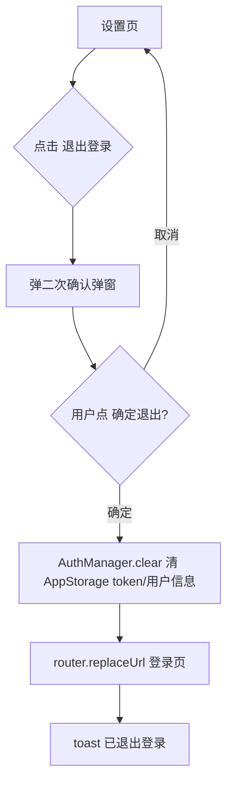
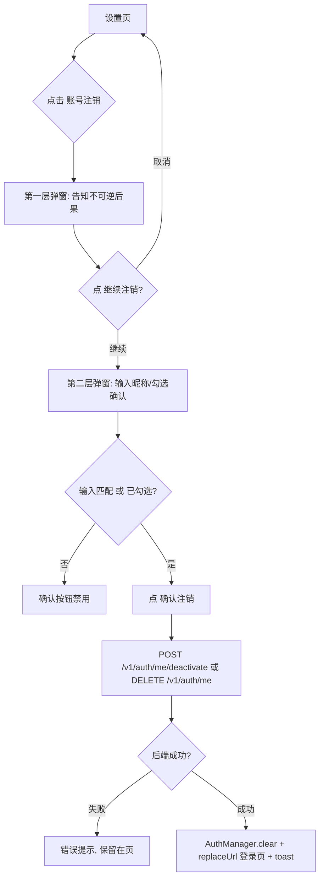

# PRD · 设置模块（大蓝书）

> 文档类型：简单 PRD（产品目标 + 用户故事 + 需求池 + UI 设计稿 + 待确认问题）
> 版本：V0.1 草稿（待架构师 / 用户拍板待确认问题）
> 作者：许清楚（产品经理）
> 关联系统：HarmonyOS NEXT 前端（ArkTS/ArkUI，API 24，ArkTS V1 严格模式）· 后端 Node.js + Express + Prisma + MySQL（端口 3000）
> 现状基线：已读源码确认 `SettingsPage.ets` 为 89 行 stub（仅「账号绑定」「内容审核台」两行）；后端 `auth.ts` 无 logout/删除端点；`User` 模型无软删字段；鉴权为无状态 JWT。

---

## 1. 产品目标

1. **补齐设置模块基础能力**：终结当前设置页仅有「账号绑定」「内容审核台」两个占位行的极简 stub 状态，让用户能自助管理账号（登出 / 注销 / 编辑资料）并查看基础设置（关于 / 版本 / 隐私政策），形成统一、分区清晰的「设置」中枢。
2. **满足 AGC 上架隐私合规硬要求**：必须提供「可用」的账号注销入口（非仅放按钮），且首次启动需隐私协议弹窗（如项目缺失则本模块补位），否则应用市场上架将被拒。
3. **最小改动、向后兼容**：前端复用现有 `AuthManager`（登出清 token）+ `api.ets` 的 `updateMe` 与账号绑定能力；后端以 soft-delete 方式实现注销，避免破坏现有无状态 JWT 与 Post/Comment 的 userId 关联；本期不引入 token 黑名单等重架构改动。

---

## 2. 用户故事

1. **作为**已登录用户，**我希望**在设置页能一键「退出登录」，**以便**在借出设备或换机时快速清空本地登录态、跳回登录页，保护账号安全。
2. **作为**想要离开大蓝书的用户，**我希望**能通过设置页的「账号注销」入口，在双重确认（含输入确认）后真正注销账号，**以便**满足我的数据自主权和隐私合规诉求（AGC 强制）。
3. **作为**注册较久的用户，**我希望**在设置页点「编辑资料」就能修改昵称与个人简介，**以便**让我的社区形象保持最新（无需回到「我的」页复杂操作）。
4. **作为**已绑定华为/第三方账号的用户，**我希望**在设置页的「账号绑定」里查看并管理绑定关系，**以便**清楚自己的登录方式与账号安全（现有能力入口保留）。
5. **作为**所有用户，**我希望**在「关于」里看到版本号与隐私政策/用户协议链接，**以便**了解应用信息、在需要时查阅条款。
6. **作为**管理员用户，**我希望**设置页仍保留「内容审核台」入口，**以便**继续处理社区违规内容（现有管理员专属行保留，不破坏）。

---

## 3. 需求池

> 优先级：**P0 = 本期必须上线**；**P1 = 重要，本期或下期**；**P2 = 锦上添花**。
> 验收标准均基于现有架构：前端 ArkTS/ArkUI（API 24，ArkTS V1 严格模式）、后端端口 3000、统一响应 `{ code, data, message }`、鉴权 `Authorization: Bearer <token>`；登录态由前端 `AuthManager`（AppStorage 存 token/用户信息）管理。
> 现有可复用资产：`api.ets` 的 `updateMe`(PUT /v1/auth/me)、`getBindings/postBindings/unbindAccount`；`AccountBindingPage.ets`；`ProfilePage.ets`（我发布/我收藏 Tab）。

### P0（本期必须）

**P0-1 重写设置页为分区结构（承载全部入口）**
- 描述：将 `SettingsPage.ets` 从两行 stub 重写为分区卡片结构，至少含「账号与安全」「通用」「关于」三组，并在底部放置登出/注销按钮。保留现有「账号绑定」行（→ `AccountBindingPage`）与「内容审核台」行（仅管理员可见，→ `ModerationPage`）。
- 验收标准：
  1. 设置页以分组卡片呈现：① 账号与安全 = 编辑资料 / 账号绑定 /（管理员）内容审核台；② 通用 = 通知设置(P1 占位) / 清除缓存(P1 占位)；③ 关于 = 关于·版本 / 隐私政策(P1 占位)。
  2. 「账号绑定」点击正确跳转 `AccountBindingPage`；「内容审核台」仅管理员可见，跳转 `ModerationPage`。
  3. 底部「退出登录」（红色文字按钮）+「账号注销」（红色·警示更强）独立成区、易点击（≥44pt）。
  4. 未登录态不展示设置入口（沿用现有 `ensureLogin` 逻辑）。

**P0-2 退出登录（前端清 token + 二次确认）**
- 描述：点击「退出登录」→ 弹二次确认 → 确认后调用 `AuthManager` 清除 AppStorage 中的 token 与用户信息 → `router.replaceUrl` 到登录页 → toast「已退出登录」。因后端为无状态 JWT，**本期不新增后端 logout 端点**，登出即前端失效本地凭证。
- 验收标准：
  1. 点击「退出登录」先弹确认弹窗（明确后果），需主动点「确定退出」才执行。
  2. 确认后 AppStorage 中 token/用户信息被清空，且页面栈替换为登录页（replaceUrl，不可返回）。
  3. 清态后再次访问需鉴权接口/页面会被拦截跳登录（沿用现有 `ensureLogin`）。
  4. 取消退出则状态不变。

**P0-3 账号注销（后端 soft-delete 端点 + 前端双重确认）**
- 描述：后端新增软删端点（建议 `POST /v1/auth/me/deactivate` 或 `DELETE /v1/auth/me`，见待确认 Q1），将当前用户置 `deletedAt`、匿名化昵称/头像，并按待确认 Q2 处理其 posts/comments。前端设置页增加「账号注销」入口 → 第一层确认弹窗（说明后果）→ 第二层输入确认（输入当前昵称或勾选确认框）→ 调注销端点 → 成功后 `AuthManager.clear()` + 跳登录页 + toast。
- 验收标准：
  1. 后端端点需在 `Authorization` 缺失/过期时返回 `401`；仅能注销**当前登录用户自身**，不可越权。
  2. 后端成功后：`deletedAt` 被写入（非物理删除）；昵称匿名化（如「已注销用户######」）、头像置默认/清空；该 userId 后续被任何接口解析为「无有效用户」即拒绝（配合待确认 Q3）。
  3. 前端走「双重确认」：第一层告知不可逆后果；第二层需用户输入昵称匹配或勾选确认后方可点「确认注销」（红色，禁用态直到满足条件）。
  4. 注销成功后前端清 token 并 replaceUrl 到登录页；用旧 token 再请求应被后端拒绝（userId 查无有效用户）。
  5. 取消任一层则不执行，状态不变。

**P0-4 编辑资料入口（复用 `updateMe`）**
- 描述：设置页「编辑资料」行 → 进入编辑资料页/弹窗（昵称 + 个人简介）→ 保存时调 `api.ets` 的 `updateMe`（PUT /v1/auth/me）→ 成功后回写本地用户信息并 toast。
- 验收标准：
  1. 编辑页预填当前昵称/简介；保存调用 `PUT /v1/auth/me`（body 含 nickname/bio）。
  2. 保存成功后「我的」页与本地 AppStorage 用户信息即时刷新。
  3. 昵称非空且 ≤20 字、简介 ≤100 字（前端校验）；接口返回失败（如 400/409）有错误提示。
  4. 本期头像**不可修改**（见待确认 Q4，COS 凭证未配置），编辑页可展示当前头像但无上传入口。

### P1（重要，本期或下期）

**P1-1 通知设置（客户端开关）**
- 描述：设置页「通知设置」行 → 开关列表（如点赞/评论/关注/系统通知），状态存本地 `Preferences`，**无后端**。预留后续接入推送服务。
- 验收标准：开关可切换并持久化（重启 App 后仍生效）；本期不触发真实推送。

**P1-2 清除缓存（客户端）**
- 描述：设置页「清除缓存」行 → 展示估算缓存大小 → 点击清除本地缓存（图片/临时文件等）→ toast 成功。
- 验收标准：点击后本地缓存被清理、大小回零或明显下降；不清除登录态与用户数据。

**P1-3 关于页（版本号 + 隐私政策/用户协议链接）**
- 描述：设置页「关于大蓝书」行 → 关于页展示 App 版本号（读取打包版本）、隐私政策与用户协议链接（WebView 或外部打开）。
- 验收标准：版本号正确展示；隐私政策/用户协议链接可点击打开；与注销/注册场景的合规文案一致。

### P2（锦上添花）

**P2-1 隐私设置（谁可以看我的帖子）**
- 描述：设置页「隐私」分组，控制帖子可见范围（公开/仅关注/仅自己）。

**P2-2 黑名单**
- 描述：管理屏蔽用户列表，屏蔽后不接收其互动。

**P2-3 数据导出**
- 描述：用户申请导出个人数据（帖子/评论/资料）为文件下载，满足数据可携权。

---

## 4. UI 设计稿

> 设计语言遵循产品文档：Apple 极简风、深色优先、卡片圆角 12pt、主品牌色 `#0A84FF`、卡片色 `#1C1C1E`、次要文字 `#8E8E93`、分割线 `#38383A`、最小点击区 44pt。警示操作用红色系。

### 4.1 设置页整体布局（ASCII）

```
┌──────────────────────────────────────────┐
│  ← 返回            设置                   │  ← 大标题 + 毛玻璃顶栏
├──────────────────────────────────────────┤
│  账号与安全                                │  ← 分组标题（13pt 次要色）
│  ┌────────────────────────────────────┐  │
│  │ 编辑资料                        >   │  │  ← P0-4
│  │ 账号绑定                        >   │  │  ← 现有，保留
│  │ 内容审核台（仅管理员）          >   │  │  ← 现有，管理员可见
│  └────────────────────────────────────┘  │
│  通用                                      │
│  ┌────────────────────────────────────┐  │
│  │ 通知设置（敬请期待）            >   │  │  ← P1-1 占位
│  │ 清除缓存（敬请期待）    12.3 MB >   │  │  ← P1-2 占位
│  └────────────────────────────────────┘  │
│  关于                                      │
│  ┌────────────────────────────────────┐  │
│  │ 关于大蓝书 · 版本 1.0.0         >   │  │  ← P1-3 占位
│  │ 隐私政策                        >   │  │  ← P1-3 占位
│  └────────────────────────────────────┘  │
│                                            │
│  ┌────────────────────────────────────┐  │
│  │        退出登录（红色文字）         │  │  ← P0-2
│  └────────────────────────────────────┘  │
│  ┌────────────────────────────────────┐  │
│  │     账号注销（红色·警示更强）        │  │  ← P0-3
│  └────────────────────────────────────┘  │
└──────────────────────────────────────────┘
```
> 说明：P1 项本期为占位入口（点击 toast「敬请期待」或灰度），不阻塞 P0 上线；分组与卡片样式同账号绑定页规范。

### 4.2 退出登录确认弹窗

```
┌──────────────────────────────────────────┐
│            退出登录？                     │
│  退出后需重新登录才能使用大蓝书。         │
│        [取消]            [确定退出]       │
└──────────────────────────────────────────┘
```
- 「确定退出」用警示红；需主动点击。

### 4.3 账号注销双重确认弹窗

**第一层（意图确认）**
```
┌──────────────────────────────────────────┐
│            注销账号？                     │
│  注销后你的账号将被永久关闭，            │
│  昵称/头像将被匿名化且不可恢复；         │
│  你的帖子/评论将按如下方式处理：         │
│  （依待确认 Q2：匿名归属保留 / 标记隐藏） │
│  请谨慎操作。                            │
│        [取消]            [继续注销]       │
└──────────────────────────────────────────┘
```

**第二层（输入确认，防误触）**
```
┌──────────────────────────────────────────┐
│           确认注销账号                    │
│  请输入你的昵称「小明」以确认注销：       │
│  [_________________________]             │
│  或勾选 ☑ 我已阅读并理解注销后果          │
│        [取消]            [确认注销]       │
└──────────────────────────────────────────┘
```
- 「确认注销」红色，**输入昵称与当前一致（或勾选确认）前为禁用态**。
- 两层均可取消，取消则状态不变。

### 4.4 编辑资料表单

```
┌──────────────────────────────────────────┐
│  ← 返回         编辑资料                  │
│  头像：（本期不可修改，展示当前头像）     │
│  昵称：[____________]  必填 · ≤20 字      │
│  简介：[____________]  ≤100 字 · 多行     │
│                                            │
│              [  保存  ]                    │
└──────────────────────────────────────────┘
```
- 保存调用 `PUT /v1/auth/me`；成功回写本地并 toast。

### 4.5 关键交互流程（Mermaid）

**退出登录流程**


**账号注销流程**


---

## 5. 待确认问题（需用户 / 架构师拍板）

### Q1 注销端点用哪种 HTTP 语义与路径？
- **现状**：后端 `auth.ts` 仅有 `POST /login`、`POST /huawei/exchange`、`GET /me`、`PUT /me`、`GET /me/bookmarks`、`GET /me/followed-tags`，**无任何注销/登出端点**。
- **选项**：
  - **A（推荐）`POST /v1/auth/me/deactivate`**：语义明确为「停用/软删」，与 soft-delete 一致，不破坏 RESTful 的 DELETE=物理删除直觉。
  - **B `DELETE /v1/auth/me`**：RESTful 但易与物理删除混淆；若内部实现为软删需在文档注明。
- **请拍板**：采用 A 还是 B？（本期推荐 A）

### Q2 注销后用户发布的帖子/评论如何处理？（决定后端 schema 改动量，强烈建议 A 或 C）
- **现状**：`Prisma User` 模型无 `deletedAt/status/isDeleted`；`Posts/Comments` 经 `userId` 标量外键关联 `User`，**无 @relation 级联**，物理删 User 会触发 FK 约束报错。
- **选项**：
  - **A（推荐）匿名化归属保留**：置 `deletedAt`，将该用户 posts/comments 的归属改为「已注销用户」（匿名化 `authorName`），内容保留。改动小、合规友好（数据不无故消失）、不破坏 FK。
  - **B 级联删除**：删除 User 及其 posts/comments。需改 schema 加 `@relation(onDelete: Cascade)` 或手动批量删，**改动大、且可能违反「用户数据可携/留存」合规考量**，不推荐。
  - **C 仅标记隐藏**：posts/comments 保留但置 `deleted/hidden` 标记（如 `Post.deletedAt`），列表与详情对其不可见，归属可匿名。改动中等，合规友好。
- **产品侧倾向：推荐 A（或 C）**——保留内容、匿名归属、不破坏现有 FK 与无状态架构。
- **请拍板**：选 A / B / C？（本期强烈建议 A 或 C）

### Q3 注销后是否需要服务端 token 黑名单？
- **现状**：鉴权为**无状态 JWT**，服务端无 session，登出本质前端清 token。
- **选项**：
  - **A（推荐，本期不做黑名单）**：注销仅前端清 token + 后端软删；后续任意请求用该 userId 解析时，因 `deletedAt` 非空判定「无有效用户」即拒绝（401）。无需黑名单基础设施。
  - **B 做 token 黑名单**：需引入 Redis/存储记录失效 token，复杂度高，本期不必要。
- **产品侧倾向：推荐 A**——靠 `deletedAt` 校验即可满足「注销后旧 token 失效」效果。
- **请拍板**：采用 A（不做黑名单）？（本期推荐）

### Q4 编辑资料是否包含头像上传？
- **现状**：COS（对象存储）**未配置凭证**，头像上传风险高；`updateMe` 当前仅支持 bio/昵称。
- **选项**：
  - **A（推荐，本期只放 bio/昵称）**：头像展示当前值、不可修改，留空/沿用；待 COS 凭证就绪后再补头像上传（P2 或后续）。
  - **B 本期做头像上传**：需先解决 COS 凭证与上传链路，风险与工作量显著。
- **产品侧倾向：推荐 A**。
- **请拍板**：本期编辑资料仅 bio/昵称（头像不可改）？（推荐）

### Q5 是否补充「首次启动隐私协议弹窗」？
- **现状**：AGC 上架要求首次启动隐私协议弹窗；本项目是否已有该弹窗**待确认**（本模块未勘察到）。
- **选项**：
  - 若已存在 → 不属于本模块，本 PRD 注销/关于页仅保证「隐私政策链接可达」即可。
  - 若缺失 → 建议在本模块（或启动流程）补齐首次启动隐私协议弹窗（含「同意/不同意」与隐私政策、用户协议链接），否则上架会被拒。
- **请拍板**：项目是否已有首次启动隐私弹窗？若缺失，是否并入本模块或单列任务？

---

## 6. 核心结论速览（给架构师 / 用户）

- **P0 清单**：① 重写设置页为分区结构（账号与安全 / 通用 / 关于 + 底部登出·注销，保留账号绑定与内容审核台入口）；② 退出登录（前端 `AuthManager.clear` + 二次确认 + replaceUrl 登录页，**不加后端 logout 端点**）；③ 账号注销（后端 soft-delete 端点 + 前端双重确认含输入确认 + 清 token 跳登录）；④ 编辑资料入口（复用 `updateMe` 改昵称/简介，头像本期不可改）。
- **后端最小改动**：新增 1 个注销端点（推荐 `POST /v1/auth/me/deactivate`）；`User` 模型加 `deletedAt`（按 Q2 选 A/C 还需相应匿名/隐藏字段）；**不引入 token 黑名单**。
- **合规要点**：注销必须「可用」（非仅按钮）；首次启动隐私弹窗若缺失需补（待确认 Q5），否则 AGC 上架被拒。
- **关键待确认（强烈建议拍板）**：Q2 注销后帖子/评论处理方式（推荐 A 匿名保留 / C 标记隐藏）、Q1 端点语义、Q3 不做黑名单、Q4 头像不改、Q5 隐私弹窗归属。
